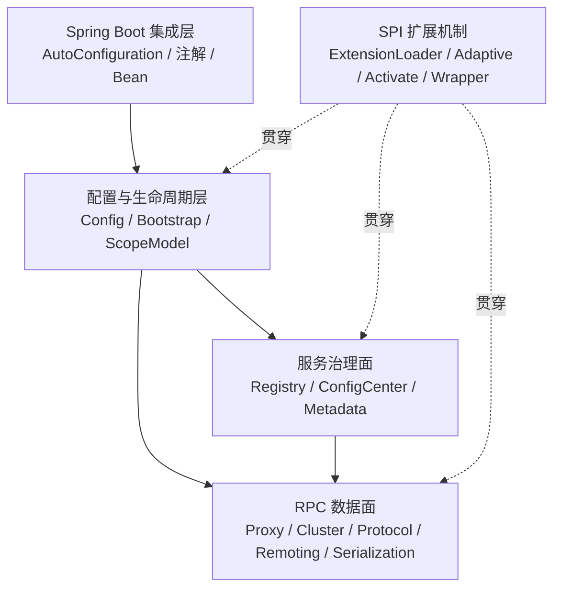

# Dubbo 3.3.6 源码学习总体方案

> 文档职责：定义稳定目标、范围、基线和统一学习原则
> 适用源码：Apache Dubbo `dubbo-3.3.6`
> 基线 commit：`f1585880bee4ca7776f44380c47c994217721ffe`
> 学习分支：`codex/learn-dubbo-source-3.3`
> 学习环境：JDK 21、Spring Boot 3.x
> 更新日期：2026-07-26

具体执行顺序、依赖和质量门禁见[整体路线图](roadmap.md)，每阶段的任务、源码入口、实验和验收见[分阶段方案](phases/README.md)。本文件不重复阶段实施细节。

## 1. 学习目标

本方案以一次完整同步 RPC 调用为第一主线，形成一套适合连续学习、调试验证和日常问题定位的简体中文 Dubbo 源码知识体系。

最终应具备以下能力：

- 说明 Dubbo 的全局架构、核心模块和依赖方向。
- 解释一次 Java 接口调用如何转换成远程请求并返回结果。
- 解释 Proxy、Invoker、Directory、Cluster、Protocol、Exporter 等核心对象的关系。
- 追踪服务暴露、服务引用和运行时对象生命周期。
- 说明 Spring Boot 3 如何驱动 Dubbo 配置、注解扫描和启动关闭。
- 说明 Nacos 作为注册、配置和元数据中心时的三条逻辑链路。
- 解释接口级与应用级服务发现并存时的地址注册、订阅和刷新。
- 理解 SPI、Filter、Router、LoadBalance 和 Cluster 容错机制。
- 使用源码索引、断点和实验定位常见调用与治理问题。

## 2. 学习边界

### 2.1 第一轮重点

| 领域 | 选择 |
|---|---|
| RPC 模型 | 普通 Java 接口同步调用 |
| 协议 | Dubbo Protocol |
| 序列化 | Hessian2 |
| 应用框架 | Spring Boot 3.x |
| 基础设施 | Nacos |
| 服务发现 | 接口级与应用级并存 |
| 调试环境 | 单 Consumer、单 Provider 起步，再扩展多 Provider |

### 2.2 暂不深入

- Triple、REST、HTTP/3、MCP、Reactive 和 Native Image 的完整实现。
- 所有注册中心、配置中心和序列化实现的横向比较。
- Dubbo 2.x 的系统学习；只在兼容路径出现时解释背景。
- 生产迁移、容量规划和完整性能基准测试。
- 公司内部二次封装但未出现在开源仓库中的实现。

这些内容可以进入[阶段 9 的后续专题清单](phases/09-knowledge-consolidation.md)，不能在第一轮挤占核心 RPC 主线。

## 3. 固定基线

| 维度 | 基线 |
|---|---|
| Dubbo | `dubbo-3.3.6` |
| commit | `f1585880bee4ca7776f44380c47c994217721ffe` |
| 分支 | `codex/learn-dubbo-source-3.3` |
| JDK | 21 |
| Spring Boot | 3.x |
| RPC 协议 | Dubbo Protocol |
| 序列化 | Hessian2 |
| 注册中心 | Nacos |
| 配置中心 | Nacos |
| 元数据中心 | Nacos |

所有源码结论、链接、调用栈和图示均应记录适用 tag 或 commit。参考 `3.3` 开发分支时必须标记为版本差异，不能混入 3.3.6 主线结论。

## 4. 核心学习方法

### 4.1 一条主线

```text
业务接口代理
→ Invocation
→ Filter / Cluster
→ Directory / Router / LoadBalance
→ DubboInvoker
→ Exchange / Transport
→ Hessian2 编解码
→ Netty 网络传输
→ Provider Invoker
→ 业务实现
→ 响应原路返回
```

其他专题都要回答自己在这条主线中的位置和作用。

### 4.2 两遍阅读

第一遍先假定 Proxy、Invoker、Directory 和 Exporter 已经存在，观察请求如何运行。

第二遍反向解释对象来源：

```text
Provider：配置 → ServiceConfig → 服务暴露 → Exporter → 注册
Consumer：配置 → ReferenceConfig → 服务引用 → Directory / Invoker → Proxy
```

### 4.3 三轮递进

| 轮次 | 阶段 | 核心问题 |
|---|---|---|
| 建立地图 | 0～2 | 它整体如何工作？ |
| 分层放大 | 3～7 | 每层如何实现，对象从哪里来？ |
| 变化与失败 | 8～9 | 规则变化或发生故障时如何工作？ |

阶段间依赖和进入条件由[路线图](roadmap.md)维护。

### 4.4 问题驱动闭环

```text
提出问题
→ 找到入口
→ 梳理正常链路
→ 定位关键对象
→ 断点和日志验证
→ 绘制图示
→ 分析异常与边界
→ 回答最初的问题
```

阅读源码不是终点。阶段问题没有被证据回答时，不能以“代码已经看过”视为完成。

## 5. 教学架构模型

以下四平面用于帮助定位源码，不代表 Dubbo 官方模块名称。



| 分组 | 重点模块 |
|---|---|
| 基础内核 | `dubbo-common` |
| 配置生命周期 | `dubbo-config` |
| RPC 数据面 | `dubbo-rpc`、`dubbo-cluster`、`dubbo-remoting`、`dubbo-serialization` |
| 服务治理面 | `dubbo-registry`、`dubbo-configcenter`、`dubbo-metadata` |
| 框架集成 | `dubbo-spring-boot-project`、`dubbo-config-spring` |

模块的具体职责和代表类由[阶段 1](phases/01-architecture-map.md)维护。

## 6. 两个统一实验场景

### 6.1 实验 A：直连核心 RPC

```text
Spring Boot 3
+ Dubbo Protocol
+ Hessian2
+ 单 Consumer
+ 单 Provider
+ 同步调用
+ 直连 URL
```

用于隔离注册中心、服务迁移和动态治理的复杂度，支撑阶段 0～6。

### 6.2 实验 B：公司技术栈场景

```text
Spring Boot 3
+ Dubbo Protocol
+ Hessian2
+ Nacos 注册中心
+ Nacos 配置中心
+ Nacos 元数据中心
+ 接口级与应用级服务发现并存
```

用于阶段 7、8。两套场景复用相同 API 和业务实现，只切换配置与基础设施，使它们汇合到同一条 RPC 数据面链路。

实验模块结构、接口字段、日志和复现要求由[阶段 0](phases/00-baseline-and-lab.md)唯一维护。

## 7. 阶段摘要

| 阶段 | 主题 | 关键结果 | 详细方案 |
|---|---|---|---|
| 0 | 稳定基线与实验台 | 可重复运行的直连实验 | [阶段 0](phases/00-baseline-and-lab.md) |
| 1 | 全局架构与模块地图 | 建立源码导航能力 | [阶段 1](phases/01-architecture-map.md) |
| 2 | 一次同步 RPC 全景 | 获得端到端调用地图 | [阶段 2](phases/02-rpc-overview.md) |
| 3 | Consumer 调用链 | 理解代理、候选地址和 Provider 选择 | [阶段 3](phases/03-consumer-invocation.md) |
| 4 | 协议、网络与 Provider | 理解编解码、线程和响应匹配 | [阶段 4](phases/04-protocol-remoting-provider.md) |
| 5 | 服务暴露与引用 | 理解运行时对象来源和生命周期 | [阶段 5](phases/05-export-and-reference.md) |
| 6 | Spring Boot 3 集成 | 理解注解、配置、Bean 和启动关闭 | [阶段 6](phases/06-spring-boot-integration.md) |
| 7 | Nacos 与服务发现 | 理解地址、配置和元数据如何进入运行时 | [阶段 7](phases/07-nacos-service-discovery.md) |
| 8 | SPI、治理、异常与安全 | 理解扩展、变化、失败和信任边界 | [阶段 8](phases/08-spi-governance-failure-security.md) |
| 9 | 知识体系收口 | 形成索引、手册、复习题和排查地图 | [阶段 9](phases/09-knowledge-consolidation.md) |

阶段执行顺序、交付依赖和 G0～G9 门禁只在[路线图](roadmap.md)中维护。

## 8. 统一文档原则

### 8.1 章节结构

主题文档通常包含：

1. 本章问题。
2. 先给结论。
3. 当前链路在全局中的位置。
4. 全景图与关键对象。
5. 分阶段源码分析。
6. 运行验证与断点。
7. 异常路径和边界。
8. 容易误解的地方。
9. 问题答案与复习题。

结构服务于内容；简单章节不为满足模板制造空小节。

### 8.2 证据类型

| 类型 | 使用方式 |
|---|---|
| 源码证据 | 指向模块、类、方法和固定版本 |
| 运行证据 | 保存调用栈、日志、断点或对象快照 |
| 设计推断 | 明确标记为推断，并说明依据 |
| 版本差异 | 明确列出版本，不覆盖 3.3.6 主线 |

### 8.3 图示原则

- 正文优先使用人工提炼的 Mermaid 图。
- 一张图只回答一个主要问题。
- 复杂链路采用“全景—局部—细节”逐层放大。
- 图下说明阅读顺序、源码映射、适用版本和验证状态。
- 自动生成的完整依赖图只能作为附录证据。

## 9. 统一完成标准

每个阶段必须同时满足：

- **讲得清**：脱离源码可以说明主要流程和边界。
- **找得到**：能够快速定位入口类、关键方法和测试。
- **跑得通**：实验、命令、调用栈和预期现象可重复。
- **证得实**：重要结论有源码证据或运行证据。

具体 G0～G9 质量门禁由[路线图](roadmap.md)维护，阶段验收清单由对应阶段文件维护。

## 10. 全局风险

| 风险 | 控制方式 |
|---|---|
| 开发分支与稳定版本混淆 | 固定 tag/commit，版本差异单独标记 |
| 官方 demo 与目标场景不同 | 建立独立学习实验，不改原 demo 语义 |
| 一开始陷入 SPI 或兼容代码 | 始终回到 RPC 主线，从真实使用点切入 |
| 生成类和 Wrapper 使调用栈复杂 | 同时保存稳定抽象链路和实际运行类型 |
| Nacos 迁移配置未知 | 运行 `interface`、`instance`、`all` 对照实验 |
| 文档退化成源码摘要 | 强制使用问题、结论、图示和验证闭环 |
| 多份文档内容漂移 | 采用下述单一归属规则，不复制阶段细节 |

## 11. 文档职责与维护规则

| 文档 | 唯一职责 |
|---|---|
| [README](README.md) | 学习入口和当前阶段状态 |
| 本文件 | 稳定目标、范围、基线和统一原则 |
| [路线图](roadmap.md) | 阶段依赖、执行顺序和质量门禁 |
| [阶段方案](phases/README.md) | 各阶段任务、实验、源码入口和验收 |
| 主题文档 | 实际源码分析、图示和运行证据 |
| `appendix/` | 词典、索引、断点和复习资料 |

维护时遵循：

- 总目标、范围或基线变化时更新本文件。
- 阶段依赖或质量门禁变化时更新路线图。
- 单阶段任务和验收变化时只更新对应阶段文件。
- 实际分析结果写入主题文档，不回填到总纲或阶段方案。
- 入口状态只在 README 中维护，其他文档链接到入口而不复制状态表。
