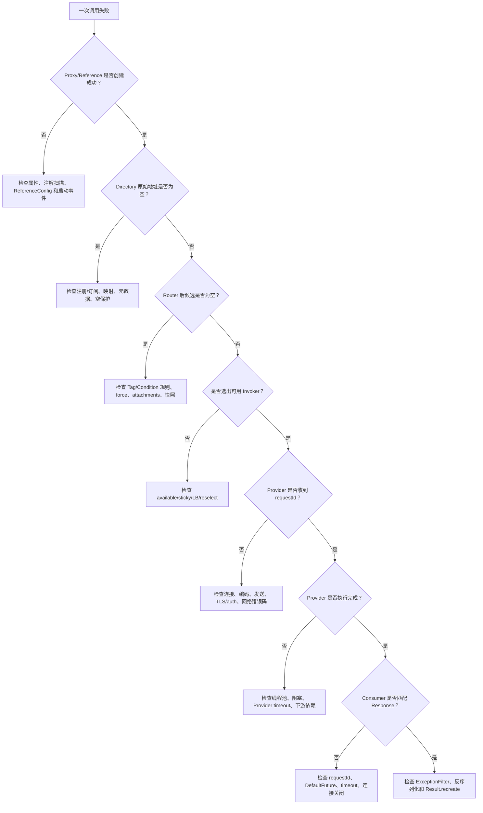

# 断点手册与故障地图

> 总入口：[Dubbo 3.3.6 源码知识地图](../notes/09-knowledge-consolidation.md)
> 原则：先确定失败边界，再下断点；每次只改变一个变量，并用同一个 `requestId` 关联 Consumer、Provider 和控制面事件。

## 1. 最小证据集

无论定位哪类问题，先保存：

```text
Dubbo tag / commit / dirty 状态：
JDK 与启动命令：
应用名、接口、group、version、protocol：
Consumer 有效 URL：
Provider 有效 URL：
requestId 与时间窗口：
Directory 原始地址数：
Router 每层输入/输出数：
实际选择地址与尝试序号：
RpcException code / isBiz / cause：
Provider 是否收到、是否完成：
关闭后端口、Client、Invoker、Exporter 状态：
```

以下信息不能互相替代：

- “注册中心能连接”不能证明订阅 dataId/serviceName 正确。
- “Directory 有地址”不能证明 Router 后仍有候选。
- “Consumer 超时”不能证明 Provider 已取消执行。
- “端口已关闭”不能证明注册数据和 Invoker 都已销毁。
- “错误码相同”不能证明原始失败边界相同。

## 2. 启动、暴露与引用断点

### 2.1 Spring Boot 和配置

| 观察目的 | 断点 | 重点变量 |
|---|---|---|
| 配置 Bean 何时加载 | `DubboConfigBeanInitializer.initialize` | Spring Environment、Config bean name、ModuleModel |
| `@DubboService` 扫描 | `ServiceAnnotationWithAotPostProcessor` 的扫描/注册方法 | packagesToScan、候选类、ServiceBean definition |
| `@DubboReference` 注册 | `ReferenceAnnotationWithAotBeanPostProcessor` 的引用 Bean 创建方法 | 字段、interfaceClass、ReferenceBean name |
| Spring refresh 启动 Dubbo | `DubboDeployApplicationListener.onApplicationEvent` | event type、application/module deployer state |
| 配置中心启动次序 | `DefaultApplicationDeployer.initialize`、`startConfigCenter` | Environment 配置源、ConfigCenterConfig、dynamicConfiguration |
| 元数据中心启动 | `DefaultApplicationDeployer.startMetadataCenter` | metadata type、MetadataReportConfig、client identity |
| Module 启动 | `DefaultModuleDeployer.start` | exportServices/referServices future、state |

属性问题应保存“输入配置源”和“最终 Config/URL”两份快照。只看 YAML 不能证明 Dubbo 最终使用该值；命令行、Spring Environment、远端配置和 Dubbo Environment 可能在后续覆盖。

### 2.2 Provider 暴露

推荐顺序：

```text
ServiceConfig.export
→ ServiceConfig.doExport
→ ServiceConfig.doExportUrls
→ ServiceConfig.doExportUrl
→ ProxyFactory.getInvoker
→ Adaptive Protocol.export
→ ProtocolFilterWrapper.export
→ ProtocolListenerWrapper.export
→ DubboProtocol.export
→ openServer / createServer
→ RegistryProtocol 注册或应用实例注册
```

| 断点 | 重点变量 |
|---|---|
| `ServiceConfig.doExportUrls` | service metadata、protocol configs、registry URLs |
| `ServiceConfig.doExportUrl` | local/remote URL、register type |
| `JavassistProxyFactory.getInvoker` | service bean、interface、Provider URL |
| `DubboProtocol.export` | service key、exporterMap、requestHandler |
| `DubboProtocol.openServer` | bind/export address、serverMap、是否复用 |
| `RegistryProtocol.doLocalExport` | provider URL、ExporterChangeableWrapper |
| Nacos register 方法 | serviceName/group/Instance metadata 或 application instance |

判断暴露是否完整要分别确认：Exporter 已创建、Server 已监听、接口/应用实例已注册、元数据/映射已发布。直连 `registry=N/A` 示例只覆盖前两项。

### 2.3 Consumer 引用

推荐顺序：

```text
ReferenceConfig.get
→ ReferenceConfig.init
→ ReferenceConfig.createProxy
→ Adaptive Protocol.refer
→ RegistryProtocol / DubboProtocol
→ Directory + Cluster.join
→ ProxyFactory.getProxy
→ Spring 字段注入
```

| 断点 | 重点变量 |
|---|---|
| `ReferenceConfig.createProxy` | direct URL/registry URLs、check、injvm、referenceParameters |
| `RegistryProtocol.doRefer` | Registry、Directory、subscribe URL、Cluster |
| `DubboProtocol.protocolBindingRefer` | target URL、Client provider、DubboInvoker |
| `DubboProtocol.getSharedClient` | address、shareconnections、reference count |
| `JavassistProxyFactory.getProxy` | interface、Invoker 包装树 |

引用成功不代表 Provider 当前可调用。检查 `check`、lazy connection、Directory 地址、Invoker available 和连接建立时机。

## 3. 调用与治理断点

### 3.1 Consumer 业务线程

```text
Proxy InvocationHandler
→ AbstractClusterInvoker.invoke
→ Directory.list
→ SingleRouterChain.route
→ Cluster.doInvoke
→ LoadBalance.select
→ 地址级 Filter
→ DubboInvoker.doInvoke
```

| 断点 | 需要保存 |
|---|---|
| 代理 InvocationHandler 的 invoke | method、arguments、生成的 RpcInvocation |
| `AbstractClusterInvoker.invoke` | Directory identity、路由前后 invokers、loadbalance class |
| `SingleRouterChain.simpleRoute` | StateRouter/Router 每层输入输出、rule、shouldFailFast |
| `FailoverClusterInvoker.doInvoke` | len、i、copyInvokers、invoked、selected、last exception |
| `AdaptiveLoadBalance.select` | method parameter、extName、候选权重 |
| Consumer 自定义 Filter | requestId、target、attachments、thread |
| `DubboInvoker.doInvoke` | timeout、ExchangeClient、Request id、invoke mode |

### 3.2 动态治理

治理变更必须采集两条时间线：规则事件与业务调用。

```text
Nacos Config dataId/group 变更
→ GovernanceRuleRepository/DynamicConfiguration listener
→ Tag/Condition rule parse
→ StateRouter rule 与 BitList 更新
→ 下一次 SingleRouterChain.route
→ 新候选列表
```

建议记录：规则原文、revision/version、解析结果、旧/新 RouterRule identity、当前 Invoker origin list、位图数量、force/fail-fast、调用 attachments。不要只记录最终选中地址。

### 3.3 LoadBalance 与 Failover

排查“为什么选到这个地址”时按顺序检查：

1. Registry/Directory 是否本来就只有该地址。
2. StateRouter 和 Router 是否排除了其他地址。
3. sticky、available check 和已调用列表是否限制重选。
4. LoadBalance 的方法级配置、权重、warmup 和随机/轮询状态。
5. 当前是第几次 Failover 尝试，是否已经重新 list。

LoadBalance 只解释“本次尝试选谁”；总尝试次数由 Cluster 的 `retries + 1` 决定。

## 4. 网络、响应与 Provider 断点

### 4.1 Consumer 发送与 Future

| 断点 | 重点变量 |
|---|---|
| `DubboInvoker.doInvoke` 创建 Request | requestId、twoWay、timeout、payload、Invocation attachments |
| `HeaderExchangeChannel.request` | 先创建 Future、后 send 的顺序 |
| `DefaultFuture.newFuture` | FUTURES/CHANNELS 中是否已有 requestId |
| Netty encoder/`DubboCodec.encodeRequestData` | header flag、serialization id、body fields |
| `DefaultFuture.received` / `doReceived` | Response status、requestId、future identity、completion thread |

如果出现“Response 已收到但业务线程仍等待”，检查 requestId、Future 是否提前移除、Response status、回调 executor 和 `Result.recreate`，不要先假设网络丢包。

### 4.2 Provider 接收与线程切换

```text
NettyServer channelRead
→ Decoder / DecodeHandler
→ HeaderExchangeHandler.received
→ Dispatcher / ChannelEventRunnable
→ DubboProtocol requestHandler.reply
→ Exporter lookup
→ Provider Filter 链
→ AbstractProxyInvoker.invoke
→ 业务 Bean
```

| 断点 | 重点变量 |
|---|---|
| Netty decoder | IO thread、16 字节 header、body length |
| `DubboCodec.decodeBody` | serialization、path/version/method/parameter desc |
| `HeaderExchangeHandler.handleRequest` | Request id、broken/twoWay、handler result future |
| `DubboProtocol` request handler | service key、exporterMap 命中结果 |
| `AbstractProxyInvoker.invoke` | Provider thread、method、arguments、Result |
| Provider `ExceptionFilter.onResponse` | exception class、接口声明、包装结果 |

线程问题至少记录 Consumer 业务线程、Netty Client IO、Provider Netty IO、Provider 业务线程和 Response completion 线程。

## 5. 地址刷新与销毁断点

### 5.1 接口级 Nacos

```text
Nacos NamingEvent
→ NacosRegistry aggregate listener
→ buildURLs
→ RegistryDirectory.notify
→ refreshInvoker
→ toInvokers
→ protocol.refer / reuse / destroy
```

保存 serviceName、group、Instance enabled、metadata、URL 数量、old/new `urlInvokerMap`、复用 identity 和销毁列表。

### 5.2 应用级发现

```text
接口 → 应用映射
+ Nacos application instances
+ MetadataInfo(revision)
→ ServiceInstancesChangedListener
→ ServiceDiscoveryRegistryDirectory
→ MigrationInvoker
```

保存应用名集合、每个 revision 的实例数、MetadataInfo 来源（local/remote）、恢复出的接口 URL、接口级/应用级两个 Invoker 的 available 状态和 `currentAvailableInvoker`。

### 5.3 关闭与资源释放

推荐顺序：

```text
Spring ContextClosedEvent
→ DubboDeployApplicationListener
→ Module/Application stop
→ Reference destroy / Service unexport
→ unsubscribe / unregister
→ Invoker / Client / Server destroy
→ Extension / ScopeModel destroy
```

验收快照：

- Exporter map 不再含学习服务 key；
- 20880 等实验端口不再监听；
- Client 引用计数归零且 Channel 关闭；
- Directory、Router、Registry listener 已销毁；
- Nacos 应用实例/接口 URL 已精确注销；
- Spring 与 Dubbo Module 解除绑定；
- 没有继续运行的业务线程或定时重试任务。

## 6. 故障定位决策树



决策树的每个“否”都对应不同证据，不要跳到最末端只看异常栈。

## 7. 错误码与重试判断

| `RpcException` code | 名称 | 常见产生点 | Failover 默认判断 |
|---:|---|---|---|
| 0 | UNKNOWN | 未分类异常或包装 | 非 Biz 时可重试 |
| 1 | NETWORK_EXCEPTION | `DubboInvoker` 捕获 RemotingException | 可重试并重选 |
| 2 | TIMEOUT_EXCEPTION | 等待 Future 超时 | 可重试，但有重复执行与预算风险 |
| 3 | BIZ_EXCEPTION | 业务异常标记 | 立即终止，不重试 |
| 4 | FORBIDDEN_EXCEPTION | 认证/授权或显式禁止路径 | 通常不应靠换地址修复 |
| 5 | SERIALIZATION_EXCEPTION | 编解码或序列化失败 | 技术上非 Biz；换地址通常无效 |
| 6 | NO_INVOKER_AVAILABLE_AFTER_FILTER | Directory/Router 后无候选 | 调用前失败 |
| 7 | LIMIT_EXCEEDED_EXCEPTION | 限流 | 是否重试取决于业务与退避，立即重试常放大压力 |
| 8 | TIMEOUT_TERMINATE | 剩余预算耗尽 | 不应再创造新尝试 |
| 9 | REGISTRY_EXCEPTION | 注册中心相关路径 | 与数据面已有地址是否可用分开判断 |
| 10 | ROUTER_CACHE_NOT_BUILD | 路由缓存不可用 | 检查规则/地址刷新一致性 |
| 11 | METHOD_NOT_FOUND | 服务/方法匹配失败 | 换地址仅在版本不一致时可能表现不同 |
| 12 | VALIDATION_EXCEPTION | 参数校验 | 不重试相同请求 |
| 13 | AUTHORIZATION_EXCEPTION | 授权失败 | 不重试，应修复身份或权限 |

框架代码只对 `isBiz()` 明确立即终止；表中“通常不应重试”是 API/运维建议，不代表所有扩展都会自动阻止重试。

## 8. 典型现象与最短验证路径

| 现象 | 首查 | 第二证据 | 不要先做什么 |
|---|---|---|---|
| 启动时没有 Reference Bean | 注解处理器扫描结果 | Bean definition 与 package | 不要先抓网络包 |
| `No provider available` | Directory 原始列表 | RouterSnapshot | 不要只重启 Nacos |
| 总是打到同一 Provider | Router 后列表 | sticky/LB/weight/warmup | 不要先认定 RoundRobin 失效 |
| 调用次数多于业务次数 | retries 与每次 target | Provider requestId/幂等键 | 不要只看 Consumer 最终成功 |
| Consumer 超时但 Provider 有副作用 | Provider receive/finish 时间 | Future timeout 与重试次数 | 不要假设 timeout 会取消服务端 |
| Provider 抛异常但 Consumer 类型不同 | ExceptionFilter 分支 | API 是否声明/共享异常类 | 不要把包装认定为序列化 bug |
| STRICT 拒绝业务 DTO | autoTrust 接口扫描 | allowlist 前缀/Serializable | 不要直接关闭检查 |
| Nacos 有实例但 Consumer 无地址 | serviceName/group/namespace | 映射、revision、MetadataInfo | 不要把接口级和应用级页面混看 |
| 地址变化后仍访问旧地址 | Registry event 与 Directory refresh | old/new Invoker identity、Client | 不要只看 Proxy identity |
| Spring 关闭后端口仍在 | close event 是否到达 | Exporter/Server/Client destroy | 不要只延长 shutdown wait |

## 9. 场景矩阵与现有证据

| 场景 | 变量 | 预期 | 证据 |
|---|---|---|---|
| 基线直连 | 单 Provider、retries=0 | 一次调用、同一 requestId 往返 | [首次直连记录](../notes/evidence/00-direct-rpc-runtime.md) |
| 双 Provider | 20880/20881、roundrobin | 地址选择可观察 | [选择与 Failover](../notes/evidence/03-consumer-selection-and-failover.md) |
| Provider 下线 | 停止一个地址 | 非 Biz 失败后可重选剩余地址 | [选择与 Failover](../notes/evidence/03-consumer-selection-and-failover.md) |
| 业务异常 | `biz-failure`、retry override | Provider 只收到一次 | [选择与 Failover](../notes/evidence/03-consumer-selection-and-failover.md) |
| Provider 延迟 | 3500 ms vs timeout 3000 ms | code 2；Provider 继续完成 | [SPI 与异常证据](../notes/evidence/08-spi-governance-and-failures.md#6-实验-e真实-3000-ms-超时) |
| Nacos 空推送 | empty protection on/off | 保留旧地址或产生 empty URL | [Nacos 故障保护](../notes/evidence/07-nacos-data-refresh-and-migration.md) |
| 元数据 revision 失败 | 首次获取失败 | 成功部分保留，失败 revision 异步重试 | [Nacos 故障保护](../notes/evidence/07-nacos-data-refresh-and-migration.md) |
| Spring 属性覆盖 | YAML/命令行/系统属性 | 最终 Config 与 URL 反映有效优先级 | [Spring 配置证据](../notes/evidence/06-spring-events-config-and-shutdown.md) |
| Spring 关闭 | Context close | unexport/destroy/端口关闭 | [关闭证据](../notes/evidence/06-spring-events-config-and-shutdown.md) |
| 不可信 Hessian2 类型 | STRICT/allowlist/Serializable | 未允许或非 Serializable 类型被拒绝 | [SPI 与异常证据](../notes/evidence/08-spi-governance-and-failures.md) |

## 10. 复验纪律

- 固定 tag/commit、JDK、配置和依赖，不在一次实验中同时改超时、重试、LB、地址和规则。
- 每次调用使用唯一 requestId；多 Provider 分别记录 providerId 和监听端口。
- 保留成功对照组，再运行单一故障组，最后验证恢复组。
- 运行日志只截取关键标记和必要上下文；完整日志放临时目录，不把环境凭据写进仓库。
- Nacos 清理限定专用 namespace 和精确 dataId/serviceName，任何批量删除都先做只读确认。
- 真实 TLS/auth 实验不得使用生产凭据；证书私钥和 token 不进入 Git。
