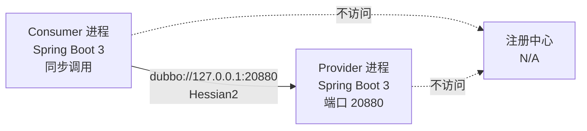
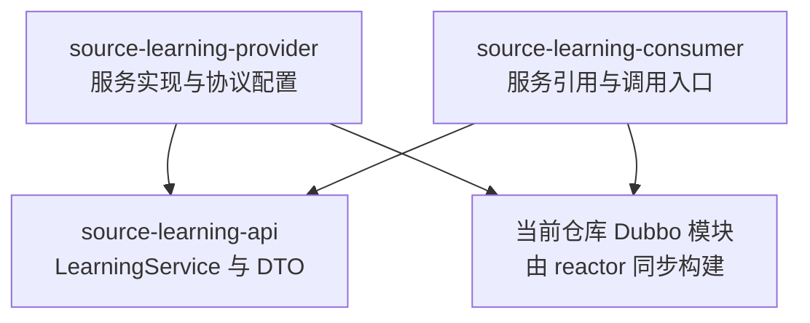
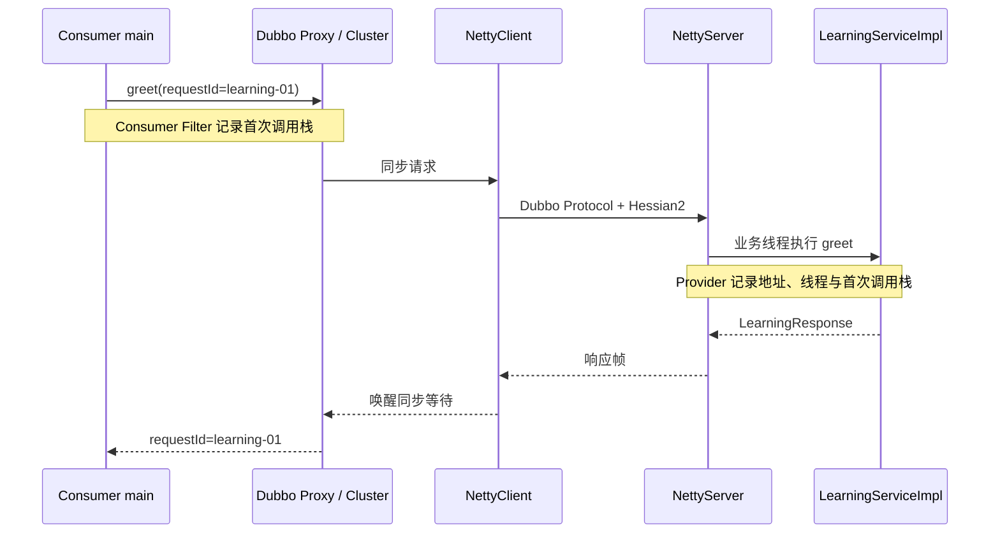

# 阶段 0：稳定基线与最小直连实验

> 阶段方案：[稳定基线与实验台](../phases/00-baseline-and-lab.md)
> 运行证据：[首次直连 RPC 运行记录](evidence/00-direct-rpc-runtime.md)
> 验收门禁：G0

## 1. 本阶段结论

阶段 0 已建立一套可重复运行、可设置断点、可关联双端日志的最小 RPC 实验：

- Provider 和 Consumer 是两个独立的 Spring Boot 3 进程。
- Consumer 通过 `dubbo://127.0.0.1:20880` 直连 Provider，不使用注册中心。
- 传输协议固定为 Dubbo Protocol，序列化固定为 Hessian2。
- 每次请求都携带 `requestId`，可在 Consumer 发送、Provider 接收和 Consumer 响应三处对应。
- Consumer 与 Provider 分别记录首次调用栈，后续阶段可在同一实验上继续放大调用链。
- 运行时输出 `dubboVersion=3.3.6` 与构建时仓库 commit，证明实验加载的是当前 reactor 构建出的 Dubbo 模块。

实测连续三次请求全部成功：

| requestId | 请求参数 | Provider | 响应 |
|---|---|---|---|
| `learning-01` | `Dubbo-1` | `provider-20880` | `你好，Dubbo-1` |
| `learning-02` | `Dubbo-2` | `provider-20880` | `你好，Dubbo-2` |
| `learning-03` | `Dubbo-3` | `provider-20880` | `你好，Dubbo-3` |

## 2. 固定基线

本次验证时间为 2026-07-26，环境如下：

| 项目 | 实际值 | 如何核对 |
|---|---|---|
| 稳定 tag | `dubbo-3.3.6` | `git rev-parse dubbo-3.3.6` |
| tag commit | `f1585880bee4ca7776f44380c47c994217721ffe` | 同上 |
| 学习分支 | `codex/learn-dubbo-source-3.3` | `git branch --show-current` |
| 本次构建前 HEAD | `b7868dbb56181bf04e3b0b6c11a77b25ffd2a951` | `git rev-parse HEAD` |
| JDK | `21.0.3` | `java -version` |
| Maven | `3.9.9` | `mvn -version` |
| Spring Boot | `3.5.0` | 根 POM 的 `spring-boot-3.version` |
| Dubbo | `3.3.6` | 根 POM 与运行日志 |
| 协议 | `dubbo` | `ProtocolConfig` 与服务导出 URL |
| 序列化 | `hessian2` | `ProtocolConfig`、直连 URL 与服务导出 URL |
| 注册中心 | `N/A` | `RegistryConfig.NO_AVAILABLE` 与运行日志 |
| Provider 端口 | `20880` | `ProtocolConfig` 与 Netty bind 日志 |

tag commit 是稳定源码起点；学习分支随后增加了路线文档，所以本次构建前 HEAD 晚于 tag。运行日志中的 `dubboCommit=b786...` 来自 reactor 构建出的 Dubbo 版本元数据，不是外部 Maven Central 制品的版本信息。

本机默认 `java` 是 JDK 8，因此所有构建和运行命令都显式使用 JDK 21。仓库的 `.mvn/wrapper/maven-wrapper.jar` 当前不存在，本次使用已安装的 Maven 3.9.9。

## 3. 实验结构

### 3.1 进程与网络拓扑



### 3.2 Maven 模块依赖



源码位于 `dubbo-demo/dubbo-demo-source-learning/`：

| 模块 | 关键入口 | 职责 |
|---|---|---|
| `source-learning-api` | `LearningService`、`LearningRequest`、`LearningResponse` | 定义跨进程契约与可序列化 DTO |
| `source-learning-provider` | `ProviderApplication`、`LearningServiceImpl` | 暴露服务、固定协议与端口、记录 Provider 证据 |
| `source-learning-consumer` | `ConsumerApplication`、`LearningClient` | 建立直连引用、发起三次同步调用、校验响应 |
| `source-learning-consumer` | `LearningConsumerStackFilter` | 在 Consumer Filter 链入口记录首次调用栈 |

## 4. 为什么选择这些配置

### 4.1 直连与禁用注册中心

Provider 和 Consumer 都显式创建：

```java
new RegistryConfig(RegistryConfig.NO_AVAILABLE)
```

Consumer 引用则显式指定：

```text
dubbo://127.0.0.1:20880?serialization=hessian2
```

这样可以先研究单条 RPC 链路，避免注册、订阅、地址刷新和服务发现同时进入调用现场。Nacos 会在阶段 7 单独接入。

### 4.2 固定超时与重试

Consumer 的 `@DubboReference` 固定 `timeout=3000`、`retries=0`、`check=true`：

- `timeout=3000` 让失败等待时间可预测。
- `retries=0` 保证一次业务调用只对应一次 Provider 调用，避免重试干扰栈与日志。
- `check=true` 让 Provider 不可用时在引用初始化阶段立即失败。

### 4.3 Spring Boot 3 的最小接入方式

本阶段使用 Spring Boot 3 作为进程与 Spring 容器，Dubbo 侧直接依赖 `dubbo-config-spring6`，并通过 `@EnableDubbo` 与显式 Java Bean 配置启动。

没有使用 `dubbo-spring-boot-starter`：当前仓库在启用 `spring-boot-3` profile 构建该 starter 时，既有 `dubbo-spring-boot` 模块仍包含 `javax.servlet` 引用，而 Spring Boot 3 提供的是 Jakarta Servlet API。阶段 0 的目标是建立最小 RPC 实验，因此先绕开自动配置层；starter、属性绑定与自动配置生命周期留到阶段 6 专门研究。

### 4.4 Provider 为什么需要显式等待

两个应用都配置为非 Web 应用。Provider 的 Netty 工作线程是 daemon，若 `main` 在 Spring 容器启动后直接返回，JVM 没有非 daemon 线程时会自然退出。因此 Provider 在输出基线后使用 `CountDownLatch.await()` 保持主线程存活；收到 `Ctrl+C` 后仍由 Spring 与 Dubbo shutdown hook 完成服务下线和资源释放。

这个现象说明：Spring 容器启动完成、Dubbo 服务导出完成和 JVM 进程持续存活是三个相关但不等价的生命周期事件。

## 5. 构建与运行

以下命令从仓库根目录执行。若本机默认 JDK 不是 21，先显式设置：

```bash
export JAVA_HOME=/Users/pancras/Office/jdk-21.0.3.jdk/Contents/Home
export PATH="$JAVA_HOME/bin:$PATH"
```

### 5.1 构建当前仓库源码和实验模块

```bash
mvn \
  -pl :source-learning-api,:source-learning-provider,:source-learning-consumer \
  -am \
  -Dmaven.test.skip=true \
  -Dcheckstyle.skip=true \
  -Dspotless.check.skip=true \
  package
```

`-am` 会把实验所依赖的当前仓库 Dubbo 模块一并加入 reactor。2026-07-26 实测 reactor 共构建 57 个模块，结果为 `BUILD SUCCESS`。

跳过测试与格式检查仅用于第一次快速构建；G0 最终验收仍单独执行实验模块的格式检查和完整直连运行。

### 5.2 启动 Provider

在终端 A 执行：

```bash
cd dubbo-demo/dubbo-demo-source-learning/source-learning-provider
java -jar target/source-learning-provider-3.3.6.jar
```

看到以下标记后再启动 Consumer：

```text
Start NettyServer bind /0.0.0.0:20880
LEARNING_BASELINE role=provider javaVersion=21.0.3 dubboVersion=3.3.6
```

### 5.3 启动 Consumer 并发起调用

在终端 B 执行：

```bash
cd dubbo-demo/dubbo-demo-source-learning/source-learning-consumer
java -jar target/source-learning-consumer-3.3.6.jar
```

Consumer 启动后自动连续调用三次，完成校验后自行关闭。成功结束标记为：

```text
LEARNING_CALLS_COMPLETE count=3
```

### 5.4 停止 Provider

在终端 A 输入 `Ctrl+C`。正常关闭会依次出现：

```text
Closing dubbo server
Close NettyServer bind /0.0.0.0:20880
Unexport service
Close all registries []
Dubbo is completely destroyed
```

## 6. 一次请求发生了什么



本阶段只确认这条路径真实存在，不急于解释每个内部对象。调用栈已经暴露出后续阶段需要回答的问题：

- 为什么业务接口会变成 `LearningServiceDubboProxy0`？
- `FilterChainBuilder` 如何组装 Consumer 和 Provider 两侧过滤器？
- `FailoverClusterInvoker` 在 `retries=0` 时仍承担什么职责？
- `DubboProtocol$1.reply` 如何把网络请求交给业务 `Invoker`？
- `HeaderExchangeHandler`、`DecodeHandler` 与线程池切换分别处在哪一层？

这些问题分别交给阶段 2、3、4、5 和 8，不在阶段 0 提前展开。

## 7. 日志关联方法

只筛选 `LEARNING_` 标记即可得到最小业务证据：

```text
Consumer: LEARNING_CONSUMER_SEND    requestId=learning-01
Provider: LEARNING_PROVIDER_RECEIVE requestId=learning-01
Consumer: LEARNING_CONSUMER_RECEIVE requestId=learning-01
```

三个位置都带同一个 `requestId`；Provider 还输出 `providerId`、业务线程、远端地址和本地地址。Consumer 收到响应后会主动校验：

- 响应 `requestId` 必须与请求一致；
- `providerId` 必须非空；
- 任一校验失败都会抛出异常，进程不会输出 `LEARNING_CALLS_COMPLETE`。

完整的首次 Consumer 栈、Provider 栈和关键运行日志保存在[运行证据](evidence/00-direct-rpc-runtime.md)，避免主笔记被长日志淹没。

## 8. G0 验收结果

| 验收项 | 结果 | 证据 |
|---|---|---|
| 指定 tag 和学习分支 | 通过 | 基线表中的 tag、commit、branch |
| JDK 21 与 Maven 已记录 | 通过 | JDK 21.0.3、Maven 3.9.9 |
| 使用当前仓库构建产物 | 通过 | `-am` reactor 构建成功；运行输出当前 HEAD commit |
| Provider 和 Consumer 独立启动、停止 | 通过 | 两个可执行 JAR；Consumer 自行关闭；Provider `Ctrl+C` 优雅下线 |
| 连续调用稳定且可关联 | 通过 | 三次请求全部成功，双端 `requestId` 一致 |
| Dubbo Protocol + Hessian2 | 通过 | 配置、导出 URL 与直连 URL 三处一致 |
| 不依赖注册中心 | 通过 | `address=N/A`；关闭日志为 `Close all registries []` |
| 新开发者可复现 | 通过 | 本文给出环境、构建、启动、调用和停止命令 |

G0 通过。阶段 1 可以直接复用这套实验建立模块地图；阶段 2 可以复用已保存的真实调用栈绘制一次同步 RPC 全景。
