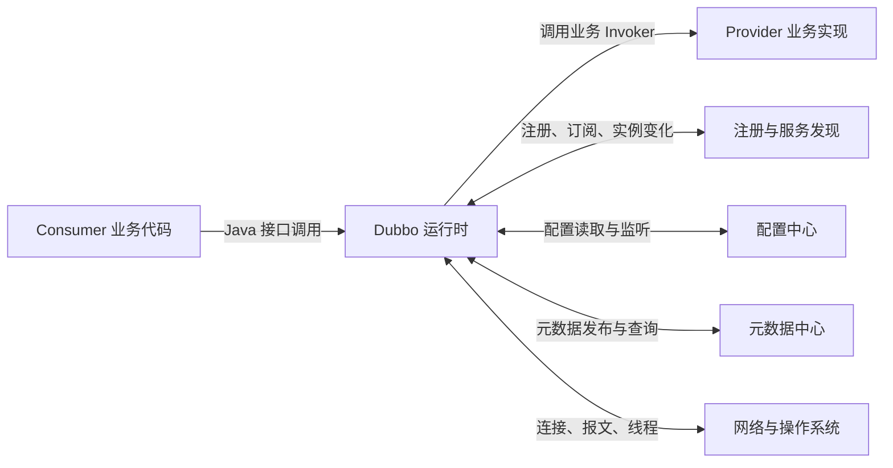
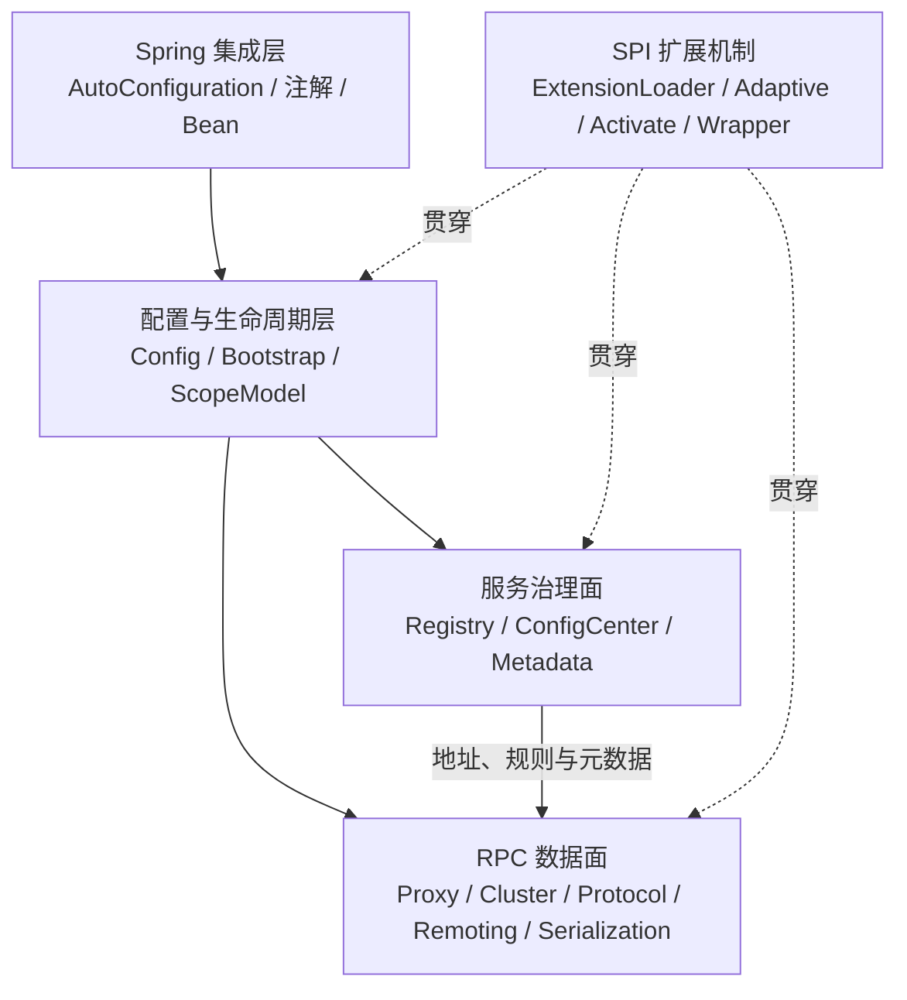
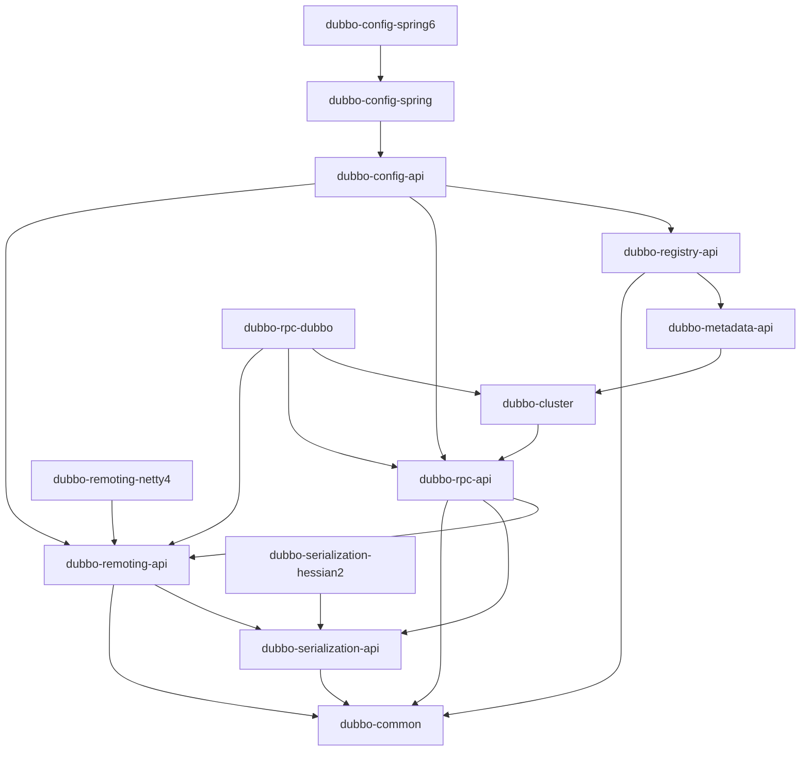
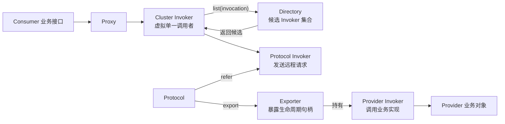
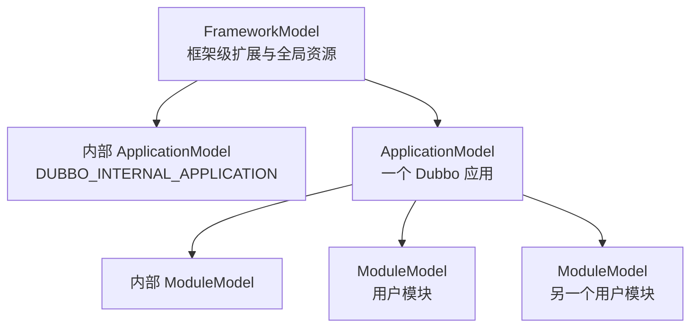

# 阶段 1：Dubbo 全局架构与模块地图

> 阶段方案：[全局架构与模块地图](../phases/01-architecture-map.md)
> 源码与 POM 证据：[模块依赖和调用栈映射](evidence/01-pom-and-stack-map.md)
> 适用版本：Apache Dubbo 3.3.6，核心源码检查基于 commit `b7868dbb56181bf04e3b0b6c11a77b25ffd2a951`
> 验收门禁：G1

## 1. 先给结论

理解 Dubbo 3.3.6，最有效的第一张地图不是根目录清单，而是三张相互校正的地图：

1. **Maven 模块地图**说明代码被放在哪里、编译时依赖谁。
2. **运行时对象地图**说明 Proxy、Invoker、Directory、Protocol、Exporter 等对象如何协作。
3. **请求穿行地图**说明一次真实调用实际经过哪些模块。

三张地图不能互相替代。根 POM 的模块顺序不是调用顺序，Java package 也不总能准确反映 Maven 模块。例如：

- `dubbo-configcenter` 聚合具体配置中心实现，但 `DynamicConfiguration` 接口位于 `dubbo-common`。
- `FilterChainBuilder` 的 package 是 `org.apache.dubbo.rpc.cluster.filter`，源码却位于 `dubbo-cluster`。
- `FutureFilter` 的 package 包含 `protocol.dubbo`，源码却位于 `dubbo-rpc-api`。
- Spring Boot 自动配置位于 `dubbo-spring-boot-project`，而承接 Spring Bean 生命周期的 `ServiceBean`、`ReferenceBean` 位于 `dubbo-config-spring`。

因此，遇到问题时应先判断它属于哪种运行时职责，再用模块表和类索引定位源码，不能只凭类名或目录名猜测。

## 2. 系统上下文



Dubbo 对业务暴露 Java 接口，对基础设施使用注册、配置、元数据和网络协议。框架内部用一组稳定抽象把两侧隔开：业务代码不需要直接操作 Netty，网络层也不需要理解业务实现对象。

## 3. 五个教学视角

以下分组用于学习导航，不是 Dubbo 官方模块名称。



### 3.1 数据面与治理面的区别

**数据面**处理一次请求本身：把方法调用变为 `Invocation`，选择 Provider，经协议、编解码和网络发送，在 Provider 侧执行，再把 `Result` 返回。

**治理面**改变数据面所使用的状态和策略：服务地址、路由规则、动态配置、元数据、迁移状态。治理面通常在启动或变化事件发生时工作，而不是为每个请求重新访问 Nacos。

阶段 0 的直连实验几乎只运行数据面：Consumer URL 已经给出唯一 Provider，`RegistryConfig` 为 `N/A`。即使没有注册中心，Proxy、Cluster、Protocol、Remoting 和 Serialization 仍能完成 RPC；这证明服务治理是可插入的数据来源，不是远程调用语义本身。

### 3.2 配置与生命周期不是数据面

`ServiceConfig`、`ReferenceConfig`、`DubboBootstrap` 和各级 Deployer 负责创建、启动和销毁运行时对象。对象创建完成后，一次普通业务调用主要在已经构造好的 Proxy、Invoker、Filter、Protocol Client 和 Server 上运行。

这也是为什么学习路线先观察调用，再反向研究对象来源：两条链路相关，但不是同一条链路。

## 4. Maven 模块地图

稳定基线的根 POM 直接聚合 54 个模块项；当前学习工作树增加 `dubbo-demo-source-learning` 后为 55 个。部分聚合模块还会继续展开子模块，所以根条目数不等于一次 `-am` 构建的 reactor 模块数。

### 4.1 十个重点区域

| 区域 | 形态 | 核心职责 | 明确边界 | 第一批代表类 |
|---|---|---|---|---|
| `dubbo-common` | JAR | URL、SPI、ScopeModel、通用工具与基础资源 | 不实现具体 RPC 协议 | `URL`、`ExtensionLoader`、`FrameworkModel`、`ApplicationModel`、`ModuleModel` |
| `dubbo-config` | POM 聚合器 | 配置对象、应用/模块部署、Spring 配置桥接 | 不负责请求报文传输 | `DubboBootstrap`、`ServiceConfig`、`ReferenceConfig`、`DefaultApplicationDeployer`、`DefaultModuleDeployer` |
| `dubbo-rpc` | POM 聚合器 | RPC 核心抽象与具体 Protocol | 不负责注册中心的地址来源 | `Invoker`、`Invocation`、`Result`、`Protocol`、`Exporter`、`ProxyFactory`、`DubboProtocol` |
| `dubbo-cluster` | JAR | Directory、Router、LoadBalance、容错与 Filter 链 | 不直接实现网络连接 | `Directory`、`Cluster`、`Router`、`LoadBalance`、`AbstractClusterInvoker`、`FailoverClusterInvoker` |
| `dubbo-remoting` | POM 聚合器 | Channel、Client/Server、Exchange、Transport 与线程派发 | 不理解业务接口语义 | `Channel`、`Client`、`RemotingServer`、`ExchangeClient`、`ExchangeServer`、`HeaderExchangeHandler`、`NettyServer` |
| `dubbo-serialization` | POM 聚合器 | 序列化 API 和具体实现 | 不负责选择 Provider 或建立连接 | `Serialization`、`ObjectInput`、`ObjectOutput`、`Hessian2Serialization` |
| `dubbo-registry` | POM 聚合器 | 接口级注册订阅、应用级服务发现、地址到 Directory | 不负责配置中心和业务报文 | `Registry`、`RegistryProtocol`、`RegistryDirectory`、`ServiceDiscovery`、`ServiceDiscoveryRegistry`、`NacosServiceDiscovery` |
| `dubbo-configcenter` | POM 聚合器 | Nacos、ZooKeeper、Apollo、File 等动态配置实现 | 核心 `DynamicConfiguration` 接口在 `dubbo-common` | `NacosDynamicConfiguration`、`ZookeeperDynamicConfiguration`、`ApolloDynamicConfiguration` |
| `dubbo-metadata` | POM 聚合器 | 服务定义、应用元数据、元数据报告与远端元数据 | 不等同于注册中心地址列表 | `MetadataInfo`、`MetadataService`、`MetadataReport`、`NacosMetadataReport` |
| `dubbo-spring-boot-project` | 根 POM 分别聚合 | Spring Boot 自动配置、starter、actuator 与兼容层 | 核心 Spring Bean 桥接仍在 `dubbo-config-spring` | `DubboAutoConfiguration`、`DubboRelaxedBindingAutoConfiguration`、`ServiceBean`、`ReferenceBean` |

具体源码路径、子模块清单和 POM 依赖证据见[证据附件](evidence/01-pom-and-stack-map.md)。

### 4.2 来自真实 POM 的主依赖方向

下图只保留重点模块的 compile 依赖，箭头表示“左侧依赖右侧”，不是请求调用方向：



从这张图可以得到三个结论：

- `dubbo-common` 是基础内核，但不是“只有工具类”；`URL`、SPI 和 ScopeModel 都在这里。
- `dubbo-config-api` 是组合入口，编译依赖会跨越 Registry、Metadata、RPC 和 Remoting，因此 Maven 图不是整齐的单向经典分层。
- 具体实现通常依赖稳定 API：Netty4 依赖 Remoting API，Hessian2 依赖 Serialization API，Dubbo Protocol 依赖 RPC、Cluster 与 Remoting API。

测试 scope 的依赖没有画入主图。例如 `dubbo-rpc-dubbo` 对 Netty4 和 Hessian2 的 POM 依赖是测试 scope，实际应用必须显式带入 transporter 和 serialization 实现；阶段 0 的 provider/consumer POM 正是这样做的。

## 5. 运行时核心对象地图

### 5.1 为什么 Invoker 是统一调用语义

`Invoker<T>` 的核心方法只有：

```java
Class<T> getInterface();
Result invoke(Invocation invocation) throws RpcException;
```

它足够小，所以不同角色都可以表现为“可调用对象”：

- Consumer 代理最终把 Java 方法调用交给一个 `Invoker`。
- `Cluster.join(Directory)` 把多个候选 Provider 包装成一个虚拟 `Invoker`。
- `Protocol.refer` 返回负责发送远程请求的 `Invoker`。
- Provider 侧 `ProxyFactory.getInvoker` 把业务实现包装成 `Invoker`。
- Filter、Listener、Metrics 和治理包装器继续用 `Invoker` 接口装饰前后两端。

因此框架的大量横切能力不需要知道下游究竟是 Cluster、远程协议还是本地业务对象，只需要继续调用 `invoke`。

### 5.2 Invoker、Directory、Protocol、Exporter 的关系



关键区别：

- `Directory` 不是 `Invoker`，它按当前 `Invocation` 提供候选 `Invoker` 列表。
- `Cluster` 本身也不是一次请求对象；`join` 后得到的 Cluster Invoker 才进入调用链。
- `Protocol.refer` 创建 Consumer 侧协议 Invoker，`Protocol.export` 接收 Provider 侧 Invoker。
- `Exporter` 不是业务调用入口，而是持有 Provider Invoker、执行 `unexport/register/unregister` 的生命周期句柄。

### 5.3 ProxyFactory 是两侧的对称转换器

```text
Consumer：Invoker --ProxyFactory.getProxy--> 业务接口 Proxy
Provider：业务实现 --ProxyFactory.getInvoker--> Invoker
```

这组对称转换把 Java 对象模型接到统一的 Invoker 模型上。`Protocol` 明确不关心透明代理，它只处理 Invoker 的暴露和引用。

## 6. 核心概念词典（第一版）

| 概念 | 一句话定义 | 主要内容/职责 | 常见误解 |
|---|---|---|---|
| `URL` | Dubbo 的结构化地址、配置参数和扩展决策上下文 | protocol、host、port、path、parameters，以及本地 attributes 中的 ScopeModel/ServiceModel | 不只是网络地址，也不能把所有参数都当成会传输的字符串 |
| `Invocation` | 一次方法调用的运行时描述 | 服务、方法名、参数类型、参数值、attachments、当前 Invoker、已调用 Invoker | 不是 Java 反射的 `Method`，也不是网络报文本身 |
| `Result` | 一次 RPC 的值、异常、attachments 与完成状态 | 同时兼容同步取值和异步完成 | `Result` 存在不代表业务成功，仍需检查异常 |
| `Invoker<T>` | 可用统一语义执行 `Invocation` 的对象 | 接口、URL、可用性、生命周期、`invoke` | 不等于 Provider；Consumer Cluster 和 Protocol 也都是 Invoker |
| `Directory<T>` | 根据调用返回候选 Provider Invoker 的动态目录 | 地址集合、RouterChain、失效/禁用状态 | 不是负载均衡器，也不是一个可直接调用的 Invoker |
| `Cluster` | 将 Directory 聚合为容错型虚拟 Invoker 的 SPI | failover 等策略的入口，构建 Cluster Invoker | 不直接保存所有注册中心数据 |
| `Router` | 在候选集合上应用路由规则 | 标签、条件、脚本等规则过滤 | 不负责真正发起网络请求 |
| `LoadBalance` | 从路由后的候选集合选择一个 Invoker | random 等选择算法 | 不负责失败重试；重试属于 Cluster 容错 |
| `Protocol` | 隔离远程调用协议细节的 SPI | `export`、`refer`、默认端口、server 生命周期 | Protocol 不必然等于 TCP；`injvm` 也是 Protocol |
| `Exporter<T>` | 一次服务暴露的生命周期句柄 | 持有 Provider Invoker，支持 unexport/register/unregister | 不是网络 Server，也不是序列化器 |
| `ProxyFactory` | 在业务对象/接口与 Invoker 之间双向转换 | `getProxy`、`getInvoker` | 代理生成与远程传输是两层职责 |
| `ScopeModel` | 隔离扩展、Bean、环境和生命周期资源的层级容器 | Framework、Application、Module 三层模型 | 不是 Maven module，也不等于 Spring ApplicationContext |

## 7. URL 为什么贯穿框架

3.3.6 的 `URL` 内部把信息分成三部分：

- `URLAddress`：protocol、host、port、path 等地址结构。
- `URLParam`：字符串参数，例如 `serialization=hessian2`、`timeout=3000`。
- attributes：本地对象属性，例如 `ScopeModel` 和 `ServiceModel`。

SPI 的 Adaptive 方法可以读取 URL 选择扩展：

- `Protocol` 根据协议选择 `dubbo`、`injvm` 等实现。
- `ProxyFactory` 根据 `proxy` 参数选择 Javassist 等实现。
- `LoadBalance` 根据 `loadbalance` 参数选择算法。

所以 URL 同时回答“去哪里”“以什么参数运行”“在哪个作用域选择扩展”。它是框架内部的决策上下文，不只是 `java.net.URL` 的替代品。

需要注意：`addParameter` 等方法会返回带新 `URLParam` 的 URL，但 attributes 承载本地运行对象。学习时应区分可字符串化的协议参数和仅本地有效的对象属性。

## 8. ScopeModel 如何隔离运行时资源



每个 `ScopeModel` 都关联：

- `ExtensionDirector`：按扩展作用域查找和缓存 SPI。
- `ScopeBeanFactory`：保存当前作用域的框架 Bean。
- classloader 集合、attributes 和 destroy listeners。
- parent 与 `ExtensionScope`，构成 Framework → Application → Module 层次。

阶段 0 启动日志已经观察到这一结构：

```text
Dubbo Framework[1]
Dubbo Application[1.0](DUBBO_INTERNAL_APPLICATION)
Dubbo Application[1.1](source-learning-provider/consumer)
Dubbo Module[1.1.0]（内部模块）
Dubbo Module[1.1.1]（绑定 Spring 容器的用户模块）
```

关闭 Provider 时，Module、Application、Framework 按层销毁，最后释放全局资源。这是 ScopeModel 生命周期的运行证据。

## 9. 阶段 0 调用栈如何穿过模块

### 9.1 Consumer 主路径

```text
学习实验模块
→ dubbo-config-spring（LazyTargetInvocationHandler）
→ dubbo-rpc-api（生成 Proxy、InvokerInvocationHandler）
→ dubbo-cluster（Filter、Router、Failover、Cluster Invoker）
→ dubbo-rpc-dubbo / dubbo-remoting（栈采集点之后继续下行）
→ Netty4 → Hessian2 → 网络
```

### 9.2 Provider 主路径

```text
dubbo-remoting-api（Decode、Exchange、线程派发）
→ dubbo-rpc-dubbo（DubboProtocol.reply、TraceFilter）
→ dubbo-rpc-api / dubbo-cluster（Provider Filter 链与 Proxy Invoker）
→ dubbo-config-api（Provider 元数据包装）
→ 学习实验模块（LearningServiceImpl）
```

实际栈还出现 `dubbo-metrics-default`、`dubbo-tracing` 和 `dubbo-rpc-triple` 的 activated filter。它们是插件/横切层，不改变本阶段关注的主骨架。完整逐帧模块映射见[证据附件](evidence/01-pom-and-stack-map.md)。

## 10. Maven 边界与运行时边界为什么不同

| 现象 | 原因 | 阅读策略 |
|---|---|---|
| 一个运行时对象跨多个模块包装 | SPI、Decorator 和 Filter 组合运行 | 沿 `Invoker` 实际类型和调用栈追踪，不只看接口模块 |
| 一个 Maven 模块包含多个运行时层次 | 代码历史、复用和发布粒度不同 | 把 Maven 模块当源码定位单元，不当严格架构层 |
| 聚合 POM 本身没有运行时代码 | 它只组织子模块和 profile | 继续进入 `*-api`、具体实现或 Spring 子模块 |
| package 与模块名不一致 | package 表达 Java 语义，模块表达构建发布边界 | 用 `rg --files` 或类索引确认真实路径 |
| 没使用的协议 Filter 出现在栈中 | 依赖带入扩展，`@Activate` 组装横切链 | 先标记为插件边界，阶段 8 再解释激活规则 |

## 11. 问题导航表

| 问题类型 | 优先模块 | 第一入口 | 下一步候选 |
|---|---|---|---|
| SPI 找不到、选错实现、Wrapper 顺序 | `dubbo-common` | `ExtensionLoader`、`ExtensionDirector` | 扩展资源文件、`@SPI`、`@Adaptive`、`@Activate` |
| 应用启动、重复模型、关闭不完整 | `dubbo-config-api`、`dubbo-common` | `DubboBootstrap`、各级 Deployer、`ScopeModel` | Framework/Application/Module 日志 |
| Consumer 注入的接口如何变成代理 | `dubbo-config-spring`、`dubbo-rpc-api` | `ReferenceBean`、`ReferenceConfig`、`ProxyFactory` | `InvokerInvocationHandler` |
| Provider 注解如何变成可调用服务 | `dubbo-config-spring`、`dubbo-config-api` | `ServiceBean`、`ServiceConfig` | `ProxyFactory.getInvoker`、`Protocol.export` |
| 无 Provider、地址不刷新 | `dubbo-registry-api`、`dubbo-cluster` | `RegistryDirectory`、`ServiceDiscoveryRegistry` | `Directory.getAllInvokers`、监听器 |
| 路由后没有候选 | `dubbo-cluster` | `Directory.list`、`RouterChain` | Router 规则和快照 |
| 选错 Provider、负载不均 | `dubbo-cluster` | `AbstractClusterInvoker`、`LoadBalance` | 候选列表、权重、warmup |
| 重试次数或异常传播不符预期 | `dubbo-cluster` | `FailoverClusterInvoker` | retries、已调用 Invoker、异常分类 |
| 端口占用、连接失败、线程切换 | `dubbo-rpc-dubbo`、`dubbo-remoting-*` | `DubboProtocol`、`HeaderExchangeHandler`、`NettyServer` | Channel、Dispatcher、线程池 |
| 参数无法序列化或反序列化 | `dubbo-serialization-*`、`dubbo-rpc-dubbo` | `Serialization`、`Hessian2Serialization`、`DubboCodec` | 序列化 ID、allowlist、DTO |
| Spring Boot 属性未生效 | `dubbo-spring-boot-autoconfigure`、`dubbo-config-spring` | `DubboAutoConfiguration`、`DubboConfigConfiguration` | relaxed binding、Bean post-processor |
| Nacos 注册、配置、元数据混淆 | `dubbo-registry-nacos`、`dubbo-configcenter-nacos`、`dubbo-metadata-report-nacos` | 三个 Nacos 实现分别定位 | 不要从一个 Nacos client 调用推断三条链路相同 |

## 12. 代表类快速索引

- 基础内核：[URL](../../../dubbo-common/src/main/java/org/apache/dubbo/common/URL.java)、[ExtensionLoader](../../../dubbo-common/src/main/java/org/apache/dubbo/common/extension/ExtensionLoader.java)、[ScopeModel](../../../dubbo-common/src/main/java/org/apache/dubbo/rpc/model/ScopeModel.java)
- 配置生命周期：[DubboBootstrap](../../../dubbo-config/dubbo-config-api/src/main/java/org/apache/dubbo/config/bootstrap/DubboBootstrap.java)、[ServiceConfig](../../../dubbo-config/dubbo-config-api/src/main/java/org/apache/dubbo/config/ServiceConfig.java)、[ReferenceConfig](../../../dubbo-config/dubbo-config-api/src/main/java/org/apache/dubbo/config/ReferenceConfig.java)
- RPC 抽象：[Invoker](../../../dubbo-rpc/dubbo-rpc-api/src/main/java/org/apache/dubbo/rpc/Invoker.java)、[Protocol](../../../dubbo-rpc/dubbo-rpc-api/src/main/java/org/apache/dubbo/rpc/Protocol.java)、[ProxyFactory](../../../dubbo-rpc/dubbo-rpc-api/src/main/java/org/apache/dubbo/rpc/ProxyFactory.java)
- 集群治理：[Directory](../../../dubbo-cluster/src/main/java/org/apache/dubbo/rpc/cluster/Directory.java)、[Cluster](../../../dubbo-cluster/src/main/java/org/apache/dubbo/rpc/cluster/Cluster.java)、[LoadBalance](../../../dubbo-cluster/src/main/java/org/apache/dubbo/rpc/cluster/LoadBalance.java)
- 网络交换：[Channel](../../../dubbo-remoting/dubbo-remoting-api/src/main/java/org/apache/dubbo/remoting/Channel.java)、[ExchangeClient](../../../dubbo-remoting/dubbo-remoting-api/src/main/java/org/apache/dubbo/remoting/exchange/ExchangeClient.java)、[HeaderExchangeHandler](../../../dubbo-remoting/dubbo-remoting-api/src/main/java/org/apache/dubbo/remoting/exchange/support/header/HeaderExchangeHandler.java)
- Spring 集成：[DubboAutoConfiguration](../../../dubbo-spring-boot-project/dubbo-spring-boot-autoconfigure/src/main/java/org/apache/dubbo/spring/boot/autoconfigure/DubboAutoConfiguration.java)、[ServiceBean](../../../dubbo-config/dubbo-config-spring/src/main/java/org/apache/dubbo/config/spring/ServiceBean.java)、[ReferenceBean](../../../dubbo-config/dubbo-config-spring/src/main/java/org/apache/dubbo/config/spring/ReferenceBean.java)

其他代表类及其精确模块归属见[完整索引](evidence/01-pom-and-stack-map.md#3-重点模块与代表类索引)。

## 13. 容易混淆的边界

1. **Maven module ≠ ModuleModel**：前者是构建单元，后者是运行时作用域。
2. **Directory ≠ Registry**：Registry 提供地址变化，Directory 保存并按调用暴露候选 Invoker。
3. **Protocol ≠ Transport**：Protocol 定义 RPC 暴露/引用语义，Transport 负责连接和收发。
4. **Exporter ≠ Server**：Exporter 管一个服务的暴露生命周期，Server 管监听端口和连接。
5. **URL parameters ≠ attributes**：前者是字符串配置，后者可关联本地 ScopeModel 等对象。
6. **Result ≠ 成功值**：它也可能携带异常。
7. **Spring Boot 自动配置 ≠ Dubbo 全部生命周期**：自动配置注册 Bean，真正部署还会进入 config/deployer/model。
8. **Nacos 是一个产品 ≠ 三中心是一条源码链**：注册、配置、元数据分别有实现模块和接口。

## 14. G1 验收结果

| 验收项 | 结果 | 证据 |
|---|---|---|
| 所有重点模块都有职责、边界和代表类 | 通过 | 十区域模块表与完整类索引 |
| 依赖图来自真实 POM | 通过 | 逐 POM 提取的 compile 依赖与 scope 记录 |
| 阶段 0 栈帧映射到模块 | 通过 | Consumer/Provider 逐帧分组表 |
| 能解释数据面与治理面 | 通过 | 五视角架构图及直连实验对照 |
| 能解释四个核心对象关系 | 通过 | Invoker/Directory/Protocol/Exporter 关系图 |
| 能快速按问题定位入口 | 通过 | 问题导航表与源码链接 |

G1 通过。阶段 2 可以使用本章的对象关系与模块穿行图，把阶段 0 的两段局部栈扩展为一次同步 RPC 的端到端全景。
