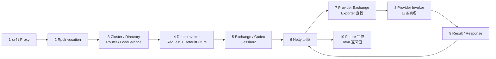
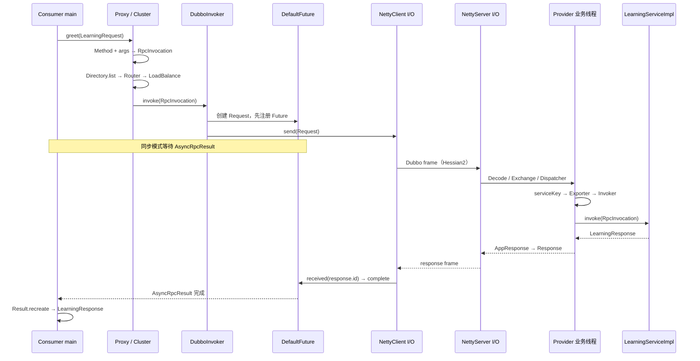
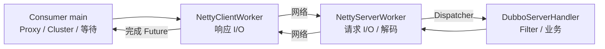

# 阶段 2：一次同步 RPC 调用全景

> 阶段方案：[一次同步 RPC 调用全景](../phases/02-rpc-overview.md)
> 证据与断点：[端到端源码锚点和复合调用链](evidence/02-end-to-end-call-chain.md)
> 运行基线：[阶段 0 直连实验](00-baseline-and-learning-guide.md)
> 适用版本：Apache Dubbo 3.3.6；质量门禁：G2

## 1. 先给结论

一次同步 Dubbo 调用，是“业务线程发起并等待、Netty 异步收发、Provider 业务线程执行、响应按 Request ID 完成 Future、Consumer 线程恢复”的组合流程。

```text
Method + args
→ RpcInvocation
→ Request(data=RpcInvocation, id=协议请求 ID)
→ Dubbo frame / Hessian2 bytes
→ Provider RpcInvocation
→ Result / AppResponse
→ Response(id=原协议请求 ID)
→ Consumer AppResponse
→ Java return value
```

## 2. RPC 全景导航图



阶段 3 放大 1～4；阶段 4 放大 4～10；阶段 5 反向解释这些运行时对象从哪里创建。

## 3. 端到端时序



## 4. Consumer：Method 如何进入 Invoker

`InvokerInvocationHandler.invoke` 为普通业务方法创建 `RpcInvocation`，记录 service model、方法名、接口名、protocol service key、参数类型和参数值。`InvocationUtil.invoke` 再设置目标 service key 与 Consumer URL，调用 `invoker.invoke`，最后用 `Result.recreate()` 还原业务返回值或抛出异常。

单 Provider 仍经过 Cluster，因为 Provider 数量只是运行时数据：

1. `AbstractClusterInvoker.invoke` 调用 `Directory.list(invocation)`。
2. 校验候选并初始化 LoadBalance。
3. `FailoverClusterInvoker.doInvoke` 选择下游 Invoker。
4. 阶段 0 的 `retries=0` 被计算为 `invokeTimes=0+1=1`，所以只执行一次。

Cluster 统一承载候选检查、路由、选择、上下文和容错语义，不因当前只有一个地址而消失。

## 5. Protocol：Invocation 如何进入网络

`DubboInvoker.doInvoke` 补充 path、version、timeout，选择 `ExchangeClient`，创建 two-way `Request`：

```text
Request
├── id：Request 内部 AtomicLong 生成
├── twoWay：true
├── version：Dubbo protocol version
└── data：RpcInvocation
```

`HeaderExchangeChannel.request` 的顺序是：

```text
DefaultFuture.newFuture(channel, request, timeout, executor)
→ channel.send(request)
→ return future
```

必须先保存 `request.id → DefaultFuture` 再发送，否则极速响应可能先于等待者注册。

### 两种 request ID

| ID | 生成者 | 用途 |
|---|---|---|
| `learning-01` | 学习实验 | 关联 Consumer、Provider 业务日志 |
| `Request.mId` | Dubbo remoting | 在 Consumer 内部匹配 `DefaultFuture` |

业务 ID 用于跨进程追踪；协议 ID 用于一次连接端点内的请求响应配对，二者不能互相替代。

## 6. Codec 与 Hessian2 边界

`DubboCodec.encodeRequestData` 依次写入 Dubbo version、service name/path、service version、method、参数类型描述、arguments 和 attachments。阶段 0 固定 `hessian2`，所以对象字段由 Hessian2 `ObjectOutput` 写入。

响应编码根据 `Result` 是否含异常、返回值是否为空写不同标志，再写 value/exception 和 attachments。Consumer 从协议 header 取得序列化 ID并构造 `DecodeableRpcResult`。

```text
Invocation → Request → Dubbo header/body → Hessian2 → Netty ByteBuf → socket
```

## 7. Provider：网络请求如何找到业务实现

阶段 0 观察到线程变化：

```text
NettyServerWorker-3-1
→ DubboServerHandler-10.220.80.142:20880-thread-2
```

`NettyServerHandler.channelRead` 把消息交给 handler 链；Exchange 与 Dispatcher 最终由 `ChannelEventRunnable` 在 Provider 业务线程继续执行。当前 Dubbo Protocol 开启线程池隔离时，请求 body 在 I/O 线程解码，而业务 Filter 和实现运行在 DubboServerHandler 线程。

`HeaderExchangeHandler.handleRequest` 用收到的 `req.id` 创建 `Response`，业务 `CompletionStage` 完成后写入 result 或 error 并发送。

`DubboProtocol.getInvoker` 用本地 port、path、version、group 计算 service key：

```text
serviceKey → exporterMap.get(key) → exporter.getInvoker()
```

找不到时会报 “Not found exported service”，通常检查接口、group、version 和端口。找到后经过 Provider Filter、`DelegateProviderMetaDataInvoker`、Javassist `AbstractProxyInvoker`，最终进入 `LearningServiceImpl.greet`。

## 8. 响应匹配与同步表象

Consumer 收到 Response 后：

```text
HeaderExchangeHandler.handleResponse
→ DefaultFuture.received(channel, response)
→ FUTURES.remove(response.id)
→ 取消 timeout task
→ complete(result) / completeExceptionally(error)
```

`DubboInvoker` 底层始终先构造 `CompletableFuture<AppResponse>` 和 `AsyncRpcResult`。`AbstractInvoker.waitForResultIfSync` 只在 `InvokeMode.SYNC` 时按 timeout 等待结果。

同步模式使用 `ThreadlessExecutor`：NettyClient I/O 线程接收响应并触发完成，等待中的 Consumer 业务线程通过 `waitAndDrain` 处理回调。因此阶段 0 的发送和业务接收日志都在 `main`，不代表网络没有异步线程。

“同步”描述调用者何时得到返回值，不代表网络、Future 和回调机制不存在。

## 9. 线程与关键边界



| 边界 | 对象变化 | 阶段 0 证据 |
|---|---|---|
| 代理边界 | Method/args → RpcInvocation | `LearningServiceDubboProxy0`、`InvokerInvocationHandler` |
| 序列化边界 | Java 对象 ↔ Hessian2 bytes | Consumer URL 与 Provider export URL |
| 网络边界 | Request/Response frame | 连接 `63351 → 20880` |
| Provider 线程边界 | NettyServerWorker → DubboServerHandler | Provider 首次调用日志 |
| 同步等待边界 | AsyncRpcResult → Java 返回值 | Consumer `main` 发送与接收 |

## 10. 稳定链与真实链的差异

稳定骨架是：

```text
Proxy → Invocation → Cluster/Directory → Protocol Invoker
→ Exchange/Transport/Codec → Provider Exporter/Invoker
→ Result → Future completion
```

真实栈还包含 Spring lazy proxy、`ScopeClusterInvoker`、`MockClusterInvoker`、两侧 Filter、Metrics、Tracing、Triple REST context，以及 Javassist 生成类。这些 Wrapper 扩展骨架，没有替代骨架。阶段 0 的栈在 Consumer Filter 和 Provider 业务入口采集，网络与响应部分由固定源码锚点补齐；详情见[复合调用链证据](evidence/02-end-to-end-call-chain.md)。

## 11. 第一版断点手册

按顺序设置方法断点：

1. `InvokerInvocationHandler.invoke`
2. `InvocationUtil.invoke`
3. `AbstractClusterInvoker.invoke`
4. `FailoverClusterInvoker.doInvoke`
5. `AbstractInvoker.invoke`、`DubboInvoker.doInvoke`
6. `HeaderExchangeChannel.request`、`DefaultFuture.newFuture`
7. `DubboCodec.encodeRequestData`、`DubboCodec.decodeBody`
8. `NettyServerHandler.channelRead`
9. `HeaderExchangeHandler.handleRequest`
10. `DubboProtocol.getInvoker`、request handler `reply`
11. `LearningServiceImpl.greet`
12. `HeaderExchangeHandler.handleResponse`
13. `DefaultFuture.received`、`DefaultFuture.doReceived`

记录线程、Request ID、method、service key、URL、attachments、Invoker 实际类型、Result value/exception。

## 12. G2 验收

| 验收项 | 结果 | 证据 |
|---|---|---|
| 关键节点有源码锚点 | 通过 | 断点手册与证据附件 |
| 真实栈与简化链差异已解释 | 通过 | Wrapper/Filter/生成类分组 |
| Invocation/Request/Result/Future 关系清晰 | 通过 | 对象转换和响应匹配 |
| 网络、序列化、线程边界明确 | 通过 | 线程图与边界表 |
| 未混淆创建过程与运行过程 | 通过 | 本章假定 Proxy/Invoker/Exporter 已存在 |

G2 通过。阶段 3 放大 Consumer 选择链，阶段 4 放大网络、编解码、线程和响应匹配。
