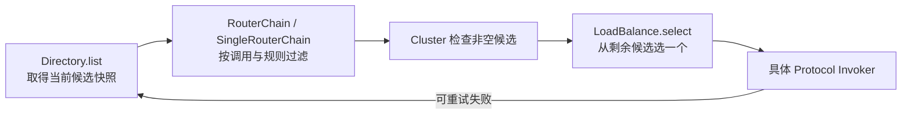
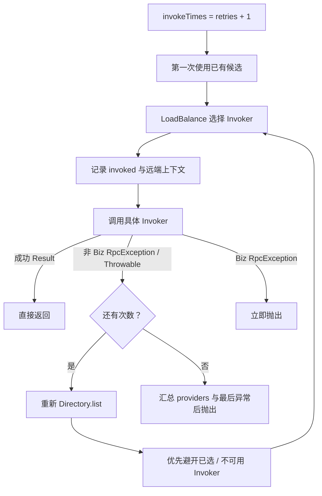

# 阶段 3：Consumer 调用链

> 阶段方案：[Consumer 调用链](../phases/03-consumer-invocation.md)
> 运行证据：[Invoker 选择与 Failover 实验](evidence/03-consumer-selection-and-failover.md)
> 上一阶段：[一次同步 RPC 调用全景](02-rpc-call-overview.md)
> 适用版本：Apache Dubbo 3.3.6；质量门禁：G3

## 1. 先给结论

Consumer 调用链不是“代理直接挑一个地址并发送”，而是两层职责不同的管道：

```text
业务代理
→ RpcInvocation
→ Cluster Filter（每次逻辑调用一次）
→ Directory / Router（得到本次候选集）
→ Failover + LoadBalance（选择、调用、失败后重列与重选）
→ Consumer Protocol Filter（每次具体 Provider 尝试一次）
→ DubboInvoker（进入协议与网络）
```

`Directory` 管候选，`Router` 按规则缩小候选，`LoadBalance` 在剩余候选中选一个，`Cluster` 决定失败后怎么办。它们都不负责真正的网络发送；最终由选中的 `DubboInvoker` 进入阶段 4。

## 2. 从接口方法到 Invoker

本实验实际调用栈的入口是：

```text
Spring Lazy Proxy
→ LearningServiceDubboProxy0.greet
→ InvokerInvocationHandler.invoke
→ InvocationUtil.invoke
→ ScopeClusterInvoker.invoke
```

`InvokerInvocationHandler` 构造时保存传入的 `Invoker`、Consumer URL 中的 `serviceModel` 与 `protocolServiceKey`。普通业务方法到来后，它创建 `RpcInvocation`；`Object` 方法、`toString`、`hashCode`、`equals` 和 `$destroy` 则走专门分支。

### 2.1 RpcInvocation 字段从哪里来

| 字段 | 来源 | 作用 |
|---|---|---|
| service model | `invoker.getUrl().getServiceModel()` | 关联 `ConsumerModel` |
| method name | `Method.getName()` | 路由、配置查找与远端分派 |
| service name | `invoker.getInterface().getName()` | 接口身份 |
| protocol service key | Consumer URL 的 `getProtocolServiceKey()` | 协议维度服务标识 |
| parameter types | `Method.getParameterTypes()` | 重载方法解析与序列化 |
| arguments | 代理收到的 `args` | 业务入参 |
| consumer/method model | `ConsumerModel` 与 `getMethodModel(method)` | 运行时模型和方法元数据 |
| target service unique name | `InvocationUtil` 从 URL `getServiceKey()` 设置 | 目标服务唯一名 |
| attachments | URL、`RpcContext`、Filter 和协议层逐步补充 | 跨层配置与上下文 |

`InvocationUtil.invoke` 在调用前保存原 `RpcContext` service context，设置目标 service key 与 Consumer URL，执行 `invoker.invoke(rpcInvocation).recreate()`，最后在 `finally` 恢复原 context。这里的 `recreate()` 是重要异常边界：异常也可能先作为 `Result` 穿过整个 Cluster，最后才在代理边界重新抛出。

## 3. 实际 Invoker 包装树

对两个直连地址运行反射快照后，得到的语义树如下。快照中的多个字段可能指向同一个对象，图中已合并重复引用：

```text
ScopeClusterInvoker
├── StaticDirectory
│   ├── ReferenceCountInvokerWrapper [127.0.0.1:20880]
│   │   └── Consumer protocol Filter chain
│   │       └── ListenerInvokerWrapper
│   │           └── DubboInvoker
│   └── ReferenceCountInvokerWrapper [127.0.0.1:20881]
│       └── Consumer protocol Filter chain
│           └── ListenerInvokerWrapper
│               └── DubboInvoker
└── MockClusterInvoker
    └── ClusterFilterInvoker
        └── Consumer cluster Filter chain
            └── FailoverClusterInvoker
                └── 同一个 StaticDirectory
```

几个容易误判的点：

- 代理持有的根不是裸 `DubboInvoker`，而是 `ScopeClusterInvoker`。
- 即使只有一个直连 Provider，只要没有启用 `unloadClusterRelated`，`ReferenceConfig` 仍会把它放进 `StaticDirectory` 再 `Cluster.join`。
- 两个直连 URL 会先各自 `protocol.refer` 成两个协议 Invoker，再由一个 `StaticDirectory` 汇总。
- `ScopeClusterInvoker`、Mock、Listener、引用计数和 Filter 都是 Wrapper；稳定骨架仍是 Cluster → Directory → Protocol Invoker。

## 4. 两条 Filter 链为什么必须分开看

`ProtocolFilterWrapper.refer` 在每个 `protocol.refer` 结果外构建 Consumer protocol Filter 链。`DefaultFilterChainBuilder.buildClusterInvokerChain` 则在整个 Cluster Invoker 外构建 Cluster Filter 链。两者都按扩展排序结果反向包裹，因此列表靠前的 Filter 运行时更外层、先进入。

本次运行得到的外到内顺序是：

| 层级 | 实际顺序 | 调用频率语义 |
|---|---|---|
| Cluster Filter | `ConsumerContextFilter` → `ObservationSenderFilter` → `ConsumerClassLoaderFilter` → `MetricsConsumerFilter` → `FutureFilter` → `MetricsClusterFilter` → `MonitorClusterFilter` → `RouterSnapshotFilter` | 一次逻辑 RPC 通常进入一次 |
| Cluster | `FailoverClusterInvoker` | 决定一次或多次 Provider 尝试 |
| Protocol Filter | `LearningConsumerStackFilter` → `RpcExceptionFilter` | 每次选中具体 Provider 都会进入 |
| Protocol | `ListenerInvokerWrapper` → `DubboInvoker` | 对具体地址发起一次协议调用 |

故障切换实验中，同一个 `requestId` 的 `LEARNING_CONSUMER_SELECTED` 出现两次，目标先是 `20880` 后是 `20881`，直接证明 protocol Filter 位于 Failover 循环内部。若把两类 Filter 混成一条列表，就无法正确推断重试时哪些逻辑会重复执行。

## 5. Directory、Router、LoadBalance 的筛选漏斗



### 5.1 Directory：候选视图，不是地址选择器

`AbstractDirectory.list` 在锁保护下克隆 `validInvokers` 或当前 `invokers`，为这次调用取得 `SingleRouterChain`，再交给 `doList`。返回前会检查空集合并输出路由快照，最终提供不可变的本次候选结果。

本实验使用 `StaticDirectory`：候选在创建引用时由直连 URL 固定写入；有 Router chain 时仍调用路由，没有则原样返回。`Static` 表示 Provider 列表不是由注册中心通知持续刷新，不表示“没有 Router”。

动态目录（如后续 Nacos 场景中的 `RegistryDirectory`）会根据注册中心通知增删或刷新 Invoker，但调用时同样通过 `Directory.list(invocation)` 暴露候选视图。这是阶段 3 和阶段 7 的交接边界。

### 5.2 Router：过滤，不负责最终挑一个

`RouterChain` 为路由规则维护当前链与备用链，刷新后原子切换；一次调用由 `SingleRouterChain.route` 依次执行 state router 与普通 router。输出仍可能有多个 Invoker，最终选择权属于 LoadBalance。

本次没有配置会排除节点的路由规则，所以两个直连 Invoker 均进入 LoadBalance。这个实验能证明 Router 位于链中，但不能证明某条生产路由规则的匹配效果；阶段 8 再构造标签或条件路由实验。

### 5.3 LoadBalance：只在需要选择时工作

`AbstractClusterInvoker.doSelect` 对一个候选直接返回，`AbstractLoadBalance.select` 自身也有同样的单候选短路。因此只有一个 Provider 时，不会进入具体负载均衡算法的 `doSelect`。

两个等权 Provider 使用 `roundrobin` 时，六次调用结果严格交替：

```text
learning-01 → 20880
learning-02 → 20881
learning-03 → 20880
learning-04 → 20881
learning-05 → 20880
learning-06 → 20881
```

`RoundRobinLoadBalance` 以 `serviceKey.method` 保存每个地址的平滑加权轮询状态。每轮给各地址的 current 加 weight，选 current 最大者，再从胜者减去 total weight。等权两节点因此在本次稳定候选顺序下交替命中；真实生产中权重、暖机、候选变化都会改变序列。

## 6. Failover：循环、重列与重选

`FailoverClusterInvoker.doInvoke` 的核心不是简单的 `for (retries)`，而是：



每次重试前重新 `list(invocation)`，是为了接受动态候选变化。`select` 若发现 LoadBalance 选中了 `selected` 中的旧节点，或开启 available check 时节点不可用，会进入 `reselect`：优先从未选且可用的候选中再次负载均衡；找不到时才退回已选可用节点或相邻节点。

本实验通过调用级 attachment 把 `retries` 覆盖为 `1`，因此总尝试次数为 `2`。消费者连接两个节点后，在真正调用前停止 `20880`：

```text
learning-01 → selected 20880 → RpcException
learning-01 → selected 20881 → provider-20881
```

日志同时出现 “Although retry ... was successful”，Provider `20881` 只收到同一个业务请求一次。这证明第二次循环重新选择了未调用节点。

### 6.1 异常不是只看 Java 类型名

| 失败形态 | Cluster 看到什么 | Failover 行为 | 本次证据 |
|---|---|---|---|
| 远端业务实现抛异常 | 含 exception 的 `Result`，随后在代理 `recreate()` 抛出 | Cluster 已经返回，不重试 | `retries=2` 仍只命中 `20880` 一次 |
| 协议/网络失败抛非 Biz `RpcException` | `doInvoke` 的 catch 可见 | 记录失败并重列、重选 | `20880` 失败后 `20881` 成功 |
| Cluster 内直接抛 Biz `RpcException` | `e.isBiz()==true` | 立即抛出 | 源码分支确认 |
| lazy client 首次连接拒绝被包装成异常 `Result` | Failover 收到普通 Result，`recreate()` 后才抛 `IllegalStateException` | 不重试 | 负向对照实验 |

因此“网络异常一定重试”仍过于粗糙。真正的判断点是：失败是否以 `FailoverClusterInvoker` 能捕获的异常形式离开具体 Invoker。阶段 4 将继续追踪协议层怎样构造 `Result` 与 `RpcException`。

## 7. RpcContext 的绑定、传递与恢复

Context 有三个不同时间尺度：

1. `InvocationUtil` 保存并最终恢复调用前的 service context，避免一次代理调用污染外层调用。
2. `ConsumerContextFilter` 把 client attachments 合并到 `RpcInvocation`，并设置 invoker、invocation 等调用上下文；响应或错误回调时清理 client attachment。
3. `AbstractClusterInvoker.invokeWithContext` 针对每次选中的 Provider 设置远端地址、远端应用和 invoked invoker，调用后恢复原 invoker。

所以重试过程中，逻辑调用的 Invocation 仍是同一个，但“当前远端”会随每次选择变化。本实验第二次 `LEARNING_CONSUMER_SELECTED` 已出现协议层补齐的 `interface`、`path`、`timeout`、`version` 等 attachments，也说明 Invocation 是沿链逐步丰富的可变调用载体。

## 8. Consumer 专用断点清单

按一次双节点调用设置以下方法断点：

1. `InvokerInvocationHandler.invoke`：记录 `Method`、args、handler 中的 Invoker。
2. `InvocationUtil.invoke`：记录 service key、Consumer URL、进入前后 `RpcContext`。
3. `ConsumerContextFilter.invoke/onResponse/onError`：记录 attachments 的合并与清理。
4. `AbstractClusterInvoker.invoke`：记录 `Directory.list` 前后候选数与 LoadBalance 类型。
5. `AbstractDirectory.list`、`StaticDirectory.doList`：记录原始与路由后候选。
6. `SingleRouterChain.route`：记录各 Router 前后的候选差异。
7. `FailoverClusterInvoker.doInvoke`：记录 `len`、循环序号、`invoked`、最后异常。
8. `AbstractClusterInvoker.select/doSelect/reselect`：记录初选和重选原因。
9. `AbstractLoadBalance.select`、`RoundRobinLoadBalance.doSelect`：记录单节点短路、weight/current/totalWeight。
10. `AbstractClusterInvoker.invokeWithContext`：记录每次尝试的远端地址。
11. `LearningConsumerStackFilter.invoke`：确认每次具体 Provider 尝试。
12. `DubboInvoker.doInvoke`：确认 Consumer 选择链的出口。

建议分别运行单节点、双节点、业务异常和停机重试四组实验，不能只靠一次 happy path 推断全部分支。

## 9. G3 验收

| 验收项 | 结果 | 证据 |
|---|---|---|
| 接口代理如何变成 Invoker 调用 | 通过 | 真实代理栈与 `RpcInvocation` 构造链 |
| Invocation 关键字段来源 | 通过 | 字段来源表与两次选择的 attachments |
| Directory、Router、LoadBalance 边界 | 通过 | 筛选漏斗、源码锚点和双节点实验 |
| 最终 Provider 的选择原因 | 通过 | 等权 `roundrobin` 六次严格交替 |
| Failover 循环、重选和异常分类 | 通过 | 业务异常、停机重试、lazy 负向对照三组实验 |
| StaticDirectory 与动态 Directory 区别 | 通过 | 直连创建路径与动态更新职责边界 |

G3 通过。阶段 4 从 `DubboInvoker` 接棒，放大 Request、Future、Codec、Netty、Provider 分派和响应完成。
