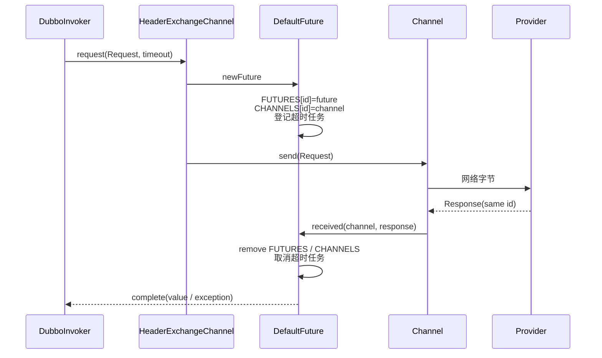
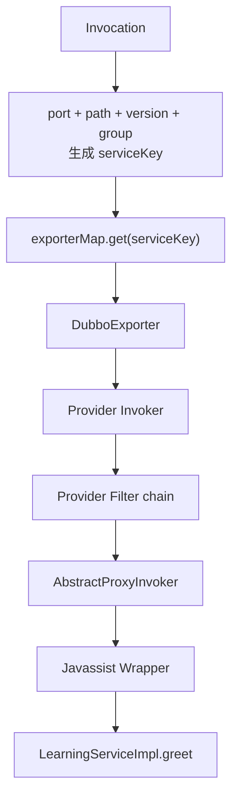

# 阶段 4：Dubbo Protocol、网络与 Provider 调用链

> 阶段方案：[Dubbo Protocol、网络与 Provider 调用链](../phases/04-protocol-remoting-provider.md)
> 运行证据：[报文、线程与 Future 实验](evidence/04-frame-threads-and-future.md)
> 上一阶段：[Consumer 调用链](03-consumer-invocation.md)
> 适用版本：Apache Dubbo 3.3.6；质量门禁：G4

## 1. 先给结论

阶段 3 选出的 `DubboInvoker` 不直接操作 Socket。一次 two-way 同步接口调用在协议内部实际是“异步请求 + Future 匹配”，仅在代理边界表现为同步返回：

```text
DubboInvoker
→ Request(id, twoWay, timeout, RpcInvocation)
→ HeaderExchangeChannel：先注册 DefaultFuture，再 send
→ DubboCodec / Hessian2：Invocation → 16 字节头 + body
→ Netty：ByteBuf 写入/读取
→ Provider IO 线程解码
→ Dispatcher：切换到 Dubbo 业务线程
→ serviceKey → exporterMap → Provider Invoker / Filter / 实现
→ Response 使用相同 id 原路返回
→ DefaultFuture.received：按 id 完成 CompletableFuture
→ AsyncRpcResult / Result.recreate：恢复接口返回值或抛异常
```

这条链上四层边界应保持清晰：Exchange 处理 Request/Response 与 Future，Transport 处理 Channel、事件和线程派发，Codec 处理对象与字节，Netty 是具体网络实现。

## 2. Consumer 协议入口：同步表面下的异步内核

`DubboInvoker.doInvoke` 先给 `RpcInvocation` 补 `path`、`version`，按轮询下标选一个 `ExchangeClient`，再计算调用模式与超时。普通同步接口调用走 two-way 分支：

1. 创建 `Request`，payload 是当前 `Invocation`，协议版本取 `Version.getProtocolVersion()`。
2. `Request` 默认 `twoWay=true`；oneway 分支才改为 `false` 并只调用 `send`。
3. 把计算后的 timeout 写回 Invocation attachment，也传给 `client.request`。
4. `client.request(...).thenApply(AppResponse.class::cast)` 返回 `CompletableFuture<AppResponse>`。
5. 用这个 future 构造 `AsyncRpcResult`，而不是在 `DubboInvoker` 内等待网络返回。


这样设计允许协议、Filter 和 Cluster 统一处理同步、异步与回调结果。对普通同步调用，当前实验的业务线程 `main` 最终在结果边界等待；响应到达后，future 被完成，`recreate()` 才把 `AppResponse.value` 还原为 `LearningResponse`。

### 2.1 Request ID、twoWay、timeout 与 payload

| 字段 | 设置位置与规则 | 本次普通调用语义 |
|---|---|---|
| `id` | `Request` 使用进程内 `AtomicLong` 递增生成；也可由指定 ID 构造器固定 | 唯一关联请求、响应与 `DefaultFuture` |
| `twoWay` | 默认 `true`；oneway 显式设为 `false` | Provider 必须返回 `Response` |
| `timeout` | `RpcUtils.calculateTimeout` 计算，并写入 Invocation attachment | Future 超时任务和远端上下文共同使用 |
| `data` | `RpcInvocation` | DubboCodec 读取方法、类型、参数和 attachments |
| `version` | Dubbo 协议版本，当前为 `2.0.2` | body 的第一个字段，并写入 Request/Response |

ID 是 `long`，溢出后出现负数仍不影响匹配；真正要求是同一连接活跃请求范围内不发生冲突，而不是“ID 必须为正”。

## 3. DefaultFuture：为什么一定要先注册再发送

`HeaderExchangeChannel.request` 的顺序是：

```text
DefaultFuture.newFuture(channel, request, timeout, executor)
→ channel.send(request)
→ 返回 future
```

若先发送再注册，极快的本机响应可能在 `FUTURES` 尚无该 ID 时到达，被当成迟到或未知响应丢弃。先注册建立了“响应可匹配”的 happens-before 关系。



完成路径的关键状态如下：

| 时刻 | `FUTURES[id]` | `CHANNELS[id]` | future 状态 |
|---|---|---|---|
| Request 创建 | 无 | 无 | 尚未创建 |
| `newFuture` 后 | 有 | 有 | pending，超时轮已登记 |
| `send` 失败 | 取消并清理 | 清理 | exceptional |
| 正常 Response 到达 | 取出并移除 | 移除 | value 或远端异常 |
| 本地超时 | 超时任务触发并清理 | 清理 | timeout exception |
| 超时后的迟到 Response | 已无匹配项 | 已无匹配项 | 记录 late response，不会二次完成 |

`DefaultFuture.received` 不只是 `complete`：它先移除全局映射、取消 timeout task，再根据 Response status 完成值或异常；使用 `ThreadlessExecutor` 时还要结束其等待状态。因此 Request ID 同时是报文关联键和本地生命周期表的 key。

## 4. 16 字节 Dubbo 报文头

阶段实验使用真实 `DubboCodec` 与 Hessian2，把固定 ID `0x0102030405060708` 的 `greet(LearningRequest)` 编成 387 字节请求：

```text
完整头：dabb c2 00 0102030405060708 00000173
         │    │ │  │                └─ body 长度 0x173 = 371
         │    │ │  └─ request id
         │    │ └─ request 保留字节
         │    └─ request + twoWay + Hessian2
         └─ magic
```

| 偏移 | 长度 | 样例 | 源码含义 |
|---|---:|---|---|
| 0–1 | 2 | `da bb` | magic `0xdabb`，用于识别帧起点 |
| 2 | 1 | `c2` | `0x80` request + `0x40` twoWay + serialization ID `2` |
| 3 | 1 | `00` | Request 保留；Response 时存 status |
| 4–11 | 8 | `0102030405060708` | big-endian Request/Response ID |
| 12–15 | 4 | `00000173` | big-endian body 长度 371 |

字节 2 的低 5 位是序列化 ID；Hessian2 的 ID 为 `2`。`event` 位是 `0x20`，心跳等事件帧使用。`c2` 因而不是一个固定“Dubbo 请求类型”，而是当前 three flags 和序列化 ID 的组合。

解码器先验证 magic 和 body 长度，再依据 request/response、event、serialization ID 选择 body 解码方式。长度字段也参与 payload 限制和半包判断，不能只当展示信息。

## 5. Hessian2 body：Invocation 与字节如何对应

普通 Dubbo 请求的 body 不是直接序列化整个 `RpcInvocation` Java 对象。`DubboCodec.encodeRequestData` 按协议顺序逐项写入：


探针对生成的 body 又使用同一 Hessian2 serialization 逐项读回，得到：

| 顺序 | 解码结果 |
|---:|---|
| 1 | protocol version = `2.0.2` |
| 2 | path = `org.apache.dubbo.sourcelearning.api.LearningService` |
| 3 | service version = `0.0.0` |
| 4 | method = `greet` |
| 5 | parameter types = `Lorg/apache/dubbo/sourcelearning/api/LearningRequest;` |
| 6 | DTO = `LearningRequest(requestId=frame-01, name=Protocol-Probe)` |
| 7 | attachments keys = `path, interface, version, timeout` |

这次 round-trip 直接证明“DTO → bytes → DTO”，但它不是抓取线上 TCP 包：探针在 Consumer 进程内调用生产 `DubboCodec`，使用固定 ID 让结果可重复；随后真实 RPC 再独立证明同一模块能跨网络调用 Provider。

`Hessian2ObjectOutput`/`Input` 是 Dubbo `ObjectOutput`/`ObjectInput` 与 Hessian API 的适配层；SerializerFactory 使用当前线程上下文 ClassLoader 寻找 DTO 类型。由此可知 Provider 必须能加载兼容的接口与 DTO 类，否则字节合法也会在对象恢复阶段失败。

## 6. Codec、Transport、Exchange、Netty 的职责

| 层 | 关键对象 | 负责 | 不负责 |
|---|---|---|---|
| Exchange | `Request`、`Response`、`HeaderExchangeChannel`、`DefaultFuture`、`HeaderExchangeHandler` | request/response 语义、ID 匹配、two-way、超时、应答 | DTO 的具体二进制格式、Socket 实现 |
| Codec | `ExchangeCodec`、`DubboCodec`、`Hessian2Serialization` | 帧头、body 顺序、序列化/反序列化、粘包半包边界 | 连接生命周期、业务线程池 |
| Transport | `Channel`、`ChannelHandler`、`Dispatcher` | 统一连接抽象、事件、handler 包装、线程派发 | 业务 service key、Java 代理 |
| Netty | `NettyClient/Server`、`NettyCodecAdapter`、Netty handlers | TCP、event loop、`ByteBuf`、pipeline，将 Netty 事件桥接到 Dubbo | RPC 方法语义、Future 匹配 |

`NettyCodecAdapter` 是具体交界点：encoder 把 Dubbo `ChannelBuffer` 写入 Netty `ByteBuf`，decoder 从 `ByteBuf` 调用 `Codec2.decode` 并处理需要更多数据的状态。`NettyClientHandler` 和 `NettyServerHandler` 再把 connected、disconnected、received、sent、caught 事件转给 Dubbo `ChannelHandler`。

## 7. Provider Pipeline 与线程切换

Provider Netty pipeline 的主要顺序是 decoder、encoder、idle state handler、server handler；开启 SSL 时还会插入协商处理。Dubbo 侧的 handler 经 `ChannelHandlers.wrap` 形成：

```text
MultiMessageHandler
└── HeartbeatHandler
    └── Dispatcher adaptive extension
        └── AllChannelHandler（本次配置）
            └── DecodeHandler
                └── HeaderExchangeHandler
                    └── DubboProtocol requestHandler
```

本次运行日志给出两个线程证据：

```text
NettyServerWorker-3-1
  DubboCodec：因 executor isolation，在 IO 线程解码 body

DubboServerHandler-10.220.80.142:20880-thread-2
  LearningServiceImpl.greet：执行 Provider Filter 与业务实现
```

`AllChannelHandler.received` 从 URL/ExecutorRepository 选择 executor，把 `ChannelEventRunnable(RECEIVED)` 提交到业务线程池。于是主要切换为：


这里有一个 3.3.6 的配置细节：启用 `executor-management-mode=isolation` 后，选择隔离 executor 需要先知道 service key，所以 body 被强制在 IO 线程解码，`decode.in.io.thread` 会被忽略。不要据此误判“业务也在 IO 线程执行”；实测实现仍在 `DubboServerHandler`。

## 8. Provider 如何由请求定位到业务实现

`HeaderExchangeHandler` 收到 two-way `Request` 后先创建相同 ID 与版本的 `Response`，再调用 `handler.reply`。Dubbo Protocol 的 request handler 要求 payload 是 `Invocation`，随后：



本实验无 group，接口 version 是 `0.0.0`，端口为 `20880`；这些字段与 path 一起组成 Exporter 查询键。`DubboProtocol.getInvoker` 用 channel 的本地端口、Invocation path、version、group 生成 key，从 `exporterMap` 取 `DubboExporter`，再取得其中的 Invoker。若 key 不存在，会抛出带现有 exporter keys 的 service-not-found 错误；阶段 3 的优雅停机故障切换正好观察到了这一分支。

真实 Provider 栈进一步确认：

```text
DubboProtocol.requestHandler.reply
→ Provider Filter chain
→ DelegateProviderMetaDataInvoker
→ AbstractProxyInvoker
→ JavassistProxyFactory wrapper
→ LearningServiceImpl.greet
```

service key 负责找到“导出的服务入口”，方法名和参数类型则由 Provider proxy wrapper 决定具体 Java 方法，两者不是同一个分派层。

## 9. Response 如何回到同步接口

成功时，Provider Invoker 返回的 `Result` 由 `HeaderExchangeHandler.handleRequest` 的 completion stage 回调写入 Response，status 设为 `OK`，ID 保持不变并发送。异常时根据类型设置错误 status 或响应 payload。

Consumer 方向再次经过 Netty 和 `DubboCodec.decodeBody`，得到 `Response(id, AppResponse)`；`HeaderExchangeHandler.handleResponse` 调用 `DefaultFuture.received`。相同 ID 找回原 Future，清理映射并完成 `CompletableFuture`。其后的链为：

```text
Response.value(AppResponse)
→ DefaultFuture.complete
→ DubboInvoker 创建的 thenApply
→ AsyncRpcResult
→ Consumer 调用等待结束
→ InvocationUtil / Result.recreate
→ LearningResponse
```

本次真实调用最终输出 `requestId=learning-01`、`providerId=provider-20880`，Consumer 与 Provider 记录相同远端端口和请求内容，完成了从 DTO 到字节、再到 Provider 参数和接口返回值的双向闭环。

## 10. 断点清单

按请求方向依次设置：

1. `DubboInvoker.doInvoke`：观察 Invocation attachments、client、mode、timeout 和 Request。
2. `Request` 构造器：观察递增 ID 与默认 twoWay。
3. `HeaderExchangeChannel.request`：确认 `newFuture` 在 `send` 之前。
4. `DefaultFuture.newFuture`、构造器：观察 `FUTURES`、`CHANNELS` 和 timeout task。
5. `ExchangeCodec.encodeRequest`：检查 16 字节头。
6. `DubboCodec.encodeRequestData`：逐项检查协议版本、path、method、descriptor、args 和 attachments。
7. `NettyCodecAdapter.InternalEncoder.encode`：观察进入 `ByteBuf` 前后的字节数。
8. Provider `NettyCodecAdapter.InternalDecoder.decode`、`DubboCodec.decodeBody`：观察 IO 线程与恢复出的 Invocation。
9. `AllChannelHandler.received`、`ChannelEventRunnable.run`：观察 executor 和线程切换。
10. `HeaderExchangeHandler.handleRequest`：观察相同 ID 的 Response 创建。
11. `DubboProtocol.requestHandler.reply`、`getInvoker`：记录 serviceKey、exporter 和 Provider Invoker。
12. Provider Filter、`AbstractProxyInvoker.invoke`、业务实现：确认实际执行边界。

响应方向继续设置：

13. `HeaderExchangeHandler` 的 completion 回调：观察 status/value。
14. Consumer `DubboCodec.decodeBody`：观察 `Response` 与 `AppResponse`。
15. `DefaultFuture.received`、`doReceived`：观察 ID 查表、清理和 complete。
16. `AsyncRpcResult` / `AppResponse.recreate`：观察异步结果如何恢复成同步返回或异常。

## 11. G4 验收

| 验收项 | 结果 | 证据 |
|---|---|---|
| DTO 参数到网络字节，再恢复为 Provider 参数 | 通过 | 真实 DubboCodec round-trip + 跨进程 RPC |
| Request ID 与 DefaultFuture 的关系 | 通过 | 固定 ID 报文、注册/完成/清理源码链 |
| 主要线程切换 | 通过 | `NettyServerWorker` → `DubboServerHandler` 实测线程名 |
| service key 定位 Exporter | 通过 | `getInvoker` 生成 key、查询 `exporterMap` 与真实 Provider 栈 |
| Response 到 Consumer 接口返回值 | 通过 | 相同 ID、Future complete、`LearningResponse` 日志 |
| 区分 Exchange、Transport、Codec 和 Netty | 通过 | 四层职责表与实际适配边界 |

## 12. 向后续阶段交接

- 阶段 5 反向解释 `DubboExporter`、`exporterMap`、Server、Client 与 `DubboInvoker` 是如何由 export/refer 创建的。
- 阶段 6 解释 Provider/Consumer 生命周期、线程池与优雅停机为何能撤销 exporter 后再关闭连接。
- 阶段 8 可在 `send`、decode、业务线程池、service key 查找、序列化和 Future timeout 等位置注入异常。
- `ProtocolFrameProbe` 是本地、确定性编码探针，不替代抓包；需要验证网络设备或跨语言实现时应补充 pcap/异构客户端实验。

## 13. 源码入口

- `dubbo-rpc/dubbo-rpc-dubbo/.../DubboInvoker.java:90`
- `dubbo-remoting/dubbo-remoting-api/.../HeaderExchangeChannel.java:148`
- `dubbo-remoting/dubbo-remoting-api/.../DefaultFuture.java:94`
- `dubbo-remoting/dubbo-remoting-api/.../ExchangeCodec.java:63`
- `dubbo-rpc/dubbo-rpc-dubbo/.../DubboCodec.java:92`
- `dubbo-remoting/dubbo-remoting-netty4/.../NettyCodecAdapter.java:37`
- `dubbo-remoting/dubbo-remoting-api/.../dispatcher/ChannelHandlers.java:44`
- `dubbo-remoting/dubbo-remoting-api/.../dispatcher/all/AllChannelHandler.java:61`
- `dubbo-remoting/dubbo-remoting-api/.../HeaderExchangeHandler.java:196`
- `dubbo-rpc/dubbo-rpc-dubbo/.../DubboProtocol.java:117`
- `dubbo-rpc/dubbo-rpc-dubbo/.../DubboProtocol.java:287`
