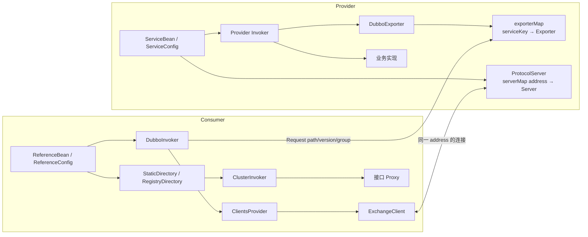
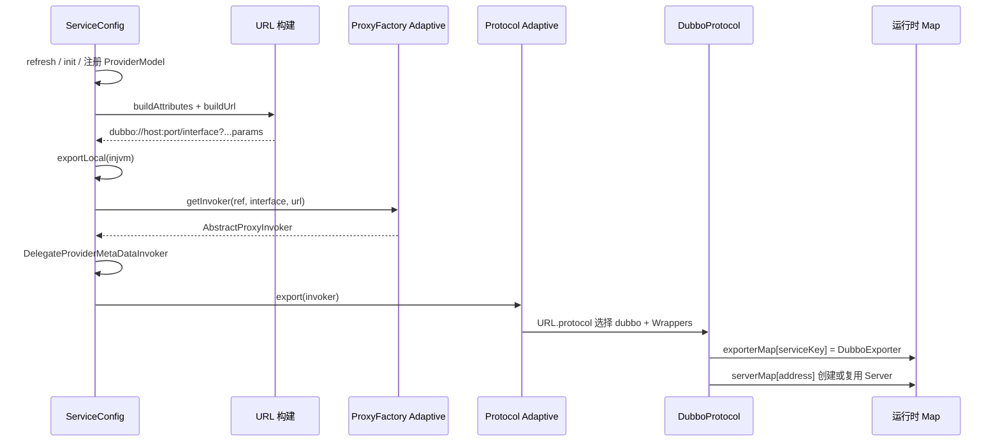
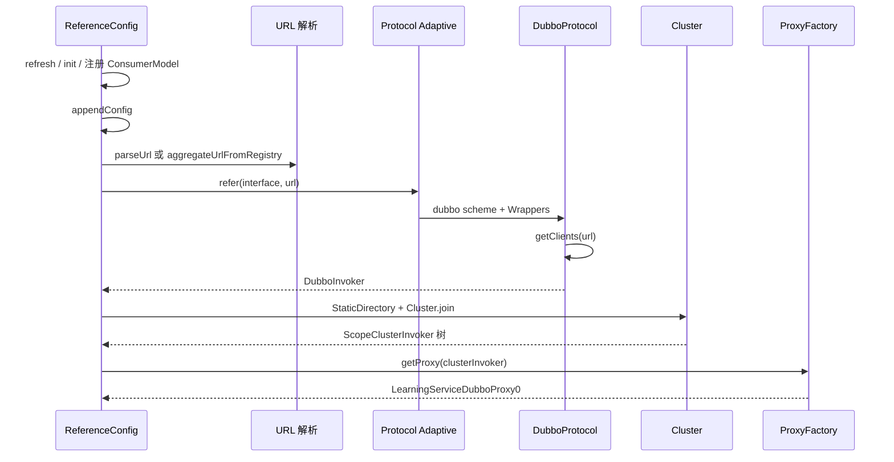
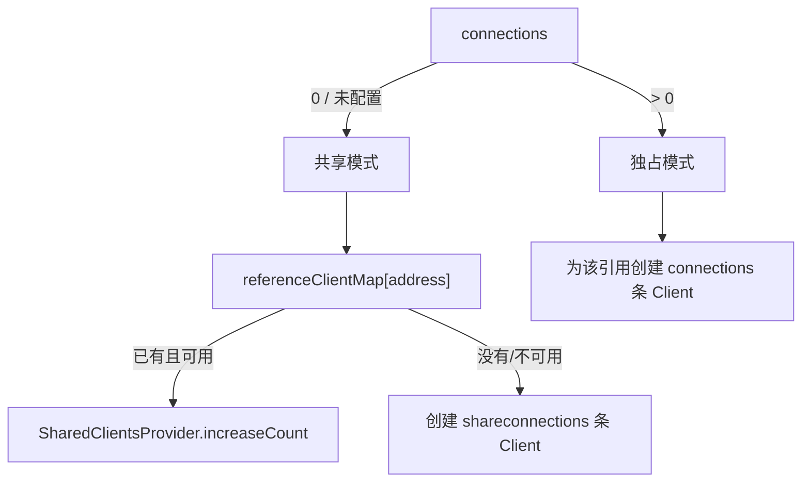

# 阶段 5：服务暴露与服务引用

> 阶段方案：[服务暴露与服务引用](../phases/05-export-and-reference.md)
> 运行证据：[创建、复用与销毁实验](evidence/05-creation-sharing-and-destroy.md)
> 上一阶段：[Dubbo Protocol、网络与 Provider 调用链](04-protocol-remoting-provider.md)
> 适用版本：Apache Dubbo 3.3.6；质量门禁：G5

## 1. 先给结论

阶段 3、4 看到的对象来自两条方向相反的装配链：

```text
Provider：业务实现 → Provider Invoker → Exporter → exporterMap → Server
Consumer：Proxy ← ClusterInvoker ← Protocol Invoker ← Client
```

`ServiceConfig` 把服务实现和 Provider 配置编译成 URL，再把实现适配成 Invoker 并交给 `Protocol.export`；`ReferenceConfig` 把 Consumer 配置和目标地址编译成 URL，经 `Protocol.refer` 得到 Invoker 树，最后生成接口 Proxy。URL 的 protocol 和参数驱动 SPI 选择及对象装配。

Provider 的 Server 按地址复用、Exporter 按 service key 区分；Consumer 默认按远端地址共享 Client、按引用各自持有 Invoker。销毁时先撤销引用或服务对象，最终由 Protocol 关闭共享网络资源。

## 2. 核心对象关系



这里 Provider Invoker 与 Consumer Invoker 同名但语义不同：

| 对象 | 谁创建 | `invoke` 的方向 |
|---|---|---|
| Provider Invoker | `ProxyFactory.getInvoker(ref, interface, providerUrl)` | 调用本地业务实现 |
| Consumer protocol Invoker | `Protocol.refer(interface, consumerUrl)` | 向某个远端地址发送请求 |
| ClusterInvoker | `Cluster.join(Directory)` | 在候选 Consumer Invoker 中治理和选择 |

Protocol API 本身刻意不关心透明代理。`export` 接收框架构造的 Provider Invoker；`refer` 则由协议实现返回能发远程请求的 Consumer Invoker。

## 3. Provider 暴露主线

本实验的 `@DubboService` 先由 Spring 注册成 `ServiceBean`；`ServiceBean` 继承 `ServiceConfig`。Spring 如何发现和启动它留到阶段 6，本阶段从 `ServiceConfig.export` 开始：



### 3.1 `export` 不是单个方法直接完成

主要步骤为：

1. `export` 保证所属 deployer 已启动，刷新配置并做幂等检查。
2. `init` 验证接口与实现，创建 `ServiceMetadata`、`ProviderModel`，注册到模块服务仓库。
3. `doExportUrls` 对每个 `ProtocolConfig` 执行一次 URL 构建与暴露。
4. `buildAttributes` 合并 application、module、provider、protocol、service、method 和 runtime 参数。
5. `buildUrl` 解析 host、bind/export IP、port、path，并附加 `ScopeModel` 与 `ProviderModel` 属性。
6. `exportUrl` 默认先导出 `injvm://`，再导出远程 `dubbo://`。
7. `doExportUrl` 创建 Provider Invoker，补 `DelegateProviderMetaDataInvoker`，交给 Protocol Adaptive。

本次一项业务服务因此有两个导出入口：

```text
injvm://127.0.0.1/...LearningService
dubbo://10.220.80.142:20880/...LearningService
```

前者供同 JVM 引用，不创建 Netty Server；后者进入 `DubboProtocol`。

### 3.2 Provider ProxyFactory 实际做什么

`ProxyFactory` 默认扩展名是 `javassist`，其 adaptive key 是 URL 参数 `proxy`。Provider 方向的 `JavassistProxyFactory.getInvoker`：

- 为实现类创建或取得 `Wrapper`；
- 返回一个 `AbstractProxyInvoker`；
- `doInvoke` 调用 `wrapper.invokeMethod`，最终落到业务实现。

阶段 4 的真实栈 `LearningServiceImplDubboWrap0 → JavassistProxyFactory$1 → AbstractProxyInvoker` 正是这条创建链的运行结果。若 Javassist 生成失败，3.3.6 会尝试回退到 JDK ProxyFactory，不能把默认选择误写成绝对保证。

### 3.3 Protocol Adaptive 与 Wrapper

`ServiceConfig` 和 `ReferenceConfig` 保存的 `protocolSPI` 都是 adaptive extension。`Protocol.export` 从 `invoker.getUrl()` 取 scheme，`refer` 直接从 URL 取 scheme：

| scheme | 命名扩展 | 本阶段用途 |
|---|---|---|
| `dubbo` | `DubboProtocol` | 远程 Dubbo Protocol 暴露/引用 |
| `injvm` | `InjvmProtocol` | 同 JVM 暴露/引用 |
| `registry` | `InterfaceCompatibleRegistryProtocol` | 在本地 Protocol 外插入注册、订阅和 Directory |

命名扩展加载后还会经过当前 classpath 上的 Protocol Wrappers：

- `ProtocolSerializationWrapper` 注册允许的序列化服务信息；
- `ProtocolSecurityWrapper` 刷新序列化安全状态并登记接口；
- `ProtocolFilterWrapper` 构建 Provider/Consumer protocol Filter 链；
- `ProtocolListenerWrapper` 构建 `ListenerExporterWrapper` 或 `ListenerInvokerWrapper`。

运行对象树已经观察到 `ListenerInvokerWrapper` 与 protocol Filter chain，Provider 栈也观察到完整 Provider Filter chain。Wrapper 的价值是让同一横切逻辑同时覆盖 `dubbo`、`injvm` 等协议，而不把代码复制到每个协议实现。

## 4. Exporter 与 Server 为什么按不同 key 缓存

`DubboProtocol.export` 做两件相互独立的事：

```text
serviceKey(url) → new DubboExporter → exporterMap
url.address      → openServer        → serverMap
```

### 4.1 Exporter key：定位服务

service key 的有效组成是：

```text
bind port + service path + version + group
```

它必须区分同一端口上的多个接口、版本和 group。`DubboExporter` 构造时把自己放入 `exporterMap`；`afterUnExport` 用 `remove(key, this)` 精确移除。阶段 4 Provider 收到 Invocation 后使用同样规则重新生成 key，因此导出与调用的定位规则闭合。

### 4.2 Server key：复用监听端口

`openServer` 只用 `url.getAddress()` 查询 `serverMap`。若地址不存在，双重检查后 `createServer`；若已存在，则调用 `server.reset(url)` 更新可重置配置，不再 bind 第二次。

本次 Provider 先后导出了：

```text
LearningService               → 10.220.80.142:20880
MetadataService(group/version) → 10.220.80.142:20880
```

日志只有一次 `Start NettyServer bind /0.0.0.0:20880`。所以“一端口多服务”的实质是：

```text
一个 address → 一个 Server → 多个 Request
每个 Request → 独立 serviceKey → 不同 Exporter
```

端口并不直接绑定某个 Java 接口，报文中的 path/version/group 才完成服务分派。

## 5. Consumer 引用主线

`ReferenceBean` 最终创建 `ReferenceConfig`。初始化链如下：



### 5.1 `ReferenceConfig.init` 的重要状态

1. 验证接口、刷新配置，生成 reference parameters。
2. 向 `ModuleServiceRepository` 注册接口描述与 `ConsumerModel`。
3. 把 reference parameters 写入 service metadata attachments。
4. `createProxy` 解析 URL、创建 Invoker、发布 Consumer service definition。
5. ProxyFactory 以最终 Invoker 生成接口代理，并写回 ConsumerModel。
6. `check=true` 时检查最终 Invoker 是否可用。

本实验的 Spring 字段先注册为 `ReferenceBean:LearningService(...)`，启动阶段建立 Netty Client，随后输出 `Referred dubbo service`，最后才宣布 Dubbo Module ready。实际 Invoker 树为：

```text
LearningServiceDubboProxy0
→ ScopeClusterInvoker
→ MockClusterInvoker / Cluster Filter / FailoverClusterInvoker
→ StaticDirectory
→ ReferenceCountInvokerWrapper
→ Protocol Filter
→ ListenerInvokerWrapper
→ DubboInvoker
→ SharedClientsProvider
→ ReferenceCountExchangeClient
→ NettyClient
```

### 5.2 直连、注册中心与 injvm 在哪里分支

| 输入 | URL 形成 | 后续对象 |
|---|---|---|
| 显式直连 URL | `parseUrl` 补 path，合并 reference parameters，标记 peer | `Protocol.refer` 后通常仍以 `StaticDirectory` 加入 Cluster |
| 注册中心配置 | `aggregateUrlFromRegistry` 生成 registry URL，把 reference parameters 放入 `REFER_KEY` attribute | `RegistryProtocol.refer` 创建订阅/Directory/Migration/Cluster 链 |
| 满足本地引用 | 生成 `injvm://127.0.0.1:0/interface` | `InjvmProtocol.refer`，无 Client/网络 |
| 多个直连 URL | 每个 URL 分别 `Protocol.refer` | 一个 `StaticDirectory` 汇总多个 protocol Invoker |

只有一个直连 URL 也不等于没有 Cluster。本实验正是单个 `DubboInvoker` 被放入 `StaticDirectory`，再 `Cluster.join`；阶段 3 已验证这一实际结构。

## 6. URL 不是日志字符串，而是装配指令

### 6.1 参数来源

| Provider URL 来源 | 代表字段示例 |
|---|---|
| runtime | `pid`、`timestamp`、`release`、`dubbo` |
| ApplicationConfig | `application`、`qos.enable`、executor mode |
| Module/ProviderConfig | 模块级、Provider 默认参数 |
| ProtocolConfig | scheme、port、serialization、server、dispatcher |
| ServiceConfig | interface、group、version、token、scope、filter |
| Method/ArgumentConfig | 方法超时、重试、callback 等带前缀参数 |
| 接口反射 | `methods`、`revision`、generic |
| 地址检测 | host、bind IP、bind port、anyhost |

Consumer URL 类似地合并 runtime、application、module、consumer、reference 和 method 配置；显式 peer URL 提供目标 scheme/host/port，再由 `ClusterUtils.mergeUrl` 合入引用参数。

### 6.2 参数如何选扩展

| URL 信息 | 驱动的扩展/行为 |
|---|---|
| scheme | `Protocol`：dubbo / injvm / registry |
| `proxy` | `ProxyFactory`：默认 javassist |
| `serialization` / 报文 flags | Serialization：本实验 hessian2 |
| `server` / `client` | Transporter：本实验 netty4 |
| `dispatcher` | ChannelHandler Dispatcher：本实验 all |
| `codec` | DubboCodec |
| `cluster` | 默认 failover Cluster |
| `loadbalance` | 本实验 roundrobin |
| `service.filter` / `reference.filter` | 激活和定制 Filter 链 |
| listener 参数 | ExporterListener / InvokerListener |

URL 还有 attributes：`ScopeModel`、`ServiceModel`、`EXPORT_KEY`、`REFER_KEY` 等对象不能可靠地序列化成查询参数。阅读源码时必须同时看 parameters 与 attributes，否则会错过注册中心嵌套 URL 和模型上下文。

## 7. Client 共享与独占边界

`DubboProtocol.getClients` 先看 `connections`：



默认 `connections=0`，`shareconnections` 默认至少为 1。同一 `DubboProtocol` 实例内，相同远端 address 的多个服务引用取得同一个 `SharedClientsProvider`，其中每个 `ReferenceCountExchangeClient` 的计数随引用增加。key 不含 service path，因此同地址不同接口也能共享连接。

明确配置 `connections>0` 会创建 `ExclusiveClientsProvider`，每个引用独占指定数量的连接。共享边界不能扩大为“全机器共享”：不同进程、不同 FrameworkModel/Protocol 实例或不同 address 均不共享。

仓库聚焦测试确认：

- `connections=0, shareconnections=1`：`demo` 与 `hello` 的 Client 对象、local address 相等；
- `connections=1`：两个接口的 Client 与 local address 不同；
- `connections=0, shareconnections=3`：两个 Invoker 得到相同的三元素 client list；
- 同一个 Invoker 重复 destroy 不会错误多减引用，另一个接口仍能调用。

## 8. 创建、复用与销毁

### 8.1 Consumer 关闭

```text
ReferenceConfig.destroy
→ 根 ClusterInvoker / Directory destroy
→ 每个 DubboInvoker.destroy
→ 从 DubboProtocol.invokers 移除
→ ClientsProvider.close
→ ReferenceCountExchangeClient count--
→ count == 0 时关闭实际 ExchangeClient
→ 注销 ConsumerModel
```

`ReferenceConfig.destroy` 用锁和 destroyed 状态保证幂等；`DubboInvoker.destroy` 也双重检查，避免重复关闭共享 Client。演示 Consumer 关闭时先记录 Module stopping，随后 Netty channel close，再停止 Application/Framework 和 executor repositories。

### 8.2 Provider 关闭

```text
ServiceConfig.unexport
→ exporter.unregister（有注册中心时）
→ waitForIdle（给最近调用留优雅窗口）
→ exporter.unexport
→ DubboExporter.afterUnExport 移除 exporterMap[serviceKey]
→ 注销 ProviderModel

应用 / Protocol 最终 destroy
→ 关闭 serverMap 中的 Server
→ 强制关闭 referenceClientMap（如有 callback Client）
→ AbstractProtocol 销毁剩余 Invoker / Exporter
```

本次 Provider 在最后一次调用后立刻收到 `Ctrl+C`，`ServiceConfig` 记录 idle 0 ms，并等待约 3332 ms 才完成 unexport；随后 `DubboProtocol` 关闭 20880 Server、撤销内部 MetadataService exporter、销毁模型与 executors。这证明优雅等待发生在服务撤销之前。

单个 `DubboExporter.unexport` 只移除服务 key，不应关闭共享 Server；否则同端口的其他服务会一起中断。Server 的最终关闭属于 Protocol/application 生命周期。

## 9. 注册中心的插入点

本阶段只固定接口边界：

### Provider

```text
ServiceConfig 构造 registry:// URL
  attribute EXPORT_KEY = 原 dubbo:// Provider URL
→ RegistryProtocol.export
→ doLocalExport：再调本地 Protocol.export
→ Registry.register
→ 订阅 configurator override
```

### Consumer

```text
ReferenceConfig 构造 registry:// URL
  attribute REFER_KEY = reference parameters
→ RegistryProtocol.refer
→ 创建 consumer URL、MigrationInvoker / Directory
→ register + subscribe
→ 通知地址再调用 dubbo Protocol.refer
→ Cluster.join(Directory)
```

因此注册中心没有替代 `DubboProtocol`：它在外层提供地址与配置变化，真正对某个 Provider 建 Client、创建 `DubboInvoker` 的仍是具体协议。阶段 7 将用 Nacos 验证这一层。

## 10. 断点清单

Provider：

1. `ServiceConfig.export`、`init`：检查幂等状态、ProviderModel。
2. `doExportUrls`、`doExportUrlsFor1Protocol`：观察 protocol 数量和 registry URLs。
3. `buildAttributes`、`buildUrl`：记录每类配置合并前后。
4. `exportUrl`、`exportLocal`、`doExportUrl`：区分 injvm、remote 与 registry。
5. `JavassistProxyFactory.getInvoker`：观察业务实现、Wrapper 和 Provider Invoker。
6. Protocol adaptive 生成类的 `export`：观察从 scheme 选择命名扩展。
7. 各 Protocol Wrapper 的 `export`：记录真实包装次序与返回对象。
8. `DubboProtocol.export`：记录 serviceKey 和 `DubboExporter`。
9. `openServer`、`createServer`：分别运行同端口第一、第二个服务。
10. `DubboExporter.afterUnExport`、`ServiceConfig.unexport`：观察 map 移除和优雅等待。

Consumer：

11. `ReferenceConfig.init`、`appendConfig`：观察 ConsumerModel 和参数来源。
12. `createProxy`、`parseUrl`、`aggregateUrlFromRegistry`：确认分支。
13. `createInvoker`：观察每个 URL 的 protocol Invoker 和最终 Cluster。
14. Protocol adaptive 生成类的 `refer` 与各 Wrapper：观察 `DubboInvoker` 外包装。
15. `DubboProtocol.protocolBindingRefer`、`getClients`：记录 Client provider 模式。
16. `getSharedClient`、`initClient`：观察 address key、引用计数与 Netty Client。
17. `Cluster.join`、`ProxyFactory.getProxy`：从 Invoker 树到接口 Proxy。
18. `ReferenceConfig.destroy`、`DubboInvoker.destroy`、`SharedClientsProvider.close`：观察引用归零时机。

## 11. G5 验收

| 验收项 | 结果 | 证据 |
|---|---|---|
| 从 Proxy 反向追踪到 ReferenceConfig | 通过 | 真实 Proxy/Invoker 树与引用创建时序 |
| 从 Exporter 反向追踪到 ServiceConfig | 通过 | `ServiceConfig → Provider Invoker → Protocol → DubboExporter` |
| 一个端口承载多个服务 | 通过 | 两个远程 service URL、一次 Server bind、不同 service key |
| Client 与 Server 复用边界 | 通过 | serverMap/referenceClientMap key 与 4 个聚焦测试 |
| URL 驱动 Protocol 和其他扩展 | 通过 | adaptive key、Wrapper 与扩展参数表 |
| 主要对象创建和销毁顺序 | 通过 | Provider/Consumer 完整启停日志与源码清理链 |

## 12. 向阶段 6、7 交接

- 阶段 6 从 `@DubboService`/`@DubboReference` 追到 `ServiceBean`/`ReferenceBean`，解释 deployer 为什么在 Spring ready 前完成 export/refer。
- 阶段 6继续验证 `ServiceConfig.unexport`、`ReferenceConfig.destroy` 与 Spring shutdown hook 的协调关系。
- 阶段 7从 `RegistryProtocol.export/refer` 进入 Nacos register、subscribe、metadata 和 migration 链。
- 连接共享测试使用两个接口，是为了验证 address 级复用；生产配置还应审查不同引用间 transport 参数是否兼容。

## 13. 源码入口

- `dubbo-config/dubbo-config-api/.../ServiceConfig.java:311`
- `dubbo-config/dubbo-config-api/.../ServiceConfig.java:568`
- `dubbo-config/dubbo-config-api/.../ServiceConfig.java:614`
- `dubbo-config/dubbo-config-api/.../ServiceConfig.java:964`
- `dubbo-config/dubbo-config-api/.../ReferenceConfig.java:297`
- `dubbo-config/dubbo-config-api/.../ReferenceConfig.java:490`
- `dubbo-config/dubbo-config-api/.../ReferenceConfig.java:669`
- `dubbo-rpc/dubbo-rpc-api/.../javassist/JavassistProxyFactory.java:80`
- `dubbo-rpc/dubbo-rpc-dubbo/.../DubboProtocol.java:336`
- `dubbo-rpc/dubbo-rpc-dubbo/.../DubboProtocol.java:367`
- `dubbo-rpc/dubbo-rpc-dubbo/.../DubboProtocol.java:435`
- `dubbo-rpc/dubbo-rpc-dubbo/.../DubboProtocol.java:486`
- `dubbo-rpc/dubbo-rpc-dubbo/.../DubboProtocol.java:589`
- `dubbo-registry/dubbo-registry-api/.../RegistryProtocol.java:272`
- `dubbo-registry/dubbo-registry-api/.../RegistryProtocol.java:557`
