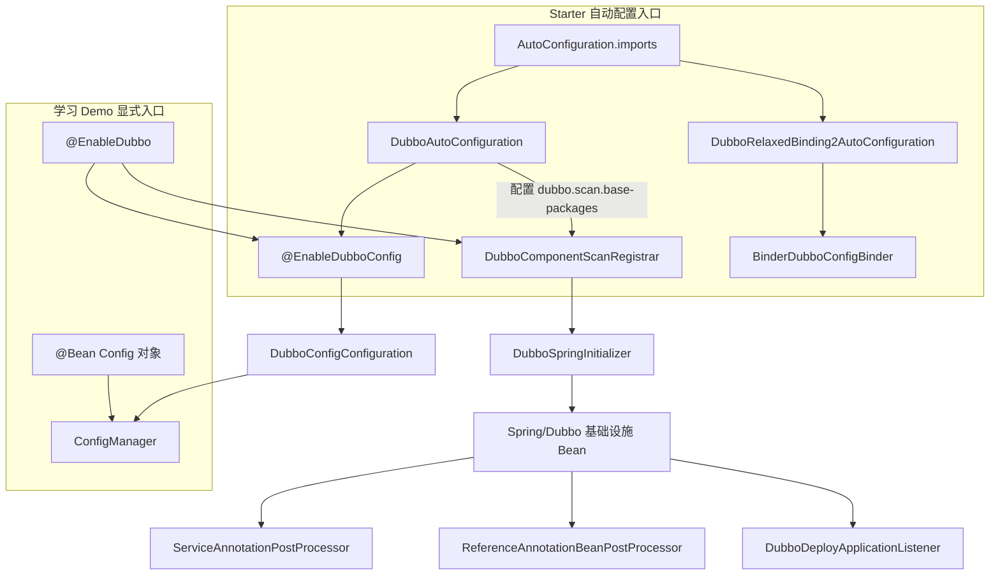
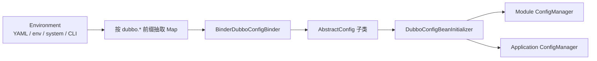
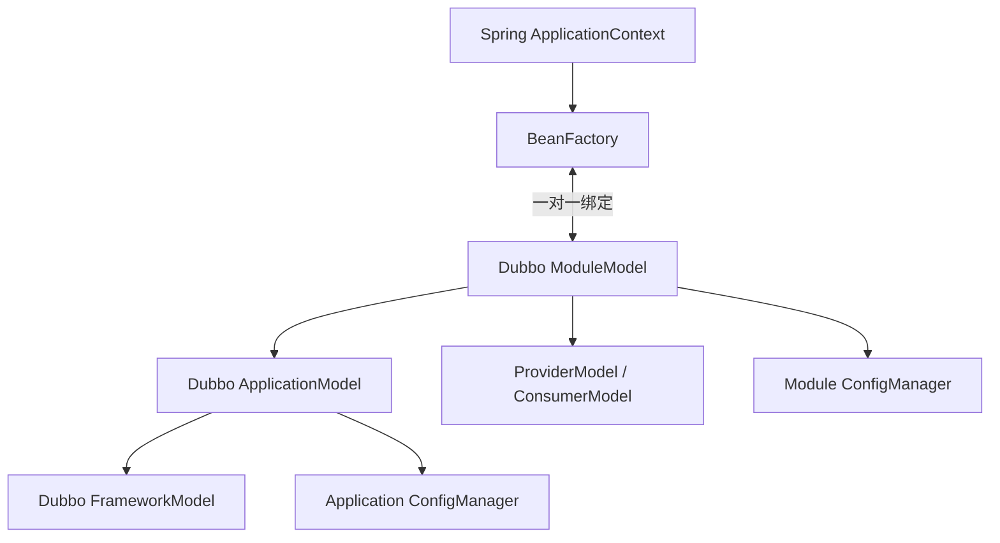
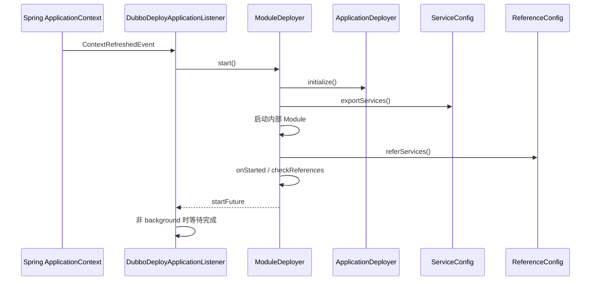

# 阶段 6：Spring Boot 3 集成与生命周期

> 阶段方案：[Spring Boot 3 集成与生命周期](../phases/06-spring-boot-integration.md)
> 运行证据：[自动配置、属性覆盖与关闭事件](evidence/06-spring-events-config-and-shutdown.md)
> 上一阶段：[服务暴露与服务引用](05-service-export-and-reference.md)
> 适用版本：Apache Dubbo 3.3.6；Spring Boot 3.3.1；质量门禁：G6

## 1. 先给结论

Spring Boot/Spring 集成层并没有重写 Dubbo 的服务暴露和引用机制。它完成的是三项适配：

1. 把外部属性转换成 `ApplicationConfig`、`RegistryConfig`、`ProtocolConfig` 等 Dubbo Config 对象。
2. 把 `@DubboService` 与 `@DubboReference` 转成 Spring BeanDefinition、`ServiceBean`、`ReferenceBean`。
3. 把 Spring 容器刷新和关闭事件转换成 `ModuleDeployer.start()` 与 `ModuleModel.destroy()`。

随后仍回到阶段 5 的核心链路：

```text
@DubboService
→ ServiceBean extends ServiceConfig
→ ServiceConfig.export
→ Protocol.export
→ Exporter + Server

@DubboReference
→ ReferenceBean implements FactoryBean
→ ReferenceConfig.get
→ Protocol.refer + Cluster.join
→ Proxy
```

本仓库的学习 Demo 要特别区分两种有效入口：

- Demo 使用 `dubbo-config-spring6`、显式 `@EnableDubbo` 和程序化 Config Bean，**没有**依赖 `dubbo-spring-boot-starter`，因此不会经过 `DubboAutoConfiguration`。
- Starter 应用从 Boot 的 `AutoConfiguration.imports` 进入 `DubboAutoConfiguration`，再启用同一套 Spring 扫描与生命周期基础设施。

两条入口在 `DubboSpringInitializer` 之后汇合。把 Demo 日志说成“证明自动配置生效”是不准确的；它证明的是 Spring 6 显式注解入口。

## 2. 两条入口如何汇合



### 2.1 Starter 自动配置入口

Boot 3 从
[`AutoConfiguration.imports`](../../../dubbo-spring-boot-project/dubbo-spring-boot-autoconfigure/src/main/resources/META-INF/spring/org.springframework.boot.autoconfigure.AutoConfiguration.imports)
导入通用自动配置。与本阶段直接相关的有：

- `DubboAutoConfiguration`；
- `DubboListenerAutoConfiguration`；
- `DubboRelaxedBinding2AutoConfiguration`；
- Triple、Observability 等可选自动配置。

[`DubboAutoConfiguration`](../../../dubbo-spring-boot-project/dubbo-spring-boot-autoconfigure/src/main/java/org/apache/dubbo/spring/boot/autoconfigure/DubboAutoConfiguration.java)
的主要生效条件是：

| 条件 | 含义 |
|---|---|
| `dubbo.enabled` 缺失或为 `true` | 默认启用；显式设为 `false` 可关闭这条自动配置入口 |
| `@AutoConfigureAfter(DubboRelaxedBindingAutoConfiguration.class)` | 先准备属性绑定器，再创建 Dubbo Config Bean |
| `dubbo.scan.base-packages` 存在 | 才注册 Starter 的服务扫描包 Bean 和扫描处理器 |

`@EnableDubboConfig` 始终负责配置 Bean 注册；服务扫描则是条件化的。没有配置扫描包不等于整个 Dubbo 自动配置失效，只代表 Starter 不主动扫描 `@DubboService`。

### 2.2 显式 `@EnableDubbo` 入口

`@EnableDubbo` 组合了：

```text
@EnableDubboConfig
+ @DubboComponentScan
```

[`DubboComponentScanRegistrar`](../../../dubbo-config/dubbo-config-spring/src/main/java/org/apache/dubbo/config/spring/context/annotation/DubboComponentScanRegistrar.java)
先调用 `DubboSpringInitializer.initialize`，再解析扫描包并注册适配当前 Spring 版本的 Service 注解处理器。

学习 Demo 的 Provider 和 Consumer 都是这条路径。Provider 还用 `@Bean` 显式构造：

```text
ApplicationConfig(name=source-learning-provider)
RegistryConfig(address=N/A)
ProtocolConfig(name=dubbo, port=${learning.provider-port})
```

这既适合作为最小实验台，也刻意绕开了 Starter 属性绑定，使“Spring 注解装配”和“Boot 自动配置”可以分别验证。

### 2.3 Spring Boot 3 的真实边界

路线方案列出的 `DubboSpringBoot3DependencyCheckAutoConfiguration` 在 3.3.6 基线上并不存在。Boot 3 专用模块的导入文件只导入 `DubboTriple3AutoConfiguration`；核心自动配置仍来自通用 `dubbo-spring-boot-autoconfigure`。

Spring 6 差异主要由 [`SpringCompatUtils`](../../../dubbo-config/dubbo-config-spring/src/main/java/org/apache/dubbo/config/spring/util/SpringCompatUtils.java)
在运行时选择：若检测到 Spring 6 类，就使用带 AOT 支持的：

- `ServiceAnnotationWithAotPostProcessor`；
- `ReferenceAnnotationWithAotBeanPostProcessor`；
- `DubboInfraBeanRegisterPostProcessor`。

所以版本边界不是“复制一套完整 Boot 3 启动流程”，而是“通用装配主线 + Spring 6/AOT 适配点”。

## 3. 属性如何变成 Dubbo Config

### 3.1 单配置与多配置前缀

[`DubboConfigConfiguration`](../../../dubbo-config/dubbo-config-spring/src/main/java/org/apache/dubbo/config/spring/context/annotation/DubboConfigConfiguration.java)
声明了要绑定的 Config 类型。

| 单配置前缀 | 目标类型举例 |
|---|---|
| `dubbo.application` | `ApplicationConfig` |
| `dubbo.module` | `ModuleConfig` |
| `dubbo.registry` | `RegistryConfig` |
| `dubbo.protocol` | `ProtocolConfig` |
| `dubbo.provider` / `dubbo.consumer` | `ProviderConfig` / `ConsumerConfig` |
| `dubbo.config-center` | `ConfigCenterConfig` |
| `dubbo.metadata-report` | `MetadataReportConfig` |
| `dubbo.metrics` / `dubbo.tracing` / `dubbo.ssl` | 对应功能 Config |

多实例使用复数前缀，例如 `dubbo.registries.registry1.address`、`dubbo.protocols.protocol1.port`，再配合 `dubbo.config.multiple=true`。

### 3.2 Boot Binder 链

[`DubboRelaxedBinding2AutoConfiguration`](../../../dubbo-spring-boot-project/dubbo-spring-boot-autoconfigure/src/main/java/org/apache/dubbo/spring/boot/autoconfigure/DubboRelaxedBinding2AutoConfiguration.java)
在 Spring Boot `Binder` 存在时创建 prototype 的 [`BinderDubboConfigBinder`](../../../dubbo-spring-boot-project/dubbo-spring-boot-autoconfigure/src/main/java/org/apache/dubbo/spring/boot/autoconfigure/BinderDubboConfigBinder.java)。后者接收已经抽取出的属性 Map，并让 Boot Binder 以宽松命名规则绑定到已有 Config 对象。



宽松绑定使 `config-center`、`configCenter` 等形式可以映射到 Java 属性，但最终优先级仍由 Spring `Environment` 决定；Dubbo Binder 不会重新定义 YAML、环境变量和命令行的高低。

### 3.3 本阶段验证的优先级

Provider 的端口使用 `@Value("${learning.provider-port:20880}")`。同时提供：

```text
application.yml                         → 20880
LEARNING_PROVIDER_PORT                  → 20882
--learning.provider-port                → 20883
```

最终 `ProtocolConfig port="20883"`，Server 监听 `20883`。因此在本 Demo 的 Spring 属性域中得到：

```text
命令行参数 > 环境变量 > application.yml > @Value 默认值
```

该实验验证的是 Spring Boot 属性源优先级，再由程序化 Bean 把最终值写入 Dubbo Config。Starter 的 `dubbo.*` 同样从该 `Environment` 读取，但进入 Config 的方式改为 Binder。

### 3.4 Config 何时真正进入 Dubbo

[`DubboConfigBeanInitializer`](../../../dubbo-config/dubbo-config-spring/src/main/java/org/apache/dubbo/config/spring/context/DubboConfigBeanInitializer.java)
实现 `InitializingBean`。它等待全部 BeanPostProcessor 注册完成后，从 BeanFactory 找到 Config Bean，分别装入 Module/Application `ConfigManager`，最后调用 `ReferenceBeanManager.prepareReferenceBeans()`。

这一时机避免 Reference 过早初始化时看不到应用、注册中心或 Consumer 配置。配置 Bean 被 Spring 创建，不等于已经被 Dubbo 运行时消费；`DubboConfigBeanInitializer` 是两者之间的明确提交点。

## 4. Spring 容器如何绑定 Dubbo 模型

[`DubboSpringInitializer`](../../../dubbo-config/dubbo-config-spring/src/main/java/org/apache/dubbo/config/spring/context/DubboSpringInitializer.java)
为一个 Spring `BeanFactory` 绑定一个 `ModuleModel`：

1. 优先使用默认 `ApplicationModel`，并为当前容器取得或创建 Module。
2. 将 `ModuleModel`、`ApplicationModel` 以单例形式放入 BeanFactory。
3. 把 Module 标记为 `lifeCycleManagedExternally=true`，表示 Spring 对其生命周期负责。
4. 注册扫描、引用、配置初始化、事件桥接等基础设施 Bean。

主要对象关系如下：



日志中的 `Dubbo Module[1.1.1]` 才是绑定学习 Demo Spring 容器的模块；同一 Framework 中还可能有内部 Module。读日志时不能看到多个 Module 就推断应用被重复启动。

## 5. `@DubboService` 到 Exporter

### 5.1 BeanDefinition 注册阶段

Spring 6 使用 `ServiceAnnotationWithAotPostProcessor`，其核心逻辑继承自
[`ServiceAnnotationPostProcessor`](../../../dubbo-config/dubbo-config-spring/src/main/java/org/apache/dubbo/config/spring/beans/factory/annotation/ServiceAnnotationPostProcessor.java)。它是 `BeanDefinitionRegistryPostProcessor`：

1. 在配置的包下扫描 `@DubboService`。
2. 注册或取得服务实现的 Spring BeanDefinition。
3. 为每个服务注解另外注册一个非 lazy 的 `ServiceBean` BeanDefinition。
4. 设置 interface、注解参数、方法配置，并用 `ref` 属性关联实现 Bean。

本次日志给出的闭环是：

```text
Found LearningServiceImpl
→ Register ServiceBean:LearningService::
→ loading dubbo config beans
→ Dubbo Module is starting
→ ServiceConfig export injvm:// 与 dubbo://
→ Start NettyServer
```

### 5.2 从 ServiceBean 回到阶段 5

[`ServiceBean`](../../../dubbo-config/dubbo-config-spring/src/main/java/org/apache/dubbo/config/spring/ServiceBean.java)
继承 `ServiceConfig`，并实现若干 Spring aware/lifecycle 接口。它保存 Spring 上下文与被引用实现，但真正创建 Provider Invoker、Exporter 和 Server 的仍是阶段 5 的 `ServiceConfig.export`。

完整映射为：

```text
@DubboService implementation
→ ServiceAnnotationPostProcessor
→ ServiceBean(ref=implementation)
→ ModuleDeployer.exportServices
→ ServiceConfig.export
→ ProxyFactory.getInvoker
→ Protocol.export
→ DubboExporter + NettyServer
```

## 6. `@DubboReference` 到 Proxy

### 6.1 注入元数据与 ReferenceBean

Spring 6 的 `ReferenceAnnotationWithAotBeanPostProcessor` 继承
[`ReferenceAnnotationBeanPostProcessor`](../../../dubbo-config/dubbo-config-spring/src/main/java/org/apache/dubbo/config/spring/beans/factory/annotation/ReferenceAnnotationBeanPostProcessor.java)。基类同时参与 BeanFactory 和 Bean 实例化后处理：

1. 查找字段或方法上的 `@DubboReference`。
2. 计算 reference key。
3. 注册或复用对应 `ReferenceBean` BeanDefinition，并登记别名和对象类型。
4. 在 `postProcessProperties` 中通过 Spring `getBean` 把对象注入字段。

AOT 子类还会提前准备注入点并发布早期 `DubboConfigInitEvent`，让原生镜像/AOT 场景能保留必要反射信息与初始化顺序。

### 6.2 两层延迟不能混为一谈

[`ReferenceBean`](../../../dubbo-config/dubbo-config-spring/src/main/java/org/apache/dubbo/config/spring/ReferenceBean.java)
是 `FactoryBean`，但 `getObject()` 返回的是 Spring 延迟代理，而非立即完成远程引用。`LazyTargetInvocationHandler` 对 `toString/hashCode/equals` 特判，首次真实业务调用才请求 target。

与此同时，[`ReferenceBeanManager`](../../../dubbo-config/dubbo-config-spring/src/main/java/org/apache/dubbo/config/spring/reference/ReferenceBeanManager.java)
在 Config 就绪后先创建并缓存 `ReferenceConfig`。因此要区分：

```text
准备引用配置：ReferenceBeanManager.prepareReferenceBeans
创建远程 Invoker：ReferenceConfig.get / init
取得业务 target：ReferenceBean.getCallProxy
字段里可见的对象：Spring lazy proxy
内部接口代理：Dubbo ProxyFactory 生成的 Proxy
```

最终调用链回到阶段 3、5：

```text
Spring LazyTargetInvocationHandler
→ ReferenceBean.getCallProxy
→ ReferenceConfig.get
→ ClusterInvoker
→ DubboInvoker
→ LearningServiceDubboProxy0
```

`ReferenceBean.destroy()` 本身不主动销毁引用，资源由 `ReferenceConfig`、ModuleDeployer 和模型生命周期统一管理，避免 Spring Bean 销毁与 Dubbo 模型销毁重复减引用计数。

## 7. 刷新事件如何启动 Dubbo

现代主线由 [`DubboDeployApplicationListener`](../../../dubbo-config/dubbo-config-spring/src/main/java/org/apache/dubbo/config/spring/context/DubboDeployApplicationListener.java)
完成：



[`DefaultModuleDeployer`](../../../dubbo-config/dubbo-config-api/src/main/java/org/apache/dubbo/config/deploy/DefaultModuleDeployer.java)
的正常状态为：

```text
PENDING → STARTING → STARTED → COMPLETION
```

失败则进入 `FAILED`，销毁进入 `STOPPING → STOPPED`。启动时先保证 Application 初始化，再暴露服务、准备内部 Module、创建引用、执行 started 回调并检查引用。

`DubboBootstrap` 仍是面向用户的 ApplicationDeployer 门面，但 Spring 现代路径直接控制 ModuleDeployer。旧的 `DubboBootstrapApplicationListener` 在 3.3.6 中仍存在但已废弃；不能用它概括当前 Spring 6 主线。

## 8. Spring 关闭如何释放 Dubbo 资源

收到 `ContextClosedEvent` 后，`DubboDeployApplicationListener` 销毁绑定的 `ModuleModel`，除非配置为 `KEEP_RUNNING`。模块销毁分为：

```text
preDestroy：服务下线
postDestroy：unexportServices → unreferServices
             → model destroy runners
             → service repository destroy
             → STOPPED
```

应用级 [`DefaultApplicationDeployer`](../../../dubbo-config/dubbo-config-api/src/main/java/org/apache/dubbo/config/deploy/DefaultApplicationDeployer.java)
随后处理应用实例注销、指标服务、注册中心、元数据报告、执行器和回调。Framework 最后销毁全局资源。

[`DubboShutdownHook`](../../../dubbo-config/dubbo-config-api/src/main/java/org/apache/dubbo/config/DubboShutdownHook.java)
知道 Spring Module 是 externally managed。本次正常关闭观察到：

```text
DubboShutdownHook：Run shutdown hook
→ 发现 Spring 管理 Module，等待 Spring
SpringApplicationShutdownHook：Module stopping
→ 关闭 DubboProtocol 与 NettyServer
→ unexport MetadataService
→ 关闭 registry / executor repository
→ Application stopped
→ Framework / global resources destroyed
→ DubboSpringInitializer unbind Module
```

这说明两个 Hook 不是并行重复销毁：Dubbo Hook 主动让位，Spring 事件桥接完成 Module 销毁，Application/Framework 再清理外围资源。

## 9. 源码阅读断点

建议分三组断点，不要从 Spring 全生命周期盲目单步：

### 9.1 自动配置与绑定

- `DubboAutoConfiguration` 的条件分支和 Bean 方法；
- `BinderDubboConfigBinder.bind`；
- `DubboConfigBeanInitializer.afterPropertiesSet`；
- `ConfigManager.addConfig`。

### 9.2 注解与对象创建

- `ServiceAnnotationPostProcessor.postProcessBeanDefinitionRegistry`；
- `ServiceAnnotationPostProcessor.registerServiceBean`；
- `ReferenceAnnotationBeanPostProcessor.postProcessProperties`；
- `ReferenceBean.getObject`、`getCallProxy`；
- `ReferenceBeanManager.prepareReferenceBeans`。

### 9.3 启停桥接

- `DubboDeployApplicationListener.onApplicationContextEvent`；
- `DefaultModuleDeployer.start`、`exportServices`、`referServices`；
- `DefaultModuleDeployer.preDestroy`、`postDestroy`；
- `DubboShutdownHook.run`。

## 10. 常见误判

| 误判 | 正确认识 |
|---|---|
| Spring Boot 应用一定经过 Dubbo Starter 自动配置 | 也可以像本 Demo 一样显式 `@EnableDubbo` |
| `@DubboService` 自己执行网络暴露 | 注解只提供元数据，`ServiceBean/ServiceConfig` 执行核心暴露 |
| `@DubboReference` 字段注入时已发起网络调用 | 字段通常先得到 Spring lazy proxy，真实 target 可延迟到首次业务方法 |
| `ReferenceBean.destroy` 负责关闭 Client | Module/ReferenceConfig 生命周期统一销毁引用与共享资源 |
| Spring 事件调用的仍是旧 Bootstrap Listener | 现代主线是 `DubboDeployApplicationListener → ModuleDeployer` |
| 多个 Module 日志说明重复启动 | 内部 Module 与绑定 Spring 容器的 Module 可以同时存在 |
| 配置 Bean 被 Spring 创建就已完全生效 | 还要经 `DubboConfigBeanInitializer` 装入 ConfigManager |

## 11. G6 验收

- [x] 从 Starter `AutoConfiguration.imports` 追踪到 `DubboAutoConfiguration`，并说明其与 ModuleDeployer/DubboBootstrap 的关系。
- [x] 从 `@DubboService` 追踪到 `ServiceBean → ServiceConfig → Protocol.export → Exporter`。
- [x] 从 `@DubboReference` 追踪到 `ReferenceBean → ReferenceConfig → ClusterInvoker → Proxy`。
- [x] 解释 Boot Binder、Config Bean 提交时机以及命令行、环境变量、YAML 的优先级。
- [x] 说明 Spring ApplicationContext、ModuleModel、ApplicationModel 的绑定关系。
- [x] 用正常关闭实验确认 Spring Module、Server、Exporter、应用和全局资源的释放顺序。

## 12. 向阶段 7 交接

阶段 7 可以从三个已经确定的入口继续：

1. `DubboConfigBeanInitializer` 装入的 `RegistryConfig`、`ConfigCenterConfig`、`MetadataReportConfig`，何时由 ApplicationDeployer 初始化。
2. `ModuleDeployer.exportServices/referServices` 如何经过 Registry Protocol 注册、订阅并形成 Directory。
3. Spring 关闭事件如何先触发服务下线，再销毁 Nacos 客户端和本地 RPC 资源。
