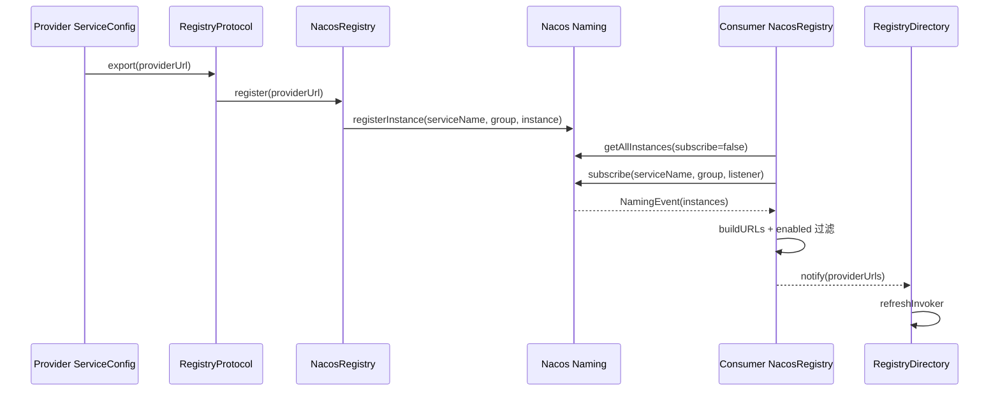
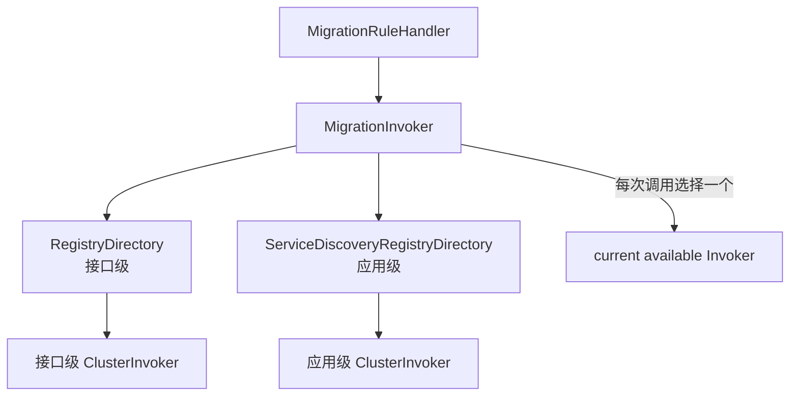

# 阶段 7：Nacos 三中心与双服务发现

> 阶段方案：[Nacos 三中心与双服务发现](../phases/07-nacos-service-discovery.md)
> 实验证据：[数据转换、迁移与故障保护](evidence/07-nacos-data-refresh-and-migration.md)
> 上一阶段：[Spring Boot 3 集成与生命周期](06-spring-boot-3-integration.md)
> 适用版本：Apache Dubbo 3.3.6；质量门禁：G7

## 1. 先给结论

同一个 Nacos 地址可以同时承担注册中心、配置中心和元数据中心，但“三中心”是三个逻辑角色，不是一个共享的 Dubbo 对象或一条连接：

| 逻辑角色 | Nacos 能力 | 保存的数据 | 直接影响 |
|---|---|---|---|
| 注册中心 | Naming Service | 接口级 Provider 实例，或应用级 ServiceInstance | Consumer 当前可见的地址集合 |
| 配置中心 | Config Service | 全局、应用配置及动态治理配置 | 启动配置和运行时规则 |
| 元数据中心 | Config Service | 接口到应用映射、应用元数据、服务定义 | 应用级实例如何还原成接口 URL |

接口级发现与应用级发现也不是同一数据模型的两个名字：

- 接口级模式直接以接口、版本、分组组成 Nacos serviceName，每个 Nacos `Instance` 携带可还原的 Provider URL 参数。
- 应用级模式以应用名注册较紧凑的实例，Consumer 先取得“接口 → 应用”映射，再按元数据 revision 恢复接口和协议信息。
- `register-mode=all` 会让 Provider 同时注册两种数据；Consumer 的 `MigrationInvoker` 可以同时持有两条 Directory 链，但一次普通调用只选择其中一个 Invoker，不会把两套地址直接合并后负载均衡。

地址更新最终都会落到 Directory 的 `refreshInvoker`：不变的 URL 复用旧 Invoker，新增 URL 执行 `protocol.refer`，失效 URL 对应的旧 Invoker 被销毁。空推送保护默认开启，防止注册中心瞬时空列表直接清空可用地址。

## 2. 三个中心何时启动

[`DefaultApplicationDeployer`](../../../dubbo-config/dubbo-config-api/src/main/java/org/apache/dubbo/config/deploy/DefaultApplicationDeployer.java) 的应用初始化主线可压缩为：

```text
initialize
├─ registerShutdownHook
├─ startConfigCenter
│  └─ prepareEnvironment：拉取全局配置和应用配置
├─ loadApplicationConfigs
├─ initModuleDeployers
├─ startMetadataCenter
└─ initialized

ModuleDeployer.start
└─ exportServices / referServices / registerServiceInstance
```

配置中心必须先于最终 Config 对象加载，因为远端配置要参与有效配置计算；元数据中心在应用配置准备完毕后启动；接口和应用实例的注册、订阅则随 Module 的服务暴露和引用发生。

### 2.1 从 RegistryConfig 派生另外两个角色

当注册中心是 Nacos，且对应扩展存在时，Dubbo 可以从 `RegistryConfig` 派生配置中心或元数据中心配置。这解释了为什么只写一个 Nacos 地址也可能启动多个客户端。显式关闭 `use-as-config-center` 或 `use-as-metadata-center` 才会阻止相应派生。

如果配置要求 `metadata-type=remote`，却没有可用的 `MetadataReportConfig`，应用初始化会失败；这不是“没有元数据也先跑”的降级路径。

### 2.2 同地址不等于复用同一 Client

在 3.3.6 源码中，四条路径各自创建客户端：

| 路径 | 创建点 | Client 类型 |
|---|---|---|
| 接口级注册发现 | [`NacosRegistryFactory`](../../../dubbo-registry/dubbo-registry-nacos/src/main/java/org/apache/dubbo/registry/nacos/NacosRegistryFactory.java) | 独立 `NamingService` |
| 应用级服务发现 | [`NacosServiceDiscovery`](../../../dubbo-registry/dubbo-registry-nacos/src/main/java/org/apache/dubbo/registry/nacos/NacosServiceDiscovery.java) 构造器 | 独立 `NamingService` |
| 配置中心 | [`NacosDynamicConfiguration`](../../../dubbo-configcenter/dubbo-configcenter-nacos/src/main/java/org/apache/dubbo/configcenter/support/nacos/NacosDynamicConfiguration.java) | 独立 `ConfigService` |
| 元数据中心 | [`NacosMetadataReport`](../../../dubbo-metadata/dubbo-metadata-report-nacos/src/main/java/org/apache/dubbo/metadata/store/nacos/NacosMetadataReport.java) | 独立 `ConfigService` |

它们可以使用相同 server address、namespace、鉴权参数，却有不同的生命周期、监听集合和失败语义。排障时应按逻辑角色分别检查，而不能只看到 Nacos 地址相同就认定“连接正常”。

## 3. 配置中心的数据与优先级

[`ConfigCenterConfig`](../../../dubbo-common/src/main/java/org/apache/dubbo/config/ConfigCenterConfig.java) 的默认值是：

| 字段 | 默认值 | Nacos 含义 |
|---|---|---|
| `namespace` | `dubbo` | 配置所在 namespace |
| `group` | `dubbo` | 全局配置 group |
| `configFile` | `dubbo.properties` | 全局配置 dataId |
| `appConfigFile` | 未设置 | 未设置时回退 `configFile` |

启动时读取两层远端配置：

1. 全局配置：`dataId=configFile`、`group=config-center.group`。
2. 应用配置：`dataId=appConfigFile`，未设置则仍用 `configFile`；`group=application.name`。

因此默认情况下可能出现相同 dataId、不同 group 的两条 Nacos Config 数据，不能只按 dataId 查找。

Dubbo 自己的 [`Environment`](../../../dubbo-common/src/main/java/org/apache/dubbo/common/config/Environment.java) 按以下顺序取第一个非空值：

```text
SystemConfiguration
> EnvironmentConfiguration
> AppExternalConfiguration
> ExternalConfiguration
> AppConfiguration
> AbstractConfig
> PropertiesConfiguration
```

其中应用级远端配置进入 `AppExternalConfiguration`，全局远端配置进入 `ExternalConfiguration`，所以应用级远端配置高于全局远端配置。这里讨论的是 Dubbo 配置域；阶段 6 的 Spring Boot `Environment` 仍有自己的命令行、环境变量、YAML 优先级。

`highestPriority` 在此基线上已经废弃，不应再用它解释当前生效顺序。

## 4. 接口级服务发现

### 4.1 Nacos 中保存什么

[`NacosServiceName`](../../../dubbo-registry/dubbo-registry-nacos/src/main/java/org/apache/dubbo/registry/nacos/NacosServiceName.java) 将服务名编码为：

```text
providers:{interface}:{version}:{group}
```

默认分隔符是 `:`。Nacos Naming group 来自 Registry URL 的 group，缺失时使用 Nacos `DEFAULT_GROUP`。每个 Provider 对应一个 Nacos `Instance`：

- `ip`、`port` 是服务地址；
- metadata 保存 Provider URL 参数；
- 额外保留 `category`、`protocol`、`path`；
- Consumer 可直接把 Instance 还原为 `ServiceConfigURL` 或 `DubboServiceAddressURL`。

因此接口级数据以“自描述”为特点：只要拿到该接口的实例列表，就已经具备构造接口 Invoker 的主要信息。

### 4.2 注册与订阅链



[`NacosRegistry`](../../../dubbo-registry/dubbo-registry-nacos/src/main/java/org/apache/dubbo/registry/nacos/NacosRegistry.java) 首次订阅先用 `getAllInstances(..., subscribe=false)` 主动取快照，再注册 `EventListener`。事件只保留 enabled 实例，随后转换 URL 并通知 Directory。

## 5. 应用级服务发现

### 5.1 Nacos 中保存什么

应用级 [`NacosServiceDiscovery`](../../../dubbo-registry/dubbo-registry-nacos/src/main/java/org/apache/dubbo/registry/nacos/NacosServiceDiscovery.java) 以应用名作为 serviceName。一个 ServiceInstance 代表一个应用进程，而不是一个接口：

- 主体是应用名、host、port；
- metadata 携带 endpoints、metadata storage type、exported-services revision 等紧凑信息；
- 接口清单和协议参数由 revision 对应的 `MetadataInfo` 补全。

### 5.2 从接口到应用，再回到接口

[`ServiceDiscoveryRegistry`](../../../dubbo-registry/dubbo-registry-api/src/main/java/org/apache/dubbo/registry/client/ServiceDiscoveryRegistry.java) 是注册中心 SPI 与应用级发现之间的桥：


Nacos 元数据中心的数据布局如下：

| 数据 | dataId | group | content |
|---|---|---|---|
| 接口 → 应用映射 | 接口 service key | `mapping` | 逗号分隔的应用名，CAS 更新 |
| 远端应用元数据 | 应用名 | metadata revision | `MetadataInfo` JSON |
| 传统服务元数据 | identifier unique key | metadata report group，默认 root | 服务定义或 URL |

映射变化会调整正在监听的应用名集合；应用实例变化产生 `ServiceInstancesChangedEvent`。[`ServiceInstancesChangedListener`](../../../dubbo-registry/dubbo-registry-api/src/main/java/org/apache/dubbo/registry/client/event/listener/ServiceInstancesChangedListener.java) 按 revision 分组，避免同一份 MetadataInfo 被重复拉取，再用应用实例的 host/port 与 MetadataInfo 中的接口信息恢复 URL。

### 5.3 `metadata-type=local` 与 `remote`

| 模式 | Consumer 获取 MetadataInfo 的路径 | 依赖 |
|---|---|---|
| `remote` | `MetadataUtils.getMetadata` → MetadataReport → Nacos Config | 元数据中心中的应用名/revision 数据 |
| `local` | 从实例 endpoints 构造内部 MetadataService URL → 临时 RPC 引用 Provider | Provider 的 MetadataService 可达 |

[`MetadataUtils`](../../../dubbo-registry/dubbo-registry-api/src/main/java/org/apache/dubbo/registry/client/metadata/MetadataUtils.java) 在 local 路径中创建临时 MetadataService 代理，读取完成后销毁临时 Invoker。这里的“local”不是从 Consumer 本地文件读取，而是元数据随 Provider 本地发布，并由 Consumer 远程调用 Provider 的内部元数据服务。

## 6. 三种注册模式

Provider 的开关是 `dubbo.application.register-mode`：

| 值 | Provider 产生的注册 URL | 主要数据 |
|---|---|---|
| `interface` | `registry://` | 接口级 Provider URL |
| `instance` | `service-discovery-registry://` | 应用 ServiceInstance |
| `all` | 两者都有 | 双注册 |

[`ConfigValidationUtils`](../../../dubbo-config/dubbo-config-api/src/main/java/org/apache/dubbo/config/utils/ConfigValidationUtils.java) 的兼容规则还与原始 Registry URL 类型有关：普通接口 Registry URL 默认 `all`，Service Discovery Registry URL 默认 `instance`。

Provider 导出完成后，一方面按注册 URL 将接口数据注册到 `NacosRegistry`，另一方面由 `ServiceConfig` 请求 Deployer 注册应用实例；当 `service-name-mapping=true` 时还会把接口到应用的映射写入元数据中心。应用元数据和实例有后续定时刷新，关闭时先注销应用实例再销毁底层资源。

## 7. 双订阅如何选择，而不是合并

兼容入口会创建 [`MigrationInvoker`](../../../dubbo-registry/dubbo-registry-api/src/main/java/org/apache/dubbo/registry/client/migration/MigrationInvoker.java)：



迁移步骤来自 `dubbo.application.migration.step`，兼容键为 `dubbo.application.service-discovery.migration`：

| 步骤 | 行为 |
|---|---|
| `FORCE_INTERFACE` | 优先使用接口级 Directory |
| `APPLICATION_FIRST` | 默认；应用级地址满足比较条件时优先，否则使用接口级 |
| `FORCE_APPLICATION` | 优先使用应用级 Directory |

`APPLICATION_FIRST` 由 [`DefaultMigrationAddressComparator`](../../../dubbo-registry/dubbo-registry-api/src/main/java/org/apache/dubbo/registry/client/migration/DefaultMigrationAddressComparator.java) 比较新旧地址数量：

```text
应用级无地址                         → 不迁移
接口级无地址、应用级有地址           → 迁移
两边都有地址                         → appCount / interfaceCount >= threshold
threshold 默认值                     → 0.0
动态属性键                            → dubbo.application.migration.threshold
```

默认阈值 0.0 意味着只要应用级存在地址，数量比较通常就通过。应用级被选中后若变为不可用，`decideInvoker()` 仍会回退到接口级。`promotion` 小于 100 时还可按比例把一部分调用留在接口级。

强制步骤是否销毁另一条链还受 migration rule 的 `force` 控制：`force=true` 时直接切换并销毁对侧；否则仍需满足比较条件。地址变化会重新执行选择，因此“启动时选了应用级”不代表以后永不回退。

## 8. 一条 Nacos 数据如何变成 DubboInvoker

### 8.1 接口级转换

```text
Nacos Instance metadata
→ NacosRegistry.buildURLs
→ Provider URL
→ RegistryDirectory.notify
→ refreshOverrideAndInvoker
→ refreshInvoker
→ protocol.refer
→ DubboInvoker
```

### 8.2 应用级转换

```text
Nacos application Instance
+ interface → application mapping
+ MetadataInfo(revision)
→ ServiceInstancesChangedListener.parseMetadata
→ interface service URLs
→ ServiceDiscoveryRegistryDirectory.notify
→ refreshInvoker
→ protocol.refer
→ DubboInvoker
```

[`RegistryDirectory`](../../../dubbo-registry/dubbo-registry-api/src/main/java/org/apache/dubbo/registry/integration/RegistryDirectory.java) 以 URL 为主要键复用 Invoker；[`ServiceDiscoveryRegistryDirectory`](../../../dubbo-registry/dubbo-registry-api/src/main/java/org/apache/dubbo/registry/client/ServiceDiscoveryRegistryDirectory.java) 使用包含服务键和地址的 key，并额外考虑实例、ServiceInfo 和 URL 是否改变。

两者共同遵循：

1. key 和有效属性未变，复用旧 Invoker 与底层 Client。
2. 新地址或关键属性变化，重新 `protocol.refer`。
3. 新列表不再使用的旧 Invoker，在刷新完成后销毁。
4. 显式 `empty://` 表示清空；普通空列表在空保护开启时不覆盖当前缓存。

这也是 Provider 上下线对请求链的真实影响：它首先改变 Directory 的可选 Invoker 集合，只有新增或变更地址才进一步创建新连接，移除地址则在旧 Invoker 销毁时释放对应引用。

## 9. 故障、恢复与空推送保护

不要把“Nacos 恢复”概括成一个统一重试。3.3.6 至少有以下层次：

| 层次 | 机制 | 保护范围 |
|---|---|---|
| Client 创建 | `nacos.retry` + `nacos.retry-wait`；默认检查 server status 和试探请求 | 启动时连接 |
| 单次 Naming 请求 | [`NacosNamingServiceWrapper`](../../../dubbo-registry/dubbo-registry-nacos/src/main/java/org/apache/dubbo/registry/nacos/NacosNamingServiceWrapper.java) 的有限循环重试 | register、subscribe、query 等当前操作 |
| 接口级失败补偿 | [`FailbackRegistry`](../../../dubbo-registry/dubbo-registry-api/src/main/java/org/apache/dubbo/registry/support/FailbackRegistry.java) 的 failed task + timer | 失败注册、注销、订阅、退订 |
| Nacos SDK | 已创建 `NamingService` 自身维护连接和订阅 | 网络断开后的底层重连；Dubbo 未在 wrapper 中主动换 Client |
| 应用元数据恢复 | MetadataInfo 全部不可用时，不发布新地址，10 秒后重试 | 防止元数据中心瞬时故障清空应用级地址 |
| 空推送保护 | 默认忽略普通空列表；关闭后生成 `empty://` | 防止误清空 Directory |

`nacos.check=false` 只允许在创建 Client 时跳过可用性检查，不代表后续请求一定成功。`nacos.retry` 是有限次数的当前调用重试；接口级长期补偿来自 `FailbackRegistry`，二者不能混为一谈。

应用级地址刷新还有一个细节：若多个 revision 中只有部分元数据失败，成功的 revision 仍可先形成地址，失败部分排入重试；只有所有 revision 都无法恢复时，本轮才完全不通知 Directory。

## 10. 可复用配置骨架

以下配置用于理解三个角色与双注册，具体 namespace、group、鉴权和 migration rule 应替换成实际环境值：

```yaml
dubbo:
  application:
    name: demo-provider
    register-mode: all
    metadata-type: remote
  registry:
    address: nacos://127.0.0.1:8848
    group: DEFAULT_GROUP
    parameters:
      namespace: dubbo-learning
  config-center:
    address: nacos://127.0.0.1:8848
    namespace: dubbo-learning
    group: dubbo
    config-file: dubbo.properties
  metadata-report:
    address: nacos://127.0.0.1:8848
    group: dubbo
```

建议实验时为三种数据分别记录：

- Naming：namespace、group、serviceName、Instance metadata；
- Config：namespace、group、dataId、MD5 和实际内容；
- Metadata：接口映射、应用名、revision、MetadataInfo 内容。

同名 `group` 配置在不同角色中的含义不完全相同，不应复制一列控制台值就认为三条链一致。

## 11. 本阶段验证结果

完整命令和输出摘要见[实验证据](evidence/07-nacos-data-refresh-and-migration.md)。本阶段共验证：

| 验证组 | 测试数 | 结果 |
|---|---:|---|
| Nacos 接口级注册与应用级发现 | 9 | 全部通过 |
| 双发现迁移、地址恢复与空保护 | 29 | 全部通过 |
| 配置中心与元数据中心创建重试 | 6 | 全部通过 |
| Naming Client、请求重试和批量注册兼容 | 16 | 全部通过 |

另有 `NacosDynamicConfigurationTest` 的 3 项真实 Nacos 集成测试被上游 `@Disabled`，原因是等待嵌入式 Nacos 问题解决。本阶段没有伪造本地 Nacos 控制台数据，结论来自 3.3.6 源码、Mock 驱动的确定性测试以及现有迁移/刷新测试。进入公司环境后应补充真实 namespace、dataId、serviceName 和断网窗口的观测记录，但这不改变上述对象链与选择算法。

## 12. G7 验收

- [x] 能区分同一 Nacos 集群的注册、配置、元数据三个逻辑职责。
- [x] 能说明接口级 Instance 与应用级 ServiceInstance + MetadataInfo 的数据差异。
- [x] 能从 Nacos 数据追踪到 URL、Directory 和可调用 Invoker。
- [x] 通过 `MigrationInvokerTest` 验证双模式只选择一条链，并覆盖切换与回退。
- [x] 能说明 Provider 上下线如何触发 Invoker 新增、复用和销毁。
- [x] 能区分有限请求重试、Failback 补偿、SDK 重连、元数据重试与空推送保护。

## 13. 向阶段 8 交接

阶段 8 可以直接复用以下插入点：

- 配置变更：`DynamicConfiguration` listener；
- 接口地址变更：`NacosAggregateListener → RegistryDirectory`；
- 应用地址变更：`ServiceInstancesChangedListener → ServiceDiscoveryRegistryDirectory`；
- 迁移选择：`MigrationRuleHandler → MigrationInvoker`；
- 治理落点：Directory 刷新后 RouterChain、ClusterInvoker 与 Filter 链的重新计算。
