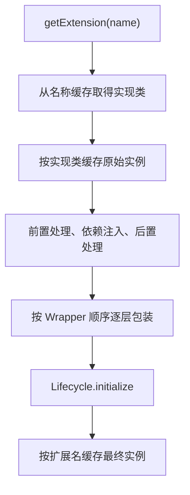
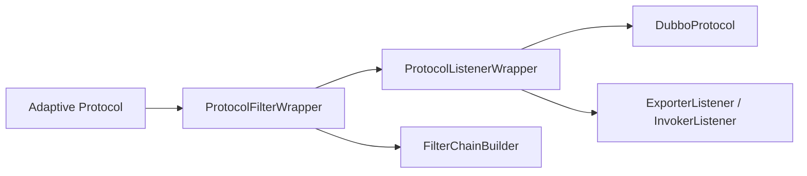

# 阶段 8：SPI、集群治理、异常与安全

> 阶段方案：[SPI、集群治理、异常与安全](../phases/08-spi-governance-failure-security.md)
> 运行证据：[SPI、治理与异常实验](evidence/08-spi-governance-and-failures.md)
> 安全基线：[Dubbo 3.3.6 学习范围威胁模型](../threat-model.md)
> 上一阶段：[Nacos 三中心与双服务发现](07-nacos-and-service-discovery.md)
> 适用版本：Apache Dubbo 3.3.6；质量门禁：G8

## 1. 先给结论

Dubbo 的可扩展性不是“在某处反射一个实现类”，而是由四层机制共同完成：

1. `ExtensionLoader` 从约定目录发现扩展，按 ScopeModel 取得对应的 Loader，完成实例化、依赖注入、Wrapper 包装、初始化和缓存。
2. Adaptive Extension 在真正调用时读取 URL 或 Invocation 参数，再把调用转发给具名扩展。
3. Activate 按 group、URL 条件、显式增删和顺序关系组装一组扩展，Filter、Router、Listener 都使用这套能力。
4. Protocol Wrapper 在 `export`、`refer` 边界透明插入 Filter 和 Listener，因此运行对象通常不是一个裸 `DubboProtocol` 或 `DubboInvoker`。

一次 Consumer 调用的治理次序可概括为：

```text
Cluster Filter
→ Directory.list
→ StateRouter / Router
→ Cluster 策略
→ LoadBalance 选择一个 Invoker
→ 地址级 Filter
→ Protocol Invoker
→ Request / Future
```

这里最容易混淆的职责边界是：Router 缩减候选地址，LoadBalance 在当前候选中选一个地址，Cluster 决定失败后是否再试，Filter 则处理上下文、指标、限流、鉴权和异常等横切逻辑。

异常不是统一在一个地方转换：连接和 Future 异常先在 `DubboInvoker` 转成带错误码的 `RpcException`；Failover 只立即终止 `BIZ_EXCEPTION`，其他 `RpcException` 可以进入下一次尝试；Provider 的 `ExceptionFilter` 还会处理“未声明且 Consumer 可能没有该异常类”的兼容问题。真实 3500 ms 延迟实验确认，3000 ms Consumer 超时被归类为错误码 2，且 Consumer 超时并不会取消 Provider 正在执行的方法。

安全方面，Hessian2 类检查只约束“允许实例化哪些 Java 类型”，不能替代调用方认证、业务对象校验、传输加密或控制面访问控制。注册中心、配置中心和元数据中心都属于高权限控制面，不能作为不可信输入源对待。

## 2. ExtensionLoader 的完整生命周期

### 2.1 发现与作用域

SPI 接口必须带 [`@SPI`](../../../dubbo-common/src/main/java/org/apache/dubbo/common/extension/SPI.java)。扩展描述文件由 LoadingStrategy 从约定目录加载，名称映射到实现类；带 `@Adaptive` 的实现被缓存为 Adaptive 类，拥有单参数 SPI 构造器的类被识别为 Wrapper，其他实现进入普通具名扩展表。

调用方通常不直接使用一个进程级静态 Loader，而是通过 URL 上的 ScopeModel 获取：

| SPI | 声明作用域 | 典型含义 |
|---|---|---|
| `Protocol` | `FRAMEWORK` | 框架内协议实现及其共享资源 |
| `Filter` | `MODULE` | 模块自己的调用链与业务配置 |
| `LoadBalance` | 默认作用域 | 当前模型中的负载均衡扩展 |
| `Cluster` | 默认作用域 | 当前模型中的集群容错策略 |

因此“扩展名相同”不必然表示跨 Framework、Application、Module 共用同一个对象。排查实例污染或销毁问题时，要同时记录扩展类型、扩展名、ScopeModel identity 和 ClassLoader。

### 2.2 创建、包装与缓存

[`ExtensionLoader.createExtension`](../../../dubbo-common/src/main/java/org/apache/dubbo/common/extension/ExtensionLoader.java) 的核心过程是：



需要区分两级缓存：

- `extensionInstances` 按实现类缓存未包装的实例，同一实现类若有多个别名，底层对象可以复用。
- `cachedInstances` 按扩展名缓存最终具名实例，包含 Wrapper 后的对象。
- `cachedAdaptiveInstance` 单独保存 Adaptive 实例。

Wrapper 类按比较器排序后反向逐层构造，因此最终外层对象顺序不能只看资源文件的文本顺序。创建后若最终对象实现 `Lifecycle` 才调用初始化；销毁时 Loader 会处理已缓存的原始和包装对象。自定义 Wrapper 若吞掉 Lifecycle/Disposable 接口，会改变钩子是否可见，应作为扩展设计审查项。

## 3. Adaptive：由 URL 把调用送到具名实现

### 3.1 生成规则

如果 SPI 已存在手写 `@Adaptive` 实现，Loader 直接使用；否则 [`AdaptiveClassCodeGenerator`](../../../dubbo-common/src/main/java/org/apache/dubbo/common/extension/AdaptiveClassCodeGenerator.java) 生成 Java 源码，再交给 Adaptive `Compiler` 编译。

生成器对每个方法执行以下规则：

1. 方法未标 `@Adaptive`：生成的方法直接抛 `UnsupportedOperationException`。
2. 参数中直接存在 `URL`：使用该参数；否则寻找拥有公共 `getUrl()` 的参数。
3. 扩展键优先取 `@Adaptive` 的显式 value；未写时由 SPI 类名转成点分隔键。
4. 有 `Invocation` 参数时，优先读取 method parameter；否则读取普通 URL parameter。
5. 特殊键 `protocol` 直接读取 URL protocol。
6. 参数没有值时回退 `@SPI` 默认扩展名；仍为空则报错。
7. 从 URL 的 ScopeModel 取得该 SPI 的 Loader，再 `getExtension(extName)` 并转调原方法。

可把生成代码理解为下面的伪代码：

```java
URL url = arg.getUrl();
String extName = url.getMethodParameter(invocation.getMethodName(), "loadbalance", "random");
ScopeModel scopeModel = ScopeModelUtil.getOrDefault(url.getScopeModel(), type);
LoadBalance extension = scopeModel.getExtensionLoader(LoadBalance.class).getExtension(extName);
return extension.select(invokers, url, invocation);
```

伪代码只用于解释结构，实际生成内容以版本源码为准。

### 3.2 从 URL 预测实现

| SPI | Adaptive 键 | 默认实现 | 示例预测 |
|---|---|---|---|
| `Protocol` | `protocol` | `dubbo` | `dubbo://...` → `DubboProtocol`；`registry://...` → `RegistryProtocol` |
| `LoadBalance` | `loadbalance` | `random` | `loadbalance=roundrobin` → `RoundRobinLoadBalance` |
| `Cluster` | `cluster` | `failover` | `cluster=failfast` → `FailfastCluster` |

Adaptive 自身只是分发器，不保存“本次永远选中的实现”。URL、方法名或动态覆盖参数变化后，同一个 Adaptive 对象可以在下一次调用选择不同具名扩展。

## 4. Wrapper：为什么 Protocol 能透明插入调用链

[`ProtocolFilterWrapper`](../../../dubbo-cluster/src/main/java/org/apache/dubbo/rpc/cluster/filter/ProtocolFilterWrapper.java) 和 [`ProtocolListenerWrapper`](../../../dubbo-rpc/dubbo-rpc-api/src/main/java/org/apache/dubbo/rpc/protocol/ProtocolListenerWrapper.java) 都拥有 `Protocol` 单参数构造器，因此会被识别为 Wrapper。



两类 Wrapper 在 registry URL 上直接委托，避免把面向具体协议地址的 Filter/Listener 链错误包到注册中心协议外层。到具体 Provider URL 或 Consumer URL 时：

- Filter Wrapper 在 export 侧构建 Provider Filter 链，在 refer 侧构建 Consumer 地址级 Filter 链。
- Listener Wrapper 把 Exporter 包为 `ListenerExporterWrapper`，把地址级 Invoker 包为 `ListenerInvokerWrapper`。

这解释了阶段 3、4 看到的对象树：实际目标是 `ListenerInvokerWrapper → DubboInvoker`，其外还有 Filter 节点；不能从代理一路只搜索 `DubboInvoker` 并把中间对象视为噪声。

## 5. Activate：一组扩展如何启用并排序

[`ExtensionLoader.getActivateExtension`](../../../dubbo-common/src/main/java/org/apache/dubbo/common/extension/ExtensionLoader.java) 同时考虑四类输入：

| 输入 | 作用 |
|---|---|
| `@Activate.group` | 匹配 `consumer`、`provider` 等使用场景 |
| `@Activate.value` | 只有 URL 存在对应键或键值时自动启用 |
| URL 显式列表 | 增加具名扩展，`-name` 删除，`-default` 删除全部默认扩展 |
| `before`、`after`、`order` | 形成最终顺序 |

显式列表中的 `default` 还是一个位置标记：`custom1,default,custom2` 表示 custom1 在默认扩展前，custom2 在默认扩展后。没有该标记时，显式扩展与自动激活扩展一起按比较器排序。

[`DefaultFilterChainBuilder`](../../../dubbo-cluster/src/main/java/org/apache/dubbo/rpc/cluster/filter/DefaultFilterChainBuilder.java) 取得排序后的列表后从尾向前包装，所以列表中的第一个 Filter 成为最外层，也最先收到请求、最后收到响应。

本阶段真实对象树中的 Consumer Cluster Filter 外到内为：

```text
ConsumerContextFilter
→ ObservationSenderFilter
→ ConsumerClassLoaderFilter
→ MetricsConsumerFilter
→ FutureFilter
→ MetricsClusterFilter
→ MonitorClusterFilter
→ RouterSnapshotFilter
→ FailoverClusterInvoker
```

地址级链为：

```text
LearningConsumerStackFilter
→ RpcExceptionFilter
→ ListenerInvokerWrapper
→ DubboInvoker
```

实际列表受依赖模块、URL 参数和用户扩展影响；上面是当前学习示例的运行快照，不是所有部署的固定常量。

## 6. Filter、Router、LoadBalance、Cluster 的分工

| 层 | 输入 | 输出或动作 | 不负责什么 |
|---|---|---|---|
| Filter | Invoker + Invocation | 上下文、观测、限流、鉴权、异常处理，继续调用下一节点 | 不维护全量地址拓扑 |
| Router | 候选 Invoker 列表 + Invocation | 按标签、条件等得到候选子集 | 不决定失败后尝试几次 |
| LoadBalance | 当前候选列表 | 为当前一次尝试选一个 Invoker | 不执行远程调用，不跨尝试保存容错策略 |
| Cluster | Directory + Invocation | 组织一次或多次尝试，处理重选和最终失败 | 不解析 Nacos 原始实例 |

执行主线是：


[`SingleRouterChain`](../../../dubbo-cluster/src/main/java/org/apache/dubbo/rpc/cluster/SingleRouterChain.java) 先执行 StateRouter，再执行普通 Router。地址变化时 `setInvokers` 同时通知两类 Router；[`RouterChain`](../../../dubbo-cluster/src/main/java/org/apache/dubbo/rpc/cluster/RouterChain.java) 使用主备链切换，使缓存重建期间的新旧地址不互相错配。

标签和条件治理规则通过 DynamicConfiguration/GovernanceRuleRepository 的监听器进入 Router，解析成规则对象后刷新 StateRouter 的地址位图。由此得到的顺序是：

```text
配置中心规则变更
→ 配置监听回调
→ 规则解析与合法性检查
→ Router 内部规则/缓存更新
→ 下一次 Directory.list 执行新 RouterChain
→ LoadBalance 只在新候选列表内选择
```

## 7. Failover、重选与超时预算

[`FailoverClusterInvoker`](../../../dubbo-cluster/src/main/java/org/apache/dubbo/rpc/cluster/support/FailoverClusterInvoker.java) 的总尝试次数是 `retries + 1`。`RpcContext` 可为单次调用覆盖 retries，读取后立即删除；小于等于 0 的总次数被修正为 1。

每次重试前都会重新 `Directory.list`，因为地址和路由规则可能已经变化；LoadBalance 再选择地址，并尽量避免已经调用过的 Invoker。业务异常 `isBiz()` 立即抛出，不进入下一次尝试；其他 RpcException 保存为最后异常，耗尽后用最后错误码生成带尝试次数和 Provider 集合的最终异常。

超时有两个层次：

- 普通直连调用由 URL、RpcContext 或 Invocation 的 `timeout` 决定当前请求等待时间。
- 级联调用启用 timeout countdown 后，Provider 收到上游剩余预算并创建 `TimeoutCountDown`；后续 Consumer 调用取剩余时间，若已经耗尽则直接返回 `TIMEOUT_TERMINATE`。

`DubboInvoker` 在真正发请求前再次计算 timeout：

| 原始失败 | 转译结果 |
|---|---|
| `TimeoutException` | `RpcException.TIMEOUT_EXCEPTION`，错误码 2 |
| `RemotingException` | `RpcException.NETWORK_EXCEPTION`，错误码 1 |
| RemotingException 内层为序列化失败 | `SERIALIZATION_EXCEPTION`，错误码 5 |
| 剩余预算小于等于 0 | `TIMEOUT_TERMINATE`，错误码 8 |

重试并不创造新的超时预算；开启 countdown 的链路会让后续尝试看到更少的剩余时间。即便未开启跨服务 countdown，多次重试仍会放大端到端延迟，所以只对幂等操作设置可控重试。

## 8. 主要异常的预测矩阵

| 场景 | 首个边界 | 典型错误码/结果 | Failover 行为 |
|---|---|---|---|
| Directory 原始地址为空 | Directory/Cluster 前置检查 | 无可用 Provider，码 6 | 没有可选择地址，调用前失败 |
| Router 把候选过滤为空 | Router → Cluster 前置检查 | 过滤后无 Invoker，码 6 | 不会凭空恢复被路由排除的地址 |
| 连接断开、写请求失败 | DubboInvoker | NETWORK，码 1 | 默认可重试并重新选址 |
| 等待 Response 超时 | DefaultFuture → DubboInvoker | TIMEOUT，码 2 | 配置了 retries 时可重试，但需考虑剩余预算与重复执行 |
| 剩余预算已经耗尽 | ConsumerContextFilter/DubboInvoker | TIMEOUT_TERMINATE，码 8 | 后续尝试无法获得新预算 |
| Provider 抛业务异常 | Provider Result → Consumer recreate | 业务异常或 BIZ，码 3 | 不重试 |
| 请求序列化失败 | Codec/Remoting → DubboInvoker | SERIALIZATION，码 5 | 技术上可进入 Failover，但换地址通常不能修复类型问题 |
| 未声明的 Provider 异常类 | ExceptionFilter | 字符串化 RuntimeException | 以兼容传播为主，不应当成网络失败 |

“地址为空”和“路由为空”最终都可能表现为码 6，但排查证据不同：前者应检查 Registry/Directory 原始 Invoker，后者应检查 RouterSnapshot 每层输入输出。

## 9. Provider ExceptionFilter 的兼容边界

[`ExceptionFilter`](../../../dubbo-rpc/dubbo-rpc-api/src/main/java/org/apache/dubbo/rpc/filter/ExceptionFilter.java) 不是统一吞异常：

- checked exception 或接口方法已声明的异常直接返回。
- JDK、Dubbo API 或 Consumer 很可能同样具备的异常类型直接返回。
- 未声明、非公共 API 且 Consumer 可能缺类的异常会记录日志，并以字符串信息包装为 `RuntimeException`，避免 Consumer 反序列化一个不存在的 Provider 私有类。

因此最稳定的业务约定仍是：把可预期业务失败声明在共享 API 中，不要依赖 Provider 私有 RuntimeException 穿越 RPC 边界。

## 10. 序列化安全机制

[`SerializeSecurityConfigurator`](../../../dubbo-common/src/main/java/org/apache/dubbo/common/utils/SerializeSecurityConfigurator.java) 在模块初始化时加载：

- `security/serialize.allowlist`；
- `security/serialize.blockedlist`；
- 对应的系统属性；
- ApplicationConfig 中的检查级别、自动信任、信任包层级和 Serializable 检查开关。

默认开启 `autoTrustSerializeClass`，会从本地受信任的服务接口出发，遍历方法参数、返回值、声明异常、泛型边界以及非 transient 字段，把 API 数据模型加入允许前缀。这个过程信任的是部署者本地加载的 API 定义，不是远端报文声明。

[`DefaultSerializeClassChecker`](../../../dubbo-common/src/main/java/org/apache/dubbo/common/utils/DefaultSerializeClassChecker.java) 的判定顺序是：

```text
DISABLE → 直接加载类
否则先匹配 allow 前缀 → 允许
STRICT 且未匹配 allow → 拒绝
WARN 模式命中 blocked 前缀 → 拒绝
WARN 模式其他未知类 → 告警后允许
最后按配置检查非 primitive 类型是否实现 Serializable
```

`alwaysAllowed` 优先于 blocked 检查，因此它是部署者的显式覆盖。安全级别在同一个 Manager 生命周期中只允许从更严格变得更宽松，`checkSerializable` 也只允许从 true 放宽为 false；多 Module 配置不一致时，最宽松设置可能影响 Framework 共享检查器，应在启动前统一应用配置。

Hessian2 定向测试确认：STRICT 下不可信目标类被拒绝，受信任且可序列化的类型可正常往返，非 Serializable 类型会被拒绝。部分“流中声明未知类”的 Hessian2 路径可能回退成 Map，而不是实例化目标类；这不等于输入已通过业务校验。

## 11. 安全属性与非目标

本阶段新增的[学习范围威胁模型](../threat-model.md)把边界固定为：

- RPC 网络、注册/配置/元数据控制面以及应用业务逻辑是不同信任域。
- 序列化 allowlist 的安全属性是限制类加载和对象实例化，不负责认证发送者或验证字段语义。
- `TokenFilter` 只是比较 URL token 与调用附件；未配置时不会自动启用，也不能等同于完整身份体系。
- 仓库具备 TLS、Dubbo Auth 和 Spring Security 集成能力，但学习示例默认直连、无 registry、无 TLS、无 auth，不能据此声称链路具备机密性或调用方身份保证。
- Nacos 等控制面必须由网络隔离、TLS、鉴权、ACL、最小权限、审计和备份共同保护；攻击者若能写入控制面，可能改写地址、路由和元数据。

常见误判：

| 观察 | 错误结论 | 正确边界 |
|---|---|---|
| STRICT 拒绝未知类 | 已防御所有反序列化攻击 | 只控制类实例化，还需输入大小、深度、业务字段和资源限制 |
| 配置了 token | 已具备强身份认证 | token 是共享值匹配，需安全分发、轮换并配合 TLS；更强身份使用专门认证能力 |
| 注册中心连接成功 | 控制面可信 | 可达性不代表写入者已被正确鉴权授权 |
| Consumer 超时 | Provider 已停止执行 | 本阶段实测 Provider 仍执行到 3500 ms 并返回，只是 Consumer 已不再等待 |
| 业务异常未重试 | 所有 RuntimeException 都不重试 | 取决于异常如何进入 Result、在哪里 recreate，以及 RpcException 是否标为 Biz |

## 12. 排障断点手册

| 问题 | 首选断点 | 需要保存的变量 |
|---|---|---|
| Adaptive 选错实现 | `AdaptiveClassCodeGenerator.generateExtNameAssignment` 或生成类调用点 | URL、method、adaptive key、extName、ScopeModel |
| 扩展顺序错误 | `ExtensionLoader.getActivateExtension` | group、URL 参数、names、排序后 class 列表 |
| Wrapper 缺失 | `ExtensionLoader.createExtension` | wrapperClassesList、match、最终 instance class |
| 路由结果异常 | `SingleRouterChain.simpleRoute` | 每层 Router 输入输出、规则 revision、Invocation 附件 |
| 负载不均 | `AbstractClusterInvoker.select` 与具体 LoadBalance | 当前候选、weight、warmup、selected Invoker |
| 重试次数不符 | `FailoverClusterInvoker.calculateInvokeTimes` | URL retries、RpcContext override、最终 len |
| 超时分类错误 | `DubboInvoker.doInvoke` catch 分支 | timeout、Request id、Future cause、RpcException code |
| 业务异常丢类型 | `ExceptionFilter.onResponse` | 接口声明异常、异常 codeSource、Consumer 是否有类 |
| 反序列化被拒绝 | `DefaultSerializeClassChecker.loadClass0` | status、className、allow/blocked 前缀、Serializable |

## 13. G8 验收结果

- [x] 能从 URL protocol、`loadbalance`、`cluster` 及方法参数解释 Adaptive 实现选择。
- [x] 能说明 Activate 的 group/value、显式增删、default 位置和最终执行顺序。
- [x] 能区分 Filter、Router、LoadBalance、Cluster 的职责与输入输出。
- [x] 能预测业务、网络、超时、序列化、空地址异常是否重试以及在哪里转译。
- [x] 定向测试和真实 3500 ms 延迟调用共同提供异常运行证据。
- [x] 安全结论已经与威胁模型对应，并明确部署方、业务方和控制面运维责任。

下一阶段将把阶段 0—8 的结论压缩为总索引、问题索引、核心链路图、复习卡片和版本升级检查表。
