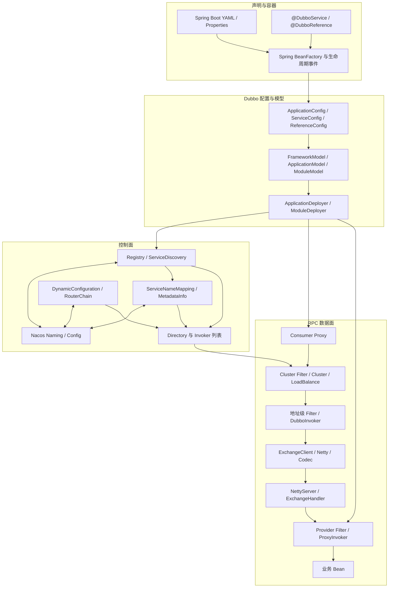
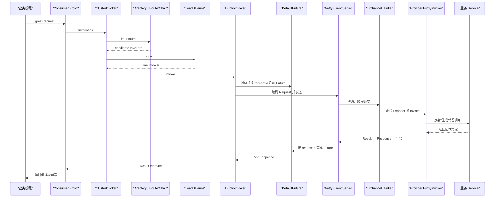
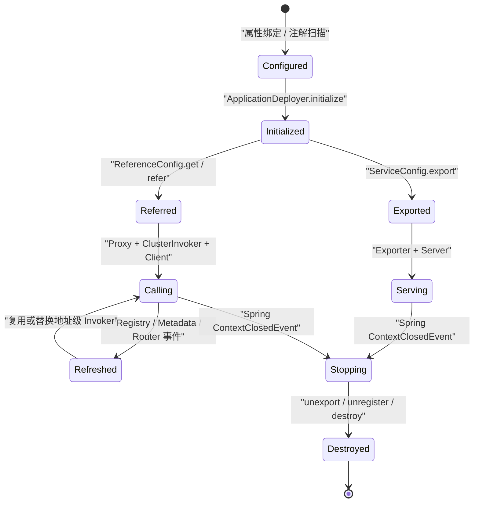
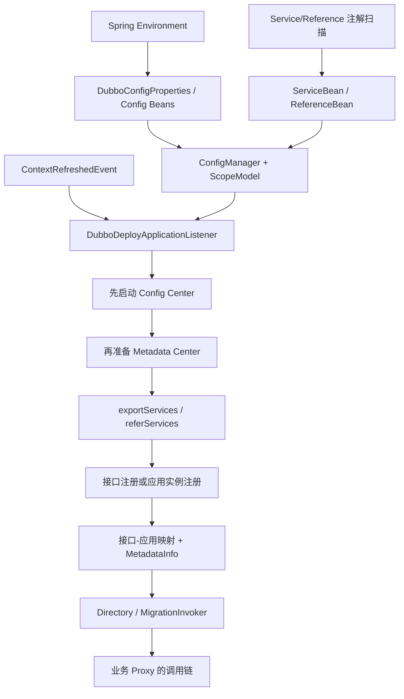

# 阶段 9：Dubbo 3.3.6 源码知识地图

> 阶段方案：[知识体系收口](../phases/09-knowledge-consolidation.md)
> 路线图：[Dubbo 源码学习整体路线图](../roadmap.md)
> 附录入口：[索引、排障与复习材料](../appendix/README.md)
> 上一阶段：[SPI、集群治理、异常与安全](08-spi-governance-failure-security.md)
> 适用版本：Apache Dubbo 3.3.6；质量门禁：G9

## 1. 这套文档现在能解决什么

阶段 0—8 已形成一条闭合主线：从固定版本和最小直连实验出发，先建立模块与对象地图，再跟踪一次同步 RPC 的 Consumer、网络、Provider、暴露、引用、Spring Boot、Nacos、SPI、治理和失败路径。阶段 9 不复制这些正文，而是提供三种检索入口：

| 入口 | 适用场景 | 从哪里开始 |
|---|---|---|
| 学习入口 | 第一次系统理解 Dubbo 3.3.6 | 本文第 3 节的阶段路径 |
| 源码入口 | 已知对象、类或扩展点，想找到代码 | [概念、源码与 SPI 索引](../appendix/concepts-source-and-spi-index.md) |
| 问题入口 | 正在定位启动、调用、地址、超时或关闭问题 | [断点手册与故障地图](../appendix/debugging-and-failure-map.md) |

需要复习、面试自测、做版本升级或继续学习 Triple 时，直接进入[复习题、边界对比与升级清单](../appendix/review-upgrade-and-next-topics.md)。

这套材料证明的是固定基线上的框架行为，不等于任意 Dubbo 版本或任意生产环境。发布 tag 是 `dubbo-3.3.6`，tag commit 为 `f1585880bee4ca7776f44380c47c994217721ffe`；源码阅读与运行证据采集基于后续学习提交 `b7868dbb56181bf04e3b0b6c11a77b25ffd2a951`。文档所在分支可能继续合入 3.3 上游更新，复现实验时应检出上述固定基线。涉及版本差异时必须保留这两个层次。

## 2. 一张总图：配置、控制面和数据面

按从上到下、从左到右阅读：上层把声明转换成运行时对象；控制面持续改变可见地址和治理规则；数据面执行每次 RPC；底层负责协议、序列化和传输。



这张图有两条不要混淆的变化路径：

- 对象装配路径：配置、注解和 Spring 事件创建 Proxy、Invoker、Exporter、Client、Server。
- 运行时刷新路径：Nacos 实例、元数据和治理规则改变 Directory/Router，已有 Proxy 不必重建。

## 3. 连续学习路径

### 3.1 第一遍：先建立稳定主线

| 顺序 | 文档 | 学完后应能回答 |
|---:|---|---|
| 1 | [阶段 0：稳定基线与最小直连实验](00-baseline-and-learning-guide.md) | 示例如何构建、启动、关联一次请求？ |
| 2 | [阶段 1：全局架构与模块地图](01-architecture-overview.md) | Maven 模块、运行时对象和 ScopeModel 如何对应？ |
| 3 | [阶段 2：一次同步 RPC 调用全景](02-rpc-call-overview.md) | 同步接口如何穿过代理、网络和 Provider 后返回？ |
| 4 | [阶段 3：Consumer 调用链](03-consumer-invocation.md) | Directory、Router、LoadBalance、Cluster 的次序是什么？ |
| 5 | [阶段 4：Protocol、网络与 Provider](04-protocol-remoting-provider.md) | Invocation 如何变成字节，Response 如何匹配 Future？ |

第一遍只要求能从 `LearningClient.greet` 讲到 `LearningServiceImpl.greet` 并返回，不必立即记住所有 Wrapper 和 Filter。

### 3.2 第二遍：解释对象从哪里来、如何变化

| 顺序 | 文档 | 学完后应能回答 |
|---:|---|---|
| 6 | [阶段 5：服务暴露与服务引用](05-service-export-and-reference.md) | Proxy、Invoker、Exporter、Client、Server 何时创建、复用、销毁？ |
| 7 | [阶段 6：Spring Boot 3 集成](06-spring-boot-3-integration.md) | 注解与属性怎样汇合到 Dubbo Deployer？ |
| 8 | [阶段 7：Nacos 与服务发现](07-nacos-and-service-discovery.md) | 接口级/应用级数据如何变成可调用 Invoker？ |
| 9 | [阶段 8：SPI、治理、异常与安全](08-spi-governance-failure-security.md) | 扩展如何选择，规则如何生效，失败如何分类，信任边界在哪里？ |

第二遍应把阶段 0 的真实对象树反向解释完整：每层对象由哪个配置、工厂、SPI 或 Wrapper 创建，以及地址变化时哪一层替换、哪一层复用。

## 4. 一次同步 RPC 的完整链路

下面只保留关键类型；Filter、Listener 和观测节点可从阶段 3、4 的实际对象树展开。



必须记住三个顺序约束：

1. Consumer 在发送 Request 前注册 Future，否则极快 Response 可能找不到等待者。
2. Provider 网络线程完成解码后再派发到业务线程，业务代码不应阻塞 IO 线程。
3. 同步只是代理对 Future 的等待方式；网络内核仍以 requestId 和异步 Future 匹配响应。

## 5. 核心对象生命周期总图



### 5.1 Provider 侧

```text
@DubboService Bean
→ ServiceBean / ServiceConfig
→ ProxyFactory.getInvoker
→ Protocol.export
→ Exporter 缓存
→ openServer 或复用 Server
→ 注册接口 URL / 应用 ServiceInstance / 元数据
```

Exporter 以服务 key 区分服务，Server 以监听地址复用；关闭时要分别验证服务解绑与端口关闭，不能用一个 Map 的大小代替完整生命周期证据。

### 5.2 Consumer 侧

```text
@DubboReference 字段
→ ReferenceBean / ReferenceConfig
→ Protocol.refer
→ Directory + ClusterInvoker
→ ProxyFactory.getProxy
→ Spring 字段注入
```

多个地址级 `DubboInvoker` 可以共享 Client；Registry/Directory 刷新会复用未变化 URL 的 Invoker、为新增 URL 创建 Invoker、销毁失效 URL 的 Invoker，而上层业务 Proxy 通常保持不变。

## 6. Spring Boot、Nacos 与调用链怎样汇合



关键时间约束：配置中心要在最终 Dubbo Config 装配前提供外部配置；元数据中心在应用配置已可用后准备；服务注册和引用随 Module 启动发生。Spring 的属性优先级与 Dubbo `Environment` 内部配置优先级是两套相邻机制，不能混成一个列表。

同一个 Nacos 地址可以产生注册中心 NamingService、应用级 ServiceDiscovery NamingService、配置中心 ConfigService、元数据中心 ConfigService 等独立 Client。排障必须按逻辑角色记录 namespace、group、dataId/serviceName、Client identity 和监听状态。

## 7. 正常、变化与失败三条阅读线

| 路径 | 核心事件 | 对象变化 | 对应证据 |
|---|---|---|---|
| 正常调用 | Proxy 发起同步 RPC | Request/Future 临时创建，长期 Invoker/Client 复用 | [端到端调用链](evidence/02-end-to-end-call-chain.md) |
| Provider 扩容 | 注册中心推送新地址 | Directory 新建地址级 Invoker，Router 缓存刷新 | [Nacos 数据刷新](evidence/07-nacos-data-refresh-and-migration.md) |
| Provider 下线 | 地址消失或连接失败 | 失效 Invoker 销毁；Failover 可重新 list/reselect | [Consumer 选择与 Failover](evidence/03-consumer-selection-and-failover.md) |
| 治理规则变化 | 配置监听收到新规则 | RouterRule/BitList 更新，Proxy 不重建 | [SPI、治理与异常](evidence/08-spi-governance-and-failures.md) |
| Consumer 超时 | Future 等待超过 timeout | RpcException code 2；Provider 可能仍执行 | [真实超时实验](evidence/08-spi-governance-and-failures.md#6-实验-e真实-3000-ms-超时) |
| Spring 关闭 | ContextClosedEvent | unexport、unregister、destroy Client/Server/Scope | [关闭事件证据](evidence/06-spring-events-config-and-shutdown.md) |

从任何失败现象出发，都先区分“对象尚未创建”“控制面没有产生正确数据”“路由后没有候选”“已选地址调用失败”“响应返回但业务重建失败”“关闭阶段资源未释放”这六类边界，再进入具体模块。

## 8. 模块与专题交叉索引

| 模块族 | 主要职责 | 首读文档 | 深入索引 |
|---|---|---|---|
| `dubbo-common` | URL、SPI、配置环境、ScopeModel、安全类检查 | 阶段 1、8 | [SPI 与安全索引](../appendix/concepts-source-and-spi-index.md#4-spi-扩展索引) |
| `dubbo-config` | Service/Reference 配置、部署器、暴露与引用 | 阶段 5 | [创建与生命周期索引](../appendix/concepts-source-and-spi-index.md#3-核心类与方法索引) |
| `dubbo-cluster` | Directory、Router、LoadBalance、Cluster、Filter 链 | 阶段 3、8 | [调用与治理断点](../appendix/debugging-and-failure-map.md#3-调用与治理断点) |
| `dubbo-rpc` | Proxy、Protocol、Invoker、Filter、Dubbo Protocol | 阶段 2、4 | [RPC 源码索引](../appendix/concepts-source-and-spi-index.md#3-核心类与方法索引) |
| `dubbo-remoting` | Exchange、Transport、Netty、Future、Codec | 阶段 4 | [网络断点](../appendix/debugging-and-failure-map.md#4-网络响应与-provider-断点) |
| `dubbo-registry` | 接口注册、应用服务发现、Directory、迁移 | 阶段 7 | [地址问题决策树](../appendix/debugging-and-failure-map.md#6-故障定位决策树) |
| `dubbo-configcenter` / `dubbo-metadata` | 外部配置、治理数据、映射与元数据 | 阶段 7 | [控制面断点](../appendix/debugging-and-failure-map.md#2-启动暴露与引用断点) |
| `dubbo-config-spring` / starter | Spring Bean、注解、属性和事件集成 | 阶段 6 | [Spring 生命周期断点](../appendix/debugging-and-failure-map.md#2-启动暴露与引用断点) |

## 9. 证据等级与使用规则

| 等级 | 证据 | 可以支持的结论 |
|---|---|---|
| A | 本机真实 Provider/Consumer 运行日志、对象树、调用栈 | 当前基线与当前配置的实际行为 |
| B | 固定版本的确定性单元/集成测试 | 被测试输入范围内的算法与边界 |
| C | 固定 tag 源码路径和分支分析 | 设计和可能路径，需要避免冒充运行结果 |
| D | 环境计划或待复验项 | 只能描述验证方法，不能写成已确认事实 |

阶段 7 没有真实 Nacos Server，阶段 8 没有真实动态规则发布和生产认证/TLS；对应结论分别标记为 Mock/源码证据或下游责任。新版本复验不能删除这些边界。

## 10. 文档维护约定

- `README.md` 只维护阶段状态和入口；路线依赖与 G0—G9 定义只在 `roadmap.md` 维护。
- `phases/` 描述“准备怎么学”，`notes/` 描述“实际确认了什么”，`notes/evidence/` 保存实验细节，`appendix/` 提供跨阶段检索。
- 主笔记先给结论，源码链接指向固定仓库路径；大段日志和完整调用栈不进入主文。
- 3.3.6 结论保持稳定。升级时新增差异记录，不直接把旧结论改成新版本行为。
- Mermaid 节点使用稳定概念名，正文紧邻说明阅读方向，避免只有图没有对象映射。
- 每次新增、移动文档后运行 Markdown 本地链接检查和 `git diff --check`。

## 11. G9 最终审计

### 11.1 内容完整性

- [x] 阶段 0—8 均通过各自质量门禁。
- [x] 正常调用、地址变化、治理变化、异常传播、安全边界和关闭路径均有专题与证据。
- [x] 总图中的配置、模型、控制面、调用面节点都能进入对应源码或专题。

### 11.2 可读性与检索

- [x] 主笔记均先给结论，再展开对象、源码、实验与验收。
- [x] 提供连续学习、源码类名和故障现象三种入口。
- [x] 长文按阶段、证据和附录拆分，没有用完整日志淹没正文。
- [x] Proxy、Invoker、Exporter、Directory、Router、Client、Server 等术语在索引中统一定义。

### 11.3 可复现性与维护性

- [x] 基线固定为 Dubbo 3.3.6、JDK 21，实验命令和预期学习标记已保存。
- [x] 核心结论标明运行、测试、源码或待复验边界。
- [x] 阶段状态只在学习入口维护，专题与附录职责清晰。
- [x] 提供版本升级差异清单，避免覆盖 3.3.6 主线。

至此，G9 的目标不是“记住每个类”，而是达到两种能力：新学习者可沿阶段文档讲清一次 RPC；故障处理者可从现象进入断点、对象和验证实验，并为每个核心判断找到证据。
