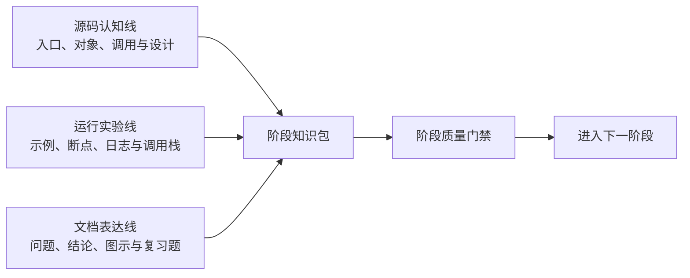
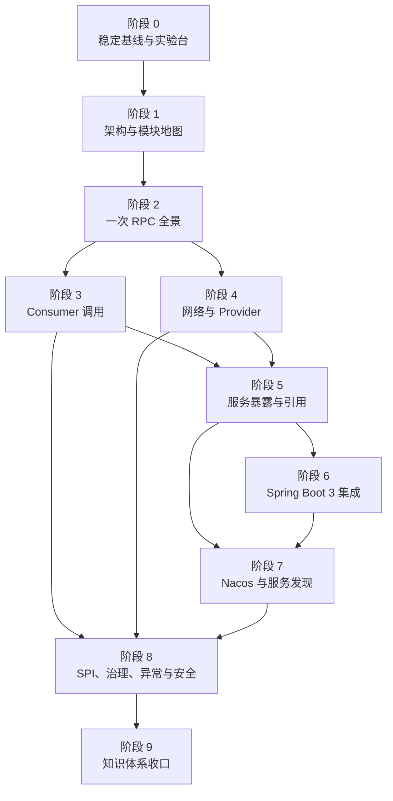

# Dubbo 源码学习整体路线图

> 总纲：[源码学习总体方案](00-source-learning-plan.md)
> 阶段索引：[分阶段方案](phases/README.md)
> 学习分支：`codex/learn-dubbo-source-3.3`

## 1. 路线目标

路线图负责回答三个问题：

1. 各阶段为什么按当前顺序安排？
2. 每个阶段必须向下一个阶段交付什么？
3. 如何判断整个学习过程是在积累证据，而不是只增加文档数量？

## 2. 三条并行产出线

每个阶段都同时推进三条产出线，但同一时间只聚焦一个阶段。

任何阶段都不能只完成其中一条线：

- 只有源码阅读，没有运行验证，结论可能不符合真实运行路径。
- 只有实验，没有源码定位，无法形成可迁移的框架理解。
- 只有文档，没有问题和证据，容易退化成源码摘要。

## 3. 阶段依赖图

阶段 3 和阶段 4 在知识上可以分别设计，但实施时仍建议先完成 Consumer，再完成网络与 Provider，避免同时维护两条未闭合的调用链。

## 4. 阶段质量门禁

| 门禁 | 阶段 | 必须证明的结果 |
|---|---|---|
| G0 | 0 | 固定版本实验可以重复运行，日志可关联两端请求 |
| G1 | 1 | 核心模块和抽象可以映射到源码目录与职责 |
| G2 | 2 | 一次同步 RPC 可以由真实调用栈和全景图共同证明 |
| G3 | 3 | Consumer 最终 Provider 的选择过程可以被解释和复现 |
| G4 | 4 | 参数到字节、线程切换和响应匹配可以被断点证明 |
| G5 | 5 | Proxy、Invoker、Exporter、Client、Server 的来源和生命周期清晰 |
| G6 | 6 | 从 Spring 注解可以追踪到最终 Proxy 或 Exporter |
| G7 | 7 | Nacos 数据可以追踪到 Directory 和可调用 Invoker |
| G8 | 8 | 主要扩展选择、动态变化和异常传播结果可以被预测 |
| G9 | 9 | 文档体系可以用于学习、复习和问题定位，链接及版本有效 |

## 5. 交付物依赖

| 上游产物 | 下游使用方式 |
|---|---|
| 阶段 0 实验台 | 后续所有动态调试和异常实验的统一载体 |
| 阶段 1 模块地图 | 后续章节标注代码所属层次 |
| 阶段 2 RPC 导航图 | 后续章节标记当前放大位置 |
| 阶段 3 Consumer 对象包装树 | 阶段 5 反向解释对象创建，阶段 8 解释治理 |
| 阶段 4 报文与线程图 | 阶段 8 分析超时、网络和反序列化失败 |
| 阶段 5 生命周期图 | 阶段 6、7 解释 Spring 和 Nacos 的插入点 |
| 阶段 6 配置与 Bean 图 | 阶段 7 解释 Nacos 外部配置进入框架的时机 |
| 阶段 7 地址刷新图 | 阶段 8 解释动态治理和失败恢复 |
| 阶段 8 故障矩阵 | 阶段 9 生成排查地图和复习材料 |

## 6. 状态定义

阶段状态只使用以下值：

| 状态 | 含义 |
|---|---|
| 方案已设计，实施待开始 | 阶段文档完整，但尚未执行源码分析和实验 |
| 进行中 | 当前唯一正在实施的阶段 |
| 待验收 | 文档和实验已完成，质量门禁尚未通过 |
| 已完成 | 质量门禁通过，证据和交付物完整 |
| 需返工 | 后续发现结论、实验或版本证据不成立 |

阶段实际状态只在[学习入口](README.md)维护。阶段完成后如果上游结论被推翻，依赖它的阶段应进入“需返工”。文档职责和变更归属见[总体方案](00-source-learning-plan.md#11-文档职责与维护规则)。
