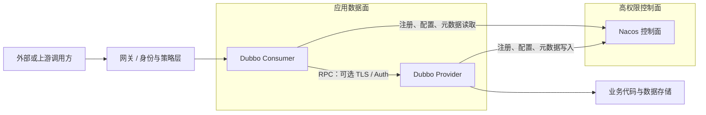

# Dubbo 3.3.6 学习范围威胁模型

> 本文是 `docs/source-learning` 为源码学习和实验补充的安全边界，不是 Apache Dubbo 官方安全承诺，也不替代[上游威胁模型](../threat-model.md)、[仓库安全政策](../../SECURITY.md)、安全公告或具体部署的风险评估。
> 适用基线：Apache Dubbo 3.3.6；最后验证：2026-07-26。

## 1. 目的与范围

本文回答三个问题：

1. 本学习路线观察的 RPC 系统中，哪些数据和组件需要保护？
2. Dubbo 3.3.6 源码已经提供哪些可配置安全机制？
3. 哪些属性不由框架默认提供，必须由部署平台、控制面运维和业务应用补齐？

范围包括 Dubbo Protocol Consumer/Provider、Hessian2 序列化、Nacos 注册/配置/元数据三种逻辑角色、动态治理、Spring Boot 3 应用生命周期和扩展加载。互联网网关、数据库、操作系统、容器平台和公司身份系统只描述与 Dubbo 相接的边界，不对其内部实现作安全证明。

## 2. 关键资产

| 资产 | 安全目标 |
|---|---|
| 服务接口与业务数据 | 机密性、完整性、合法用途、最小暴露 |
| Provider 执行能力 | 只有被授权调用方能触发允许的方法，限制资源消耗 |
| 注册地址与应用实例 | 防止流量重定向、伪造 Provider、恶意摘除 |
| 动态配置与治理规则 | 防止未授权路由、降级、限流和迁移策略变更 |
| 元数据与接口映射 | 防止接口拓扑泄露、错误映射和恶意类型信息 |
| 序列化类型边界 | 防止加载或实例化未授权 Java 类型 |
| 凭据、证书与 token | 机密存储、最小分发、轮换和撤销 |
| 日志、指标和调用链 | 可审计，同时避免泄漏请求参数和秘密 |

## 3. 信任边界

必须分别处理以下边界：

- 外部/上游 → Consumer 或 Provider：调用方身份、授权、请求大小、速率和业务字段均不可信。
- Consumer ↔ Provider：网络可被监听、篡改或重放，除非部署明确启用并验证 TLS/认证能力。
- 应用 ↔ Nacos：Nacos 是高权限控制面。连接成功不代表访问者可信，服务端和客户端都要执行认证授权。
- 反序列化流 → Java 对象：流内类型名、对象图、集合大小和字段值均不可信。
- SPI/插件 → Framework/Module：部署到 classpath 的扩展代码拥有进程内代码权限，属于供应链和发布审批边界。
- Dubbo → 业务实现：框架通过类型和协议校验的请求仍可能违反业务权限或状态机约束。

## 4. 威胁主体与前提

需要考虑：

- 能访问暴露端口但没有合法业务权限的网络调用者；
- 拥有低权限合法身份、尝试越权或耗尽资源的调用者；
- 泄漏或复用 token、证书、Nacos 凭据的攻击者；
- 能向注册中心、配置中心或元数据中心写入数据的主体；
- 引入恶意或有漏洞 SPI jar、序列化依赖或业务模型的供应链主体；
- 因错误配置关闭安全检查、暴露管理端口或打印秘密的内部操作者。

本文不假设 JVM、操作系统或宿主机已经被攻击者完全控制。若攻击者已有同进程任意代码执行能力，SPI、allowlist 和 RPC 认证都不能重新建立进程内隔离。

## 5. 主要威胁与控制

### 5.1 未授权调用与流量窃听

威胁：攻击者直接访问 Provider、伪造调用附件、窃听或篡改明文 RPC。

源码能力：

- [`TokenFilter`](../../dubbo-rpc/dubbo-rpc-api/src/main/java/org/apache/dubbo/rpc/filter/TokenFilter.java) 在配置 `token` 时比较 Provider URL token 与 Invocation 附件。
- `dubbo-plugin/dubbo-auth` 提供专门认证扩展。
- Netty 传输层具有 TLS handler，`SSLConfig` 提供证书相关配置。
- `dubbo-plugin/dubbo-spring-security` 可把 RPC 上下文接入 Spring Security。

下游责任：

- 学习示例默认没有启用 TLS、token 或 auth，因此不提供调用方身份、机密性和抗篡改保证。
- 简单 token 是共享秘密匹配，不是完整用户/服务身份体系；必须安全分发、轮换并避免写入日志。
- 生产环境应按协议能力启用双向或服务端 TLS、校验证书和主机/服务身份，并限制 Provider 端口只对需要的网络主体开放。
- 方法级、租户级和数据级授权必须由网关、认证插件和业务代码共同完成。

### 5.2 不可信反序列化

威胁：报文请求实例化危险类、非预期类或超大对象图，进而造成代码执行、内存/CPU 消耗或业务绕过。

源码能力：

- [`SerializeSecurityConfigurator`](../../dubbo-common/src/main/java/org/apache/dubbo/common/utils/SerializeSecurityConfigurator.java) 加载 allowlist/blockedlist，并可从本地服务 API 自动信任数据模型。
- [`DefaultSerializeClassChecker`](../../dubbo-common/src/main/java/org/apache/dubbo/common/utils/DefaultSerializeClassChecker.java) 提供 `DISABLE`、`WARN`、`STRICT` 模式和 Serializable 检查。
- Hessian2 在类加载处调用安全检查器；STRICT 下未允许目标类不会被实例化。

安全属性：限制反序列化阶段能够加载和实例化的 Java 类型。

非目标与下游责任：

- allowlist 不认证报文发送者，不验证字段值，不限制所有集合大小、嵌套深度、字符串长度和业务语义。
- 不应为解决兼容问题直接设置 `DISABLE`，也不应把过宽包名前缀长期加入 alwaysAllowed。
- 应使用窄 DTO、统一多 Module 安全配置，限制报文和对象图资源，并在业务入口执行字段、租户、权限和状态校验。
- Map 回退只表示没有实例化原目标类，不表示内容安全。

### 5.3 控制面被篡改

威胁：攻击者写入 Nacos 后注册恶意地址、删除 Provider、修改路由/迁移规则、替换应用映射或元数据。

框架行为：Dubbo 会把控制面事件转成 Directory、Router 和配置变化；这是正常设计，不会判断一次已授权 Nacos 写入是否符合业务变更审批。

下游责任：

- Nacos 使用专用账号、最小读写权限、namespace 隔离、TLS、网络策略和审计；禁止应用共用管理员凭据。
- Provider 通常只需要注册自身和发布限定元数据，Consumer 通常只需要读取订阅；配置发布权限应与运行身份分离。
- 高风险治理变更执行审批、灰度、版本记录和快速回滚；定期备份关键 dataId、映射和命名数据。
- 对地址、应用名、revision 和规则变更建立监控，不把“SDK 连接正常”当作完整性证明。

### 5.4 路由、重试与资源耗尽

威胁：恶意或错误规则把候选地址过滤为空；慢调用占满线程；超时重试造成重复写入和级联放大。

源码能力：RouterSnapshot、超时、timeout countdown、限流 Filter、Cluster 策略、Provider 超时告警和连接可用性检查。

下游责任：

- 写操作默认按非幂等设计，除非有幂等键、去重存储或事务性语义，否则不要开启 Failover 重试。
- Consumer timeout 不会自动中断 Provider 业务线程；Provider 必须有自己的截止时间、资源隔离和下游超时。
- 动态规则先在隔离环境验证空结果与 force 语义，发布时监控 Router 每层输入输出。
- 配置线程池、请求大小、并发、队列和熔断，避免只依赖客户端超时。

### 5.5 扩展与供应链

威胁：恶意 SPI/Wrapper 在调用链中读取数据、绕过 Filter、改变协议或阻塞销毁。

源码事实：ExtensionLoader 会实例化 classpath 中发现的扩展，执行依赖注入、Wrapper 构造和 Lifecycle 钩子；扩展与应用运行在同一 JVM，没有沙箱隔离。

下游责任：

- 依赖锁定、来源校验、SBOM、漏洞扫描和发布审批覆盖所有 Dubbo 扩展 jar。
- 记录实际启用的 Adaptive 目标、Activate 列表和 Wrapper 对象树，升级时比较差异。
- 不允许租户或外部用户上传任意扩展 jar；需要不可信插件时使用进程或容器隔离。

### 5.6 日志与管理面泄漏

威胁：异常文本、URL 参数、token、业务参数或元数据写入日志；QOS/管理端口被错误暴露。

下游责任：

- 对 URL、attachments、异常消息和 access log 做秘密与个人信息脱敏。
- 学习示例使用的调用栈和 Invoker 树只用于本地实验，生产环境不应无条件全量输出。
- 管理端口默认绑定策略、认证和网络可达性必须纳入部署检查；不需要的能力显式关闭。

## 6. 安全属性、非目标与责任矩阵

| 属性 | Dubbo 机制 | 是否默认保证 | 主要责任方 |
|---|---|---|---|
| 允许类型实例化边界 | 序列化 allow/blocked/STRICT | 部分；取决于配置和 API 模型 | 框架配置 + API 维护者 |
| 传输机密性/完整性 | TLS 能力 | 学习示例不保证 | 平台与应用部署方 |
| 调用方身份 | token/auth/Spring Security 集成 | 未配置时不保证 | 身份平台 + 应用方 |
| 方法和数据授权 | Filter/业务代码可实现 | 不自动保证 | 业务方 |
| 控制面数据完整性 | Nacos 鉴权、ACL、审计 | 不由 Dubbo 客户端单独保证 | 控制面运维 |
| 请求幂等与防重复 | 可携带上下文，Cluster 可重试 | 不保证 | API 与业务方 |
| Provider 强制取消 | 超时告警和剩余预算 | Consumer timeout 不保证取消 | Provider 与下游依赖方 |
| SPI 隔离 | ScopeModel 隔离实例域 | 不提供恶意代码沙箱 | 构建与发布平台 |

## 7. 已知非问题与报告边界

以下现象单独出现时通常不能直接认定为框架漏洞：

- 未启用 TLS 的示例流量为明文：属于示例非目标，生产部署仍必须明确选择安全传输。
- 有 Nacos 写权限的管理员能够改变路由：这是控制面授权能力，重点审查权限是否过宽或可绕过。
- Consumer timeout 后 Provider 继续执行：是分布式取消未建立的语义边界，应通过幂等、截止时间传播和 Provider 资源控制处理。
- WARN 模式允许未命中 allowlist 且未 blocked 的类：是该模式定义；若文档或配置声称 STRICT 却实际处于 WARN，才需要继续调查。
- Provider 私有未声明异常被包装成 RuntimeException：是跨 classpath 兼容处理，不等同于异常被静默吞掉。

如果发现攻击者无需预期权限即可绕过 STRICT、绕过已启用认证/TLS、执行任意代码、跨租户访问或篡改控制面数据，应按[仓库安全政策](../../SECURITY.md)私下报告，不在公开 issue 中提前披露复现细节。

## 8. 部署验收清单

- [ ] Provider RPC、QOS、管理和指标端口只暴露给需要的网络主体。
- [ ] 已按协议启用并验证 TLS；证书身份、轮换和过期告警有效。
- [ ] 调用方认证开启，方法/租户/数据授权有独立测试。
- [ ] 序列化检查状态、allowlist、blockedlist 和 Serializable 检查符合预期，多 Module 配置一致。
- [ ] Nacos 账号、namespace、ACL、TLS、审计、备份和变更审批已验证。
- [ ] timeout、retries、幂等键、线程池、队列、请求大小和下游超时形成统一预算。
- [ ] 日志、URL、attachments、异常和链路数据已脱敏，不输出 token、凭据或敏感业务参数。
- [ ] SPI/插件依赖来源可追溯，实际 Activate/Wrapper 列表经过升级差异检查。
- [ ] 有 Router 空结果、Provider 下线、控制面断线、证书轮换和恢复演练记录。
